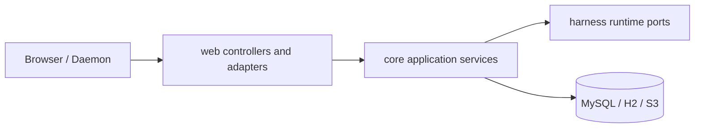

# 后端落地设计

本文描述当前 `share`、`core` 和 `web` 的 Harness 控制面。领域状态由 `core` 管理，`web` 仅负责 HTTP、SSE 和 WebSocket 适配。

## 分层



| 层 | 职责 |
| --- | --- |
| `share` | DTO、JSON 字段和 HTTP 数据边界 |
| `web` | 路由、参数解析、SSE emitter、WebSocket adapter、HTTP 状态映射 |
| `core.harness` | Session、Run、Task、Tool、Control、Usage、Artifact 的应用服务与持久化 |
| `core.environment` | 全局 Environment CRUD、capability/heartbeat 应用和 daemon gateway |
| `harness/*` | Provider、Turn、Session、Run、Tool 和协议领域合约 |

## API 边界

所有 Snowflake ID 在 HTTP 载荷和路径中均为正十进制字符串。格式非法、负 cursor 或非法 limit 返回 `400`；格式合法但不存在的资源返回 `404`；版本、状态或引用冲突返回 `409`。

| 域 | 接口 | 用途 |
| --- | --- | --- |
| Provider / Model / Agent | `/api/providers`、`/api/models`、`/api/agents` | 全局 Agent 资源 CRUD |
| Harness Session | `GET` / `POST /api/sessions`、`GET /api/sessions/{id}` | 根 Session 列表、创建和读取 |
| Session Entry | `GET /api/sessions/{id}/entries`、`POST /api/sessions/{id}/messages` | 完整消息历史和用户消息提交 |
| Run | `GET /api/sessions/{id}/runs`、`GET /api/runs/{id}` | Run 状态查询 |
| Run Event | `GET /api/runs/{id}/events`、`/events/stream` | cursor 查询与 `run_event` SSE |
| Root Activity / Task | `GET /api/sessions/{id}/activities`、`/activities/stream`、`/tasks` | Root Activity SSE 和子代理任务查询 |
| Tool | `GET /api/runs/{id}/tool-invocations`、`POST /api/tool-invocations/{id}/decision` | Tool 状态与权限决策 |
| Control / YOLO | `/api/sessions/{id}/steer`、`/follow-ups`、`/abort`、`/yolo` | 可恢复运行控制与根 Session 策略 |
| Artifact / Usage | `/api/artifacts/{id}`、`/api/usage/sessions/{id}` | 原始 artifact bytes 和用量/成本汇总 |
| Environment | `/api/environments`、`/api/environments/daemon/v1` | 全局 Environment CRUD 与 daemon WebSocket |

ComfyUI 和 S3 接口的边界由 [ComfyUI 工作流 API](comfyui-workflow-api.md) 与 [S3 预签名](s3-presign.md) 定义。

## Session 与 Run

创建根 Session 时解析 Agent 定义并持久化冻结 Snapshot。提交用户消息以 `expectedLeafEntryId` 防止分支覆盖，并在同一事务内写入 User Entry 与 queued Run。Run worker 从数据库 claim 工作，使用冻结配置构建 Turn；Session Entry 保存完整用户、assistant、tool 和 artifact 语义，Run Event 保存增量和执行状态。

事务锁顺序固定为 `Run -> Session -> Root -> Invocation/Task/Control`。Assistant Entry、Usage 和 Run Event 一起提交，使崩溃恢复后的历史与账本一致。

## SSE 与可恢复投影

Run Event 与 Root Activity SSE 都先从数据库读取 cursor 之后的事实，并在每次成功 `send` 后推进 cursor。恢复 cursor 取查询参数与 `Last-Event-ID` 中合法非负十进制值的较大者，避免原生 EventSource 自动重连时被原始 query cursor 回退；错误 cursor 返回 `400`。SSE 轮询线程池有界，过载时拒绝新连接并返回 `503`。SSE emitter 不保留业务 EventBus 或执行状态。

## Tool、Environment 与 Artifact

Tool Invocation 在数据库中经历权限、lease、partial 与 terminal 状态。Cloud、Control 和 Environment 分别使用受限的 worker 查询和 lease 语义；Environment gateway 的连接注册表只保存 transient connection handle。Environment daemon 返回的 artifact bytes 经协议校验后写入全局 ArtifactStore。Artifact HTTP 接口返回原始 bytes 和有效的持久 media type；异常的既有 media metadata 降级为 `application/octet-stream`，并统一附加 `X-Content-Type-Options: nosniff` 和 `Content-Security-Policy: sandbox`。

Environment REST CRUD 不接受 capability 或 last-seen 字段；这两个 daemon-owned 事实仅由认证后的 daemon protocol 更新。协议、token、envelope 和 artifact 限制见 [Environment Daemon Gateway](environment-daemon-gateway.md)。

## 验证

```bash
env JAVA_HOME=$JAVA_HOME_17 mvn clean verify -Dspotless.check.skip=true
env JAVA_HOME=$JAVA_HOME_17 mvn validate -Dspotless.check.skip=true
```

Java 代码还需通过仓库 Checkstyle、Google Java Format 1.18.0 strict dry-run、newline audit 和 `git diff --check`。
