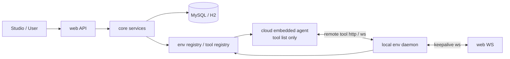

# 云端内嵌 agent runtime

本文是整体技术方案的一部分，描述运行时主方向。

## 运行模型

系统采用以下运行模型：

- 云端内嵌运行自研 agent。
- 本地 daemon 只提供环境能力与工具能力。
- 所有 session / event / run 都只在云端完成。

这样可以把分布式 agent 运行时问题收敛为 remote tool 调用问题，简化系统复杂度。

相关定义：

- session / event / run 的持久化对象见 `storage-models.md`。
- branch、assistant attempt、tool call 的执行语义见 `agent-engine.md`。

## 顶层架构

## 关键原则

### 1. agent 只在云端运行

云端是唯一 agent runtime：

- agent 主循环在云端。
- session event tree 在云端。
- run 生命周期在云端。
- abort / retry / branch 继续执行都在云端。

### 2. 云端与本地通过统一环境注册表和环境接口收口

云端与本地共享一套统一的环境注册表和环境接口：

- 本地 daemon 负责注册环境、维持在线状态并上报工具能力。
- 云端通过统一环境接口读取环境与工具能力，组装 agent 可用工具列表。
- remote tool 的路由、环境选择与调用入口都经由这套接口收口。

本地 daemon 只负责：

- 注册环境。
- 保持 keepalive。
- 上报本地 tool capability。
- 执行 remote tool call。

### 3. agent 只感知工具列表

- agent 可见的是普通 `Tool` 列表与对应 schema。
- 为 agent 配置工具时，可以绑定特定环境上报的工具能力。
- agent 不直接感知环境注册、连通性和 remote tool 路由细节。

这种方式把环境差异统一收敛到环境注册表与 remote tool registry。

## 最小链路

### 1. 通道链路

- daemon 启动。
- daemon 建立 WebSocket。
- daemon 完成 `env_register`。
- daemon 周期发送 `env_heartbeat`。
- server 记录在线状态。

### 2. 能力链路

- daemon 上报 `tool_capability_snapshot`。
- cloud 将环境信息与 capability 写入统一环境注册表。
- cloud 根据 `agent_profile_tool_binding` 组装 agent 的工具列表。
- Studio 可查看 env / tool capability，并为 agent 绑定特定环境工具。

### 3. 执行链路

- 用户在 Studio 创建 session 并提交消息。
- 云端 native agent 加载 session/event。
- 云端 agent 通过 remote tool 调用本地能力。
- 所有 event 仍只写入云端 canonical store。

## 远程工具方向

## 云端侧

云端组件：

- `EnvironmentRegistry`
- `RemoteToolRegistry`
- `RemoteToolRegistration`
- `RemoteTool`

云端 agent 看见的仍然是普通 `Tool` SPI，只是执行时实际委托给 daemon。

云端侧职责包括：

- 维护统一环境注册表。
- 根据环境能力和 `agent_profile_tool_binding` 组装 agent 工具列表。
- 在工具执行时把调用路由到目标环境。

## daemon 侧

daemon 组件：

- `DynamicToolManager`
- `ToolHost`
- `ToolInvoker`

它们负责：

- 注册本地工具。
- 查找工具。
- 执行工具。
- 返回流式输出、完成态和错误态。

## 本地原生工具接入基线

最小闭环以单个本地原生工具接入为基线：

- daemon 上报工具 capability。
- 云端把该工具注册到 `RemoteToolRegistry`。
- `agent_profile_tool_binding` 选择该工具并暴露给 agent。
- agent 按普通 `Tool` 调用该工具，执行请求被路由到目标环境。

## 实现顺序

1. 跑通 daemon keepalive 链路。
2. 设计并落地 core / web 的存储模型。
3. 建立 daemon-facing API 与 remote tool 协议。
4. 接入原生 Java tool 注册。
5. 让云端自研 agent 能稳定调用本地 remote tool。
