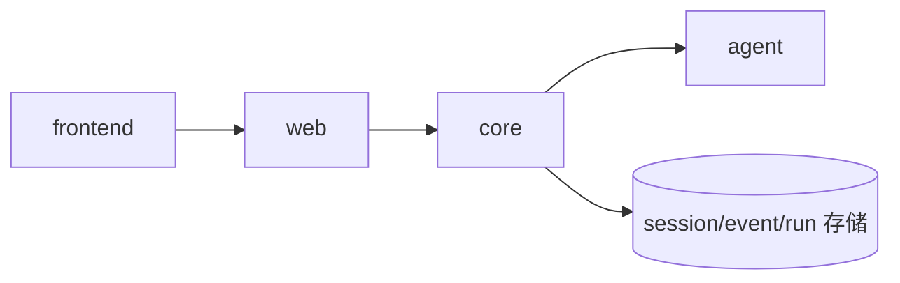
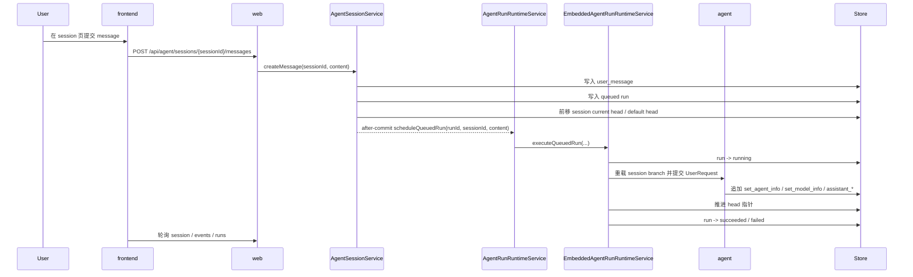

# 云端内嵌 agent runtime

本文描述当前仓库已经落地的云端 embedded runtime 形态。

## 运行时摘要

| 主题 | 当前状态 |
| --- | --- |
| 运行模型 | 服务端单进程 embedded runtime |
| 触发方式 | `POST /api/agent/sessions/{sessionId}/messages` after-commit 调度 |
| 存储位置 | session / event / run 统一落在 `core` 使用的存储 |
| 刷新方式 | 前端轮询式 query |
| ToolRegistry | 当前运行时组装为空列表 |

## 运行模型

## 执行链路

## 执行步骤

| 步骤 | 行为 | 说明 |
| --- | --- | --- |
| 1 | 追加 `user_message` / `text` 事件 | 由 `AgentSessionService` 在事务内写入 |
| 2 | 创建 `queued` run | `triggerEventId` 指向刚创建的 `user_message` |
| 3 | 前移 session / default head | 指向当前 `user_message` |
| 4 | after-commit 调度 runtime | 由 `AgentRunRuntimeService` 发起 |
| 5 | run 进入 `running` | 由 `EmbeddedAgentRunRuntimeService` 执行 |
| 6 | 重载分支并继续追加事件 | `set_agent_info`、`set_model_info`、`assistant_*` |
| 7 | 再次前移 head | 指向最新 assistant 事件 |
| 8 | run 进入 `succeeded` 或 `failed` | 终态持久化 |

## 运行约束

| 主题 | 当前规则 |
| --- | --- |
| 调度模型 | 单进程 executor 调度 |
| 推送方式 | 前端轮询 `events` 与 `runs` |
| Tool 组装 | `AgentInfo.tools` 使用空列表 |
| Provider 配置 | 通过 `kk-studio.agent.runtime.providers.<providerName>` 解析 |
| local-h2 验收 | `LocalH2AcceptanceConfiguration` 使用 stub provider 返回 `stub response` |
| 事件流 | 控制面 `user_message` 与 runtime `set_*` / `assistant_*` 混合保存 |

## 模块边界

| 模块 | 职责 |
| --- | --- |
| `agent` | 主循环、provider 调用、session event 投影与 branch 重放 |
| `core` | run 调度、状态迁移、事件落库、执行上下文组装 |
| `web` | session / run 查询、消息提交 API |
