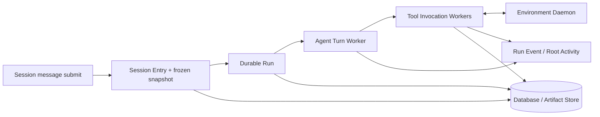

# Harness 执行运行时

本文描述 Harness Session 从用户消息到可恢复 Run、Tool、子代理和终态的执行链。所有执行进度以数据库记录为准，worker 和连接可以重启或丢失。

## 运行时结构

## 消息到终态

1. `POST /api/sessions/{id}/messages` 校验叶节点，写入 User Session Entry，并创建 queued Run。
2. Run worker 以 durable claim 获取 Run，加载 Session Tree、冻结 Agent Snapshot、控制消息和可用 Tool binding。
3. Agent Turn 将 provider 输出的 Assistant、Tool Call 和 Tool Result 语义写为 Session Entry；流式进度和状态变化写为 Run Event。
4. Tool Invocation 按权限策略等待 allow/deny、YOLO 或 worker 分发。Cloud Tool 在服务端执行；Environment Tool 由持久 gateway 分发给匹配的 daemon。
5. Tool terminal result、artifact、usage 和 cost 写入后，Run 继续下一轮或进入 completed、failed 或 cancelled 终态。

一个 Run 的完整消息历史由 Session Entry 重放；Run Event 只提供未物化实时进度。Provider 流和 SSE 中断不会改变已经提交的持久事实。

## 控制与权限

`steer` 和 `follow-up` 都写为带消费状态的 Run Control Message；worker 在定义的边界消费它们。`abort` 持久化 cancel 请求，worker、Tool worker 和 gateway 在后续 poll 中观察并协作取消。控制命令不会依赖内存队列。

Tool permission 以 Invocation 状态表示。`POST /api/tool-invocations/{id}/decision` 原子决定 allow 或 deny；根 Session 的 YOLO 策略在执行前参与权限裁决。子代理的权限请求同时写入 Root Activity，因此根 UI 可以投影为可恢复 relay。

## 子代理与 Root Activity

Subagent Task 保存 child Session、child Run、目标 Agent、状态、working-copy 事实和终态 report。Root Activity 将根 Session 树内的 Run、Task、Tool、Permission 和 Control 进度归集成 cursor 查询与 SSE；Task 树和权限 relay 都可从 REST snapshot 恢复。

## Environment 执行

Environment binding 在 Run 资源解析时冻结为 `environment:<id>/<tool>@<version>`。gateway 在 dispatch 前验证 binding 和 invoke payload，写入 durable lease 后才发送。daemon connection 断开只释放 transient active state；未完成 invocation 由 lease recovery 和后续 poll 接管。daemon 返回的所有 envelope、phase、scope、sequence、payload、Base64 与大小都经过严格校验。

## 计量与成本

每次 provider 调用产生不可变 Model Usage Record。Prompt cache 命中/创建信息与 token 明细一起持久化，价格快照计算的成本写入 ledger；Session API 只返回聚合结果。详细字段和 cache 策略见 [Prompt Cache、Usage 与成本账本](prompt-cache-usage-cost.md)。
