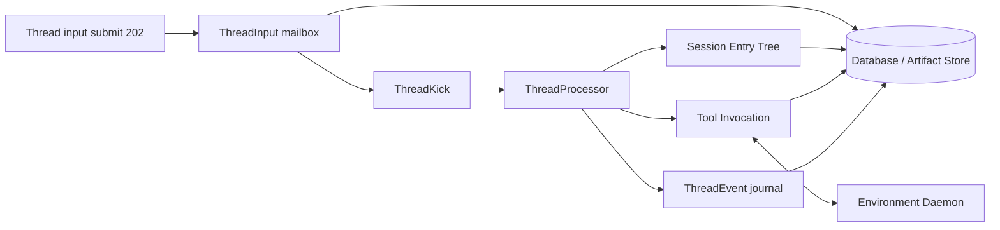

# Harness 执行运行时

本文描述 Harness 从用户输入进入 Thread mailbox，到 ThreadProcessor 按 Turn 推进、Tool/Subagent 收敛并释放 token 的执行链。所有执行进度以数据库记录为准；进程、worker 与连接可以重启或丢失。

## 运行时结构



## 所有权表

| 概念 | 职责 | 持久化 |
| --- | --- | --- |
| Session | 共享 append-only Entry Tree、稳定 Main Thread 与父子关系 | `harness_session` |
| Entry | 语义 durable 真源 | `harness_session_entry` |
| AgentThread | Branch actor：head 游标、mailbox sequence、状态、processor fencing | `harness_thread` |
| Branch(thread) | root→head 路径 | **不持久化**，查询时派生 |
| ThreadInput | 有序输入队列与幂等键 | `harness_thread_input` |
| ThreadStop | Stop 幂等回执与被取消 Input 的关联 | `harness_thread_stop` |
| ThreadEvent | 流式/状态可观测覆盖层；全局 eventId cursor | `harness_thread_event` |
| ToolInvocation | 工具执行与副作用幂等边界 | `tool_invocation` |
| SubagentTask | parent invocation → child Session + child Thread | `harness_subagent_task` |
| Turn | 一次模型请求 + 其 Tool 处理 | **仅运行时**，不持久化 |

## 提交到空闲

```mermaid
sequenceDiagram
    participant C as Client
    participant API as Thread API
    participant Q as ThreadInput
    participant P as ThreadProcessor
    participant DB as Database

    C->>API: POST /api/threads/{id}/messages
    API->>DB: lock Thread row; allocate sequence; insert input
    API-->>C: 202 ThreadInputDTO
    API->>P: kick(threadId)
    P->>DB: tryAcquire(processorToken, lease)
    alt acquire 成功
        loop until idle
            P->>DB: 收敛 tool / apply terminal results
            P->>DB: harvest cutoff 内全部 queued input
            alt current head requires model
                P->>DB: beginTurn
                P->>P: model stream + deltas
                alt final assistant
                    P->>DB: commitFinalAssistant + usage
                else tool calls
                    P->>DB: prepareTools + invocations
                    P->>DB: append THREAD_WAITING; releaseForExternalWait
                end
            end
        end
        P->>DB: releaseIfIdle
    else token 仍有效
        Note over P: 当前 holder 继续；kick 被吸收
    end
```

文字步骤：

1. `POST /api/threads/{threadId}/messages` 或配置命令在 Thread 行锁下分配 `sequence`、写入 `ThreadInput`，`clientMessageId` 幂等；HTTP **202**。
2. 提交事务后 `ThreadKick.kick(threadId)` 激活有界 `ThreadProcessor`。
3. Processor `tryAcquire`：仅当 `processor_token` 为空或 `processor_until` 已过期时写入新 token 与租约；持有期间按 `lease/3` 心跳 `renew`。
4. 主循环从 durable 事实恢复：先收敛非终态 Tool / 应用已终态 Tool Result；在 Provider 调用前、无 Tool Turn 完成后、当前 Tool batch 全部终态并应用后或 Compaction 后，Harvest cutoff 内全部 queued Input。
5. `beginTurn` 原子录取并写 `TURN_STARTED`；通过后发起 **一次** Provider 请求。Delta 批量写入 ThreadEvent；终态时写 Assistant Entry + `model_usage_record`（同一事务），或 `prepareTools` 创建 Invocation。
6. 需要外部等待（权限、工具执行、subagent）时，Processor 先写 `THREAD_WAITING`，再由 `releaseForExternalWait` 在 Thread 行锁下确认并释放 token；完成后再 kick。
7. 同批包含消息时只发起一次 Provider 请求；配置-only 批次不调用 Provider。无 response debt、queue 为空且无待处理 Tool 时写 `THREAD_IDLE` 并 `releaseIfIdle`。

## Turn 边界与幂等

- **Turn**：一次 LLM 请求及其工具处理；不落库。Assistant Entry ID 关联流式事件与 Usage。
- **Input → Entry**：Harvest 按 sequence 应用 cutoff 内全部 Input；每条 Input 仅能 CAS 一次为 `APPLIED`，并在 Thread 行锁与 processor token 校验下推进 `head_entry_id`。
- **LLM**：at-least-once。崩溃后可再次请求；已成功提交的 Assistant Entry / Usage 由唯一键保护。
- **Tool**：`tool_invocation.id` 是副作用幂等边界；decision 与 terminal 锁序为 **非锁 peek → 锁 Thread → 锁 invocation**，commit 后 kick。

## 权限与路径配置

Thread 保存当前生效配置（agent/model/variant）与运行策略（yolo）；完整 Agent 配置（prompt/tools/skills/subagents/policy/environmentName）在 Turn 时从当前 AgentDefinition 动态装载。`SET_AGENT` / `SET_MODEL` 会写配置变更 Entry 并更新当前生效配置；`SET_YOLO` 只改 Thread 运行策略。tools/skills 使用短名；Skill 元数据 platform-first 解析后写入 runtime config，并渲染为 system prompt 的 `<available_skills>`。有 selected skills 时自动注入 `load_skill`；Goal CONTROL 工具（`create_goal`/`get_goal`/`update_goal`）始终自动注入，状态按 Thread 持久化。上述 Input 在消息边界 Harvest 后生效，不即时改写进行中的模型请求。

`POST /api/tool-invocations/{id}/decision` 原子写入 allow/deny，并 kick 所属 Thread。子代理权限请求投影到 Root Activity，根 UI 可作 relay。

## 子代理

Subagent Task 创建独立 **Child Session + Child Main Thread**，记录 parent/child、`root_thread_id`、`max_turns`、working-copy 与终态 report。子 Thread 独立 Processor；完成后 report 回父 Invocation 并 kick 父 Thread。Child Tool ASK 的事实保留在 Child Thread，并向 `root_thread_id` 镜像 relay event，根 UI 使用同一 Invocation ID 决策。任务取消树与 `maxTurns` 在 `beginTurn` 与 Task 创建事务中线性化评估。

## ThreadEvent 与 Entry

| 层 | 职责 |
| --- | --- |
| Entry | 语义 durable 真源；transcript 与失败审计基线 |
| ThreadEvent | 流式 delta、权限/工具进度、thread waiting/idle/failed；**可观测覆盖层** |

事件类型包括：`thread_started`、`turn_started`、`assistant_*`、`compaction_*`、`input_applied`、`tool_*`、`permission_*`、`subagent_*`、`thread_waiting`、`thread_idle`、`thread_failed`。

SSE：`GET /api/threads/{id}/events/stream`，事件名 `thread_event`，event id 为全局十进制 `eventId`；恢复时取 query `afterEventId` 与 `Last-Event-ID` 中合法非负值的较大者。

## Environment 执行

Environment binding 在 Turn 资源解析时冻结。gateway 在 dispatch 前校验 binding 与 payload，写入 durable lease 后发送。连接断开只释放 transient handle；未完成 invocation 由 lease 与 ThreadProcessor / recovery kick 接管。

## 计量与成本

每次成功 Provider 调用写一条不可变 `model_usage_record`，归属 `session_id` + `thread_id` + **唯一** `assistant_entry_id`。聚合 API 按 Thread / Session / Model 读取账本。详见 [Prompt Cache、Usage 与成本账本](prompt-cache-usage-cost.md)。

## 失败与多节点矩阵

| 场景 | 行为 |
| --- | --- |
| 重复 `clientMessageId` 入队 | 返回既有 ThreadInput；不再次分配 sequence |
| enqueue 成功、kick 丢失 | 低频 recovery 扫描 pending input 后 kick |
| 节点 A 持有 token，节点 B kick | B `tryAcquire` 失败；A 继续 |
| lease 过期 / 持有者崩溃 | 其他节点可 acquire；以 DB token 为准 |
| 模型流中途崩溃 | 未提交 Assistant 可重试；已提交 Entry/Usage 不重复 |
| Provider 瞬态失败 | 写 `ASSISTANT_ERROR` Entry、`ASSISTANT_FAILED` 与 `THREAD_RETRY_SCHEDULED`，进入 `RETRYING`；到期后先偿还失败 Turn，再 Harvest 后续 mailbox。Error Entry 不进入下一次 Provider Context |
| Provider 不可重试失败或重试耗尽 | 写 `ASSISTANT_ERROR` Entry 与 `THREAD_FAILED` 类事件并停止；新的 USER/CUSTOM input 才重新启动普通循环 |
| Tool terminal / permission | 锁 Thread 后锁 invocation；after-commit kick |
| external wait 释放 | `releaseForExternalWait` 原子释放 token |
| SSE 断线 | 仅丢可观测增量；以 Entry + 重放 events 恢复 |
| recovery 扫描 | 仅 expired token 或 pending input / due tool / head 终态 tool；**不**选择纯 `WAITING_APPROVAL` 无 work 的 idle Thread |

配置：`kk-studio.harness.runtime.threadRecoveryInterval`（默认 1s）、`threadRecoveryBatchSize`（默认 100）。主路径是事件触发，recovery 不是主轮询。
