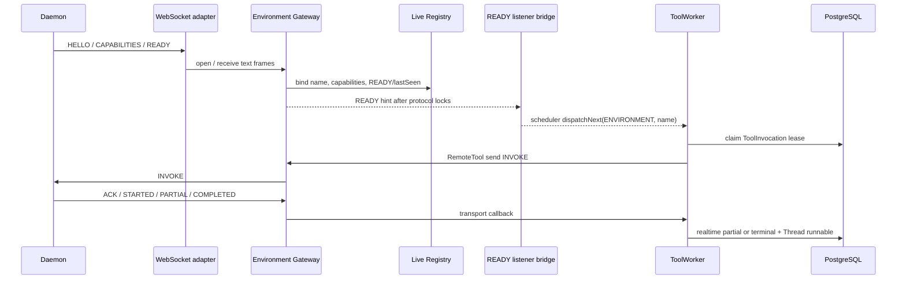

# Environment Daemon Gateway

本文描述全局 live Environment 注册表与 Daemon v1 WebSocket Gateway 的当前协议、内存边界和运行约束。

## 职责与边界

Environment 是**服务器内存**中的实时资源，按非空 `environmentName` 唯一。它保存当前 READY Daemon 连接、canonical `{tools, skills}` capabilities 与 lastSeen 时间戳。`ENVIRONMENT` ToolInvocation 仍是 PostgreSQL durable 执行事实；WebSocket 连接、Daemon 进程和 Gateway 内存句柄都是可丢弃传输状态。

| 层 | 职责 |
| --- | --- |
| `core/environment` | LiveEnvironmentRegistry、Daemon endpoint/Gateway、RemoteToolTransport、load_skill 端口 |
| `harness-tool` | location-neutral Tool API、RemoteTool、Daemon v1 envelope/capabilities/result codec |
| `harness-daemon` | 独立 Daemon 连接、重连、本地工具执行与 invocation journal |
| `harness-runtime` | 统一 `ToolWorker`、ToolInvocation durable 状态、`ToolExecutionLocation` 路由 |
| `web` | 通过 Core endpoint/query API 提供 `/api/environments/daemon/v1` WebSocket 文本帧与只读 `GET /api/environments`；不直接消费 Harness 类型 |

数据库是 ToolInvocation 状态、lease、终态结果、所属 Thread runnable 与全局 Artifact 的唯一来源。partial 进度进入 Redis realtime projection。Gateway 拥有连接与协议，不是第二套 durable 状态机。

## 配置与连接

服务端配置：

```yaml
kk-studio:
  harness:
    environment-gateway:
      daemon-token: ${KK_STUDIO_DAEMON_TOKEN}
      max-artifact-bytes: 8388608
      max-message-bytes: 16777216
```

`daemon-token` 是部署范围的共享连接密钥。Gateway 在 HELLO 中以常量时间比较它；缺失、空白或不匹配的密钥会关闭连接。生产部署使用 TLS 终止后的 `wss://`。

Daemon 以 CLI 参数启动：

```text
java ... DaemonMain \
  --environment-name local-dev \
  --gateway-uri wss://studio.example/api/environments/daemon/v1 \
  --gateway-token ${KK_STUDIO_DAEMON_TOKEN} \
  --skill-dir ~/.agents/skills \
  --daemon-id optional-stable-daemon-name
```

`environment-name` 与 `gateway-token` 必填。`--skill-dir` 可重复；未提供时若存在则默认 `~/.agents/skills`。

## 认证、绑定与能力

Daemon 连接后的首帧必须是 HELLO。Gateway 验证 envelope、共享密钥与非空 `environmentName`，并将连接绑定到该实时环境名。**首个同名连接获胜**。

Daemon 随后按序发送：

```text
HELLO -> CAPABILITIES -> READY {"pull":true}
```

`CAPABILITIES` 形状为 `{"tools":[...],"skills":[{"name","description"}]}`。tool descriptor 是 location-neutral 功能描述（不含 executionLocation）；ENVIRONMENT 路由由连接绑定的 `environmentName` 与 runtime `ToolBinding` 提供。skills 仅上报短 `name`/`description`。`READY` 后 `HEARTBEAT` 刷新 `lastSeen`。断线时 registry 移除该 name。

只读查询：

```text
GET /api/environments
```

返回 `name` / `status` / `lastSeen` / `tools` / `skills`。无 create/update/delete API。

保留名 `platform` 表示内置 Skills Provider：Skill 候选 = READY `platform` + 可选所选 Environment，platform 同名优先。

Gateway 可按需通过 `LOAD_SKILL` 请求完整 skill 正文。PLATFORM 工具 `load_skill` 将其暴露给已选择 Skills 的 Agent。

## Invocation 分发

`harness_tool_invocation.environment_name` 冻结实时环境名。统一 `ToolWorker` 通过 `TOOL_INVOCATION` target 分发指定 Invocation；对应 Environment READY event 则通过 `dispatchNext(ENVIRONMENT, name)` 领取一个 due Invocation。两者都经 `RemoteTool` 与 Gateway transport 分发。发送前发现 Environment unavailable 时，worker 释放未开始的 claim 并保留 `QUEUED`；它不立即重发 Redis target，而是等待下一次该 Environment 的 READY event。



Wire `invocationId` 始终是持久 Invocation ID 的十进制字符串。`INVOKE` 包含冻结 tool name、version、JSON object arguments 和剩余 timeout。

分发前校验：

1. 调用未取消、未过期
2. 当前 live capability 仍精确包含冻结 `name@version`
3. frozen arguments 是 JSON object
4. recovered lease 的非幂等调用保守收敛为 `UNKNOWN`，不重发

连接丢失或发送失败只丢弃瞬时 active handle，不伪造终态。持久 lease 与 fencing 仍由 PostgreSQL claim 约束。

Gateway 构造时注入不可变 `EnvironmentReadyListener`，不持有 ToolWorker，也不暴露 mutable handler/executor setter。`HarnessToolWorkerConfiguration` 只按 `RemoteToolTransport` SPI 构造 ToolWorker；listener 使用 lazy ToolWorker provider 与 tool-worker scheduler，将 READY event 异步桥接为 `dispatchNext(ENVIRONMENT, name)`。scheduler 拒绝或 worker dispatch 失败只记录并隔离，不在 WebSocket caller thread 直调，也不轮询 READY 连接。

## 回调、结果与 Artifact

Daemon 回调严格使用连续 sequence。相同 sequence 的完全相同 envelope 是幂等重放。

| Daemon callback | 效果 |
| --- | --- |
| `STARTED` | transport 执行确认 |
| `PARTIAL` | 解码 result，经 ToolWorker 写入 Redis realtime projection |
| `COMPLETED` | after-tool hooks 后 `SUCCEEDED` terminal CAS |
| `FAILED` | `FAILED` terminal CAS |
| `CANCELLED` | `CANCELLED` terminal CAS |

`ACK` / `ERROR` 只描述 transport，不单独改写 durable 状态。

`DaemonToolResultCodec` 使用严格 JSON shape。Gateway 在保存 artifact bytes 前验证 wire ownership，并将 ref 重写为全局 ArtifactStore ref。

terminal CAS 成功后标记所属 Thread runnable；CAS 失败表示 ownership 已丢失，仅丢弃本地 handle。

## Daemon 本地执行

Daemon 的 invocation journal 记录本地 RUNNING/terminal 状态。重连后重新发送 HELLO、CAPABILITIES 和 READY。重复 `INVOKE` 在 journal 命中 RUNNING 时返回 `STARTED {"replayed":true}`，命中终态时重放该终态。

Daemon 仅依赖 harness-tool，不反向依赖 runtime/model。

### Coding tools

独立 Daemon 进程通过 `CodingTools.registerAll` 注册稳定 coding capability 集合：

```text
read, write, edit, apply_patch, bash, grep, find,
lsp_goto_definition, lsp_workspace_symbols, lsp_java_decompile
```

静态 MIT prompt 资源位于 `harness/daemon/src/main/resources/.../coding/prompts/`。LSP bridge 协议为 JSON stdin/stdout；未配置 bridge 时不得伪造成功结果。
