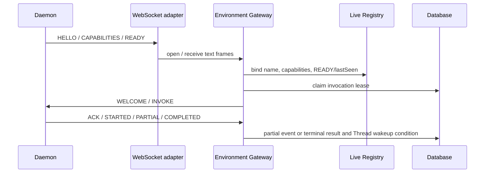

# Environment Daemon Gateway

本文描述全局 live Environment 注册表与 Daemon v1 WebSocket Gateway 的当前协议、内存边界和运行约束。

## 职责与边界

Environment 是**服务器内存**中的实时资源，按非空 `environmentName` 唯一。它保存当前 READY Daemon 连接、canonical `{tools, skills}` capabilities 与 lastSeen 时间戳。`ENVIRONMENT` Tool Invocation 仍是持久化的执行事实；WebSocket 连接、Daemon 进程和 Gateway 内存句柄都是可丢弃传输状态，**不再**持久化 `tool_environment` 表。

| 层 | 职责 |
| --- | --- |
| `core/environment` | LiveEnvironmentRegistry、协议状态机、Environment 专用 invocation lease、load_skill 端口 |
| `harness/tool` | Daemon v1 envelope、capabilities 与 result/artifact/skill codec |
| `harness/daemon` | 独立 Daemon 连接、重连、本地工具执行与 invocation journal |
| `web` | `/api/environments/daemon/v1` WebSocket 文本帧适配；只读 `GET /api/environments` |

数据库是以下事实的唯一来源：Tool Invocation 状态、lease、partial event、终态结果、所属 Thread 的可恢复推进条件和全局 Artifact。`LiveEnvironmentRegistry` 是 capabilities 与在线状态的唯一实时来源。

## 配置与连接

服务端配置：

```yaml
kk-studio:
  harness:
    environment-gateway:
      daemon-token: ${KK_STUDIO_DAEMON_TOKEN}
      max-artifact-bytes: 8388608
      max-message-bytes: 16777216
```

`daemon-token` 是部署范围的共享连接密钥。Gateway 在 HELLO 中以常量时间比较它；缺失、空白或不匹配的密钥会关闭连接，且不会写入 live registry。生产部署使用 TLS 终止后的 `wss://` URI 保护握手密钥。

Daemon 以 CLI 参数为权威配置启动（连接项可回退系统属性）：

```text
java ... DaemonMain \
  --environment-name local-dev \
  --gateway-uri wss://studio.example/api/environments/daemon/v1 \
  --gateway-token ${KK_STUDIO_DAEMON_TOKEN} \
  --skill-dir ~/.agents/skills \
  --daemon-id optional-stable-daemon-name
```

`gateway-uri` 使用 `ws` 或 `wss`。`environment-name` 与 `gateway-token` 必填。`--skill-dir` 可重复；未提供时若存在则默认 `~/.agents/skills`。skill 路径仅本地 CLI 配置，不接受服务端下发。

## 认证、绑定与能力

Daemon 连接后的首帧必须是 HELLO：

```json
{
  "protocolVersion": 1,
  "messageType": "HELLO",
  "environmentName": "local-dev",
  "sequence": 0,
  "payload": {
    "daemonId": "host-a",
    "protocolVersion": 1,
    "gatewayToken": "..."
  }
}
```

Gateway 验证 envelope、HELLO payload、共享密钥与非空 `environmentName`，并将连接绑定到该实时环境名。**首个同名连接获胜**：后续同名 HELLO 被拒绝并关闭新连接，不置换已绑定连接。Gateway 返回 `WELCOME`。

Daemon 随后按序发送：

```text
HELLO -> CAPABILITIES -> READY {"pull":true}
```

`CAPABILITIES` 使用共享 `DaemonToolCapabilitiesCodec` 严格解码，形状为 `{"tools":[...],"skills":[{"name","description"}]}`。每个 tool descriptor 必须使用 `ENVIRONMENT` execution mode，`name@version` 必须唯一；skills 仅上报短 `name`/`description`，不含本地路径或正文。`READY` 仅在 capabilities 接收后生效；`HEARTBEAT` 仅在 READY 后接受，并刷新 live registry 的 `lastSeen`。断线时 registry 移除该 name 条目。

只读查询：

```text
GET /api/environments
```

返回紧凑列表：`name` / `status` / `lastSeen` / `tools` / `skills`。无 create/update/delete API。

Gateway 可按需通过 `LOAD_SKILL` 请求完整 skill 正文（core 端口，尚未暴露为 model Tool）：

```text
LOAD_SKILL {"name":"dev"}  --invocationId 必填-->
  SKILL_LOADED {"name":"dev","content":"<full SKILL.md>"}
  或 SKILL_LOAD_FAILED {"name":"dev","message":"..."}
```

`EnvironmentSkillLoader.loadSkill(environmentName, skillName, timeout)` 返回有界异步结果；离线、超时或断线得到失败结果。

## Invocation 分发与恢复

`tool_invocation.environment_name` 冻结实时环境名。`DatabaseEnvironmentToolInvocationWorkerStore` 仅查询 `target_type = ENVIRONMENT`、目标 `environment_name` 相同且 due 的记录。它使用 Environment 约束的 compare-and-set claim 和 heartbeat SQL。

Gateway 对 READY 连接按名 claim 并分发。若目标 Environment 不在 live registry 或未 READY，则**立即**将 due invocation 收敛为确定性 `FAILED`，错误/结果文案为：

```text
<environment> is offline; <tool> is unavailable
```

不进行等待、重试或回退。



Gateway 以每个 Environment 至多一个 active invocation 的方式执行 READY/PULL。Wire `invocationId` 始终是持久 Invocation Snowflake ID 的十进制字符串；发给 Daemon 的 `INVOKE` 包含冻结的 tool name、version、JSON object arguments 和剩余 timeout。

分发前 Gateway 校验：

1. 调用未取消、未过期；
2. 当前 live capability 仍精确包含冻结的 `name@version` 且为 `ENVIRONMENT` mode；
3. frozen arguments 是 JSON object；
4. recovered lease 的 `NON_IDEMPOTENT` 调用收敛为 `UNKNOWN`，不会重发。

连接丢失或发送失败只丢弃瞬时 active handle，不伪造终态。持久 lease 到期后由下一次 READY/PULL 重新 claim；若 Environment 已离线则按上节直接 FAILED。取消请求在 active 调用上发送一次 `CANCEL` 并持续 heartbeat，直到收到 `CANCELLED` 或 lease 失效。

## 回调、结果与 Artifact

Daemon 回调严格使用连续 sequence。相同 sequence 的完全相同 envelope 是幂等重放；冲突重放、回退、跳号、错误 Environment scope、错误阶段和错误 invocation owner 都会触发 `ERROR` 并关闭该连接。

| Daemon callback | 持久化效果 |
| --- | --- |
| `STARTED` | 仅确认 transport execution；replayed 标记只允许为 `true` |
| `PARTIAL` | 解码 result，写入 durable `TOOL_DELTA_BATCH` |
| `COMPLETED` | 经 after-tool hooks 后以 `SUCCEEDED` terminal CAS 持久化 |
| `FAILED` | 以 `FAILED` terminal CAS 持久化 Daemon message |
| `CANCELLED` | 以 `CANCELLED` terminal CAS 持久化 Daemon reason |

`ACK` 必须引用已发送的 gateway sequence，`ERROR` 必须携带非空 message；两者只描述 transport，不改变持久调用状态。

`DaemonToolResultCodec` 使用严格 JSON shape。artifact payload 包含 `mediaType`、`sizeBytes` 和 canonical Base64 `contentBase64`。Gateway 在保存 artifact bytes 前验证 result 的 wire `toolCallId` 等于当前 Invocation ID，随后将 ref 重写为全局 ArtifactStore ref，并把 result 的 tool call ID 恢复为冻结的 provider tool call ID。

terminal CAS 成功后才发布 `ToolCompleted` lifecycle observation，并使所属 Thread 可在当前 Tool batch 收敛后继续推进。CAS 失败表示 lease 或终态已被其他持久化执行者取得，Gateway 仅丢弃本地 active handle。

## Daemon 本地执行

Daemon 的 invocation journal 记录本地 invocation ID 的 RUNNING/terminal 状态。重连后重新发送 HELLO、CAPABILITIES 和 READY；Gateway 可安全重新分发可重试调用。重复 `INVOKE` 在 journal 中命中 RUNNING 时返回 `STARTED {"replayed":true}`，命中终态时重放该终态。Daemon 对 `CANCEL` 取消本地 handle 并发送 `CANCELLED`。

Daemon 仅注册 `ENVIRONMENT` execution mode 的工具。其 `PARTIAL` 和 `COMPLETED` result 使用同一 codec 读取本地 artifact bytes，因此 Cloud 不依赖 Daemon 本地文件路径。
