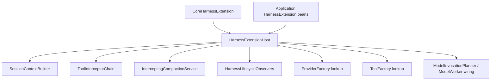

# Harness 扩展机制

本文描述 Harness Runtime 当前生效的可信编译期扩展机制，包括扩展装载、typed contribution、执行顺序、安全边界和生命周期观察。

## 设计目标

Harness 扩展用于在保持核心状态机与持久化协议稳定的前提下，为 Agent 执行链增加确定性的编译期能力。

核心入口为：

```java
public interface HarnessExtension {
  String id();

  int priority();

  void contribute(HarnessExtensionRegistry registry);
}
```

应用通过 Spring 提供 `HarnessExtension` 实例。`HarnessExtensionHost` 负责校验、排序、执行 contribution 并冻结最终注册表。

## 模块边界

| 模块 | 职责 |
| --- | --- |
| `harness/runtime` | Extension Host、typed registry、Context / Tool / Compaction hooks、lifecycle observation、Provider/Model 契约与 factory contract；ModelInvocationPlanner 冻结 ProviderRequest |
| `core` | Spring 装配、内置 Permission / Provider adapter（LangChain4j）/ Tool contribution |

Host 只装载应用显式提供的已编译实例。Session Entry、AgentThread、ThreadInput、Tool Invocation 和 ThreadEvent 继续由原生 Runtime 与数据库状态机管理。

## 装载与顺序

`HarnessExtensionHost` 按以下过程启动：

1. 校验 extension 非空且 `id` 非空白。
2. 在任何 contribution 前检查重复 extension id。
3. 按 `priority` 升序、`id` 字典序排序。
4. 按排序结果依次调用 `contribute(...)`。
5. 保留同一 extension 内同类 contribution 的注册顺序。
6. 冻结注册表并暴露不可变 contribution 列表与 factory lookup。

Provider factory 以 `ProviderType` 为唯一键，Tool factory 以 `name + version` 为唯一键。重复键在 Host 启动阶段失败。

Extension 可通过 `registry.onDispose(...)` 注册清理动作。Host 关闭时按实际注册顺序逆序执行全部 disposer；关闭操作幂等。

## Typed contribution

| Extension point | 输入输出 | 生效位置 |
| --- | --- | --- |
| `ContextTransform` | `ContextState -> ContextState` | Session head path 完成默认转换后 |
| `BeforeToolCallInterceptor` | `BeforeToolCallContext -> BeforeToolCallResult` | Tool Invocation 创建前 |
| `AfterToolCallInterceptor` | `AfterToolCallContext -> ToolResult` | Tool callback 完成后、Invocation terminal CAS 前 |
| `BeforeCompactionInterceptor` | `BeforeCompactionContext -> SessionContext` | Compaction delegate 调用前 |
| `HarnessLifecycleObserver` | typed lifecycle observation | 对应数据库 transition 成功后 |
| `ProviderFactory` | credential/config -> `ProviderAdapter` | Provider adapter 解析 |
| `ToolFactory` | frozen descriptor -> `Tool` | 非 Environment Tool registry lookup |

修改型 hook 严格按 Host 给出的顺序串行执行，后一项接收前一项的完整结果。Hook 返回空值或抛出异常时，当前操作进入对应的确定性失败路径。

## Tool 安全边界

Tool before chain 分为普通修改器和唯一 `PermissionBoundaryInterceptor`：

```text
ordinary before hooks
  -> 每步 tool name / descriptor schema / arguments 校验
  -> PermissionBoundaryInterceptor
  -> 原生 prepareTools 创建 durable Invocation
```

`PermissionEvaluator` 是 Core 内置的 permission boundary。`ToolInterceptorChain` 总是把该 boundary 放到普通修改器之后，并要求：

- 普通修改器的 permission action 与 prompt preview 保持为空。
- Tool name 在整个 before chain 中保持不变。
- 每个修改结果立即通过当前 descriptor schema 校验。
- Permission boundary 读取最终 binding、arguments、Tool settings、由 Entry path fold 得出的 YOLO 和路径上下文。
- Permission boundary 产生最终 permission，并原样返回最终 binding 与 arguments。

Permission 结果由原生 prepare 路径转换为 `QUEUED`、`WAITING_APPROVAL` 或 deterministic `FAILED` Invocation。Invocation 状态迁移由原生 Runtime 独占执行。

Tool 执行完成后，after chain 在 terminal CAS 前串行变换最终 `ToolResult`。After hook 必须保持 `toolCallId`；hook 失败会生成 deterministic error result，并由原生路径将 Invocation 持久化为 `FAILED`。

## Context、Provider 与 Compaction

### Context

`SessionContextBuilder` 先执行 `DefaultContextTransform`，再按 Host 顺序执行全部 `ContextTransform`，最后投影为 `AgentMessage`。Extension 接收前一 transform 的完整 `ContextState`。Context 以当前 Thread head 路径为输入。

### Provider request

`ModelInvocationPlanner` 从 response debt 前缀构造标准 `ProviderRequest`（`cacheControl = NONE`），再直接调用 `PromptCacheRequestFinalizer` 派生最终 cache control，得到冻结后的请求写入 durable ModelInvocation。`ModelWorker` / `ModelExecutor` 只回放该冻结请求，不再经过 extension interceptor 或执行时 hook。Provider 瞬态失败按当前持久 retry policy 自动重试；不可重试 Provider 或重试耗尽进入 Thread FAILED 路径。

### Compaction

`InterceptingCompactionService` 使用固定 session id 串行执行全部 before-compaction hooks，并把最终 `SessionContext` 交给实际 `CompactionService`。Hook 或 delegate 失败由 `ThreadProcessor` 持久化为 Thread 失败事件；成功路径写 Compaction Entry 与 `compaction_*` ThreadEvent。

## Lifecycle observation

Lifecycle observer 接收以下 typed observation：

- `TurnStarted(threadId, sessionId, occurredAt)`
- `AssistantCompleted(threadId, sessionId, toolCallCount, stopReason, occurredAt)`
- `ThreadIdle(threadId, sessionId, occurredAt)`
- `CompactionCompleted(threadId, sessionId, firstKeptEntryId, occurredAt)`
- `ToolCompleted(invocationId, threadId, status, error, occurredAt)`

Observation 只在对应数据库 transition 成功后发布，并复用该 transition 的时间戳。可靠恢复与审计使用数据库 Thread、Session Entry、Invocation 和 ThreadEvent，不以 observer 为真源。

Observer 按 Host 顺序调用。单个 observer 的 `RuntimeException` 会在数据库提交后记录 warning，后续 observer 继续执行。

## Core 内置扩展

`CoreHarnessExtension` 通过同一个 registry 注册：

- `PermissionEvaluator`
- OpenAI Chat Completions Provider factory
- OpenAI Responses Provider factory
- Anthropic Provider factory
- Google Provider factory
- Spring 提供的 PLATFORM Tool factories（含 `task`、`load_skill`、`create_goal`、`get_goal`、`update_goal`）

Spring Tool 列表在 contribution 前按 descriptor `name`、`version` 排序。Tool registry 只从 Host factory lookup 创建工具实例。

Turn 绑定额外规则：

- 已注册的 `create_goal` / `get_goal` / `update_goal` 对所有 Agent 自动注入 model-visible bindings（即使 Agent 配置未列出）
- 已注册的 `load_skill` 仅在 Agent 有 selected skills 时自动注入
- Goal 状态按 `thread_id` 持久化到 `harness_thread_goal`；本切片不实现自动 continuation / budget controller

## Spring 装配



`HarnessExtensionHost` 是 Runtime hook 和 factory contribution 的唯一 Spring 装配入口。`ThreadProcessor` 与 Tool worker 只消费 Host 冻结后的不可变列表或 lookup。
