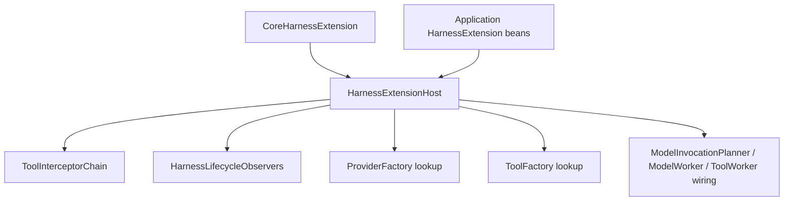

# Harness 扩展机制

本文描述 Harness Runtime 当前生效的可信编译期扩展机制。

## 设计目标

在保持核心状态机与持久化协议稳定的前提下，为 Agent 执行链增加确定性的编译期能力。

```java
public interface HarnessExtension {
  String id();

  int priority();

  void contribute(HarnessExtensionRegistry registry);
}
```

应用通过 Spring 提供 `HarnessExtension` 实例。`HarnessExtensionHost` 校验、排序、执行 contribution 并冻结注册表。

## 模块边界

| 模块 | 职责 |
| --- | --- |
| `harness-runtime` | Extension Host、typed registry、Tool interceptors、lifecycle observation、Provider/Tool factory contract；ModelInvocationPlanner 冻结 ProviderRequest；`harness.model` 包内 Model/Provider 契约 |
| `core` | Spring 装配、内置 Permission / LangChain4j Provider adapter / Tool contribution |

Host 只装载应用显式提供的已编译实例。Session Entry、HarnessThread、ThreadInput、Model/Tool Invocation 与 Interaction 由原生 Runtime 与数据库状态机管理。

## 装载与顺序

1. 校验 extension 非空且 `id` 非空白
2. 检查重复 extension id
3. 按 `priority` 升序、`id` 字典序排序
4. 依次 `contribute(...)`
5. 保留同一 extension 内同类 contribution 的注册顺序
6. 冻结注册表

Provider factory 以 `ProviderType` 为唯一键，Tool factory 以 `name + version` 为唯一键。`registry.onDispose(...)` 在 Host 关闭时逆序执行。

## Typed contribution（现行全集）

| Extension point | 输入输出 | 生效位置 |
| --- | --- | --- |
| `BeforeToolCallInterceptor` | `BeforeToolCallContext -> BeforeToolCallResult` | Tool Invocation 创建前 |
| `AfterToolCallInterceptor` | `AfterToolCallContext -> ToolResult` | Tool 完成后、Invocation terminal CAS 前 |
| `HarnessLifecycleObserver` | typed lifecycle observation | 对应数据库 transition 成功后 |
| `ProviderFactory` | credential/config -> `ProviderAdapter` | Provider adapter 解析 |
| `ToolFactory` | frozen descriptor -> `Tool` | PLATFORM Tool registry lookup |
| disposer | `Runnable` | Host 关闭 |

## Tool 安全边界

```text
ordinary before hooks
  -> 每步 tool name / descriptor schema / arguments 校验
  -> PermissionBoundaryInterceptor
  -> 创建 durable ToolInvocation / Interaction
```

`PermissionEvaluator` 是 Core 内置 permission boundary。`ToolInterceptorChain` 要求：

- 普通修改器的 permission action 与 prompt preview 保持为空
- Tool name 在 before chain 中不变
- 每个修改结果立即通过 descriptor schema 校验
- Permission boundary 读取最终 binding、arguments、Tool settings 与 YOLO 上下文

Permission 结果由原生路径转换为 `QUEUED`、Interaction（approval）或 deterministic `FAILED`。Invocation 状态迁移由原生 Runtime 独占。

after chain 在 terminal CAS 前串行变换最终 `ToolResult`；必须保持 `toolCallId`。

## Provider request

`ModelInvocationPlanner` 从 response debt 前缀构造标准 `ProviderRequest`（`cacheControl = NONE`），再调用 `PromptCacheRequestFinalizer` 得到冻结请求写入 durable ModelInvocation。`ModelWorker` 直接回放该冻结请求。

## Lifecycle observation

当前 typed observation 在对应数据库 transition 成功后发布。可靠恢复与审计使用数据库 Thread、Session Entry、Invocation 与 Interaction，不以 observer 为真源。单个 observer 的 `RuntimeException` 记录 warning，后续 observer 继续执行。

## Core 内置扩展

`CoreHarnessExtension` 注册：

- `PermissionEvaluator`
- OpenAI Chat Completions / OpenAI Responses / Anthropic / Google Provider factory
- Spring 提供的 PLATFORM Tool factories（含 `load_skill`、`create_goal`、`get_goal`、`update_goal` 等）

绑定规则：

- `create_goal` / `get_goal` / `update_goal` 对所有 Agent 自动注入 model-visible bindings
- `load_skill` 仅在 Agent 有 selected skills 时自动注入
- Goal 状态按 `thread_id` 持久化到 `harness_thread_goal`

## Spring 装配



`HarnessExtensionHost` 是 Runtime hook 和 factory contribution 的唯一 Spring 装配入口。`ThreadReconciler`、`ModelWorker` 与 `ToolWorker` 只消费 Host 冻结后的不可变列表或 lookup。
