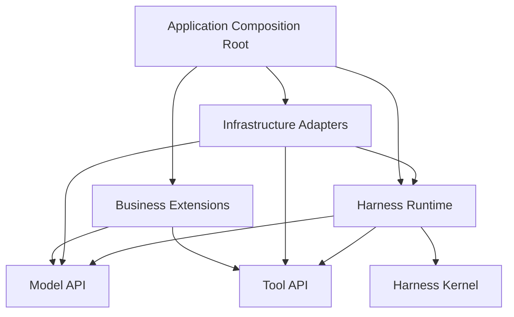
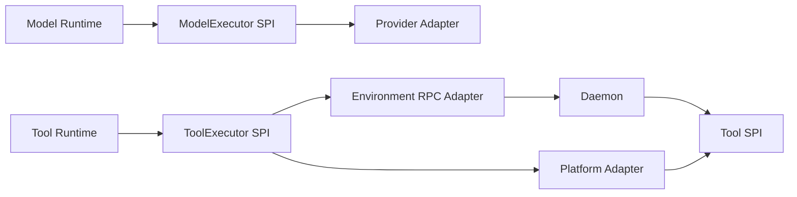
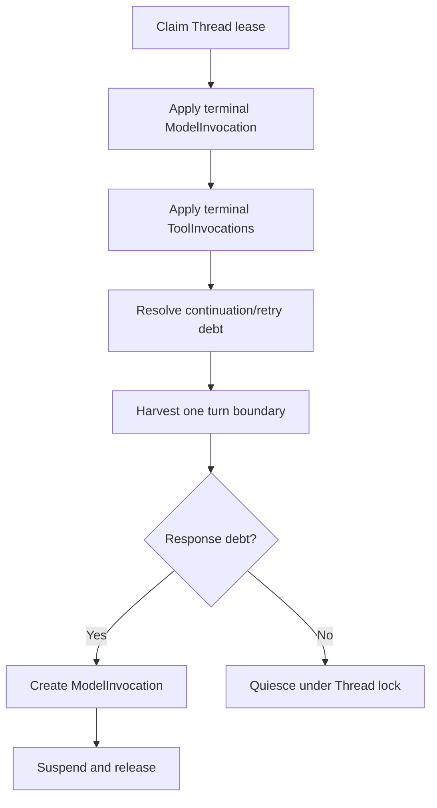
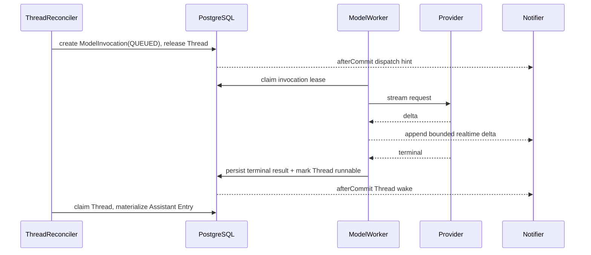
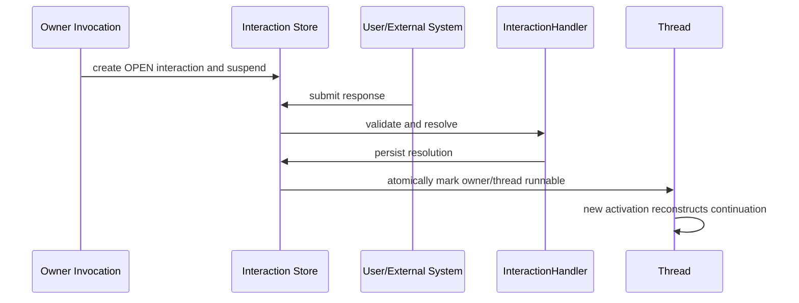

# Harness Kernel 架构

## 1. 目标

Harness 是一个数据库持久化、可恢复、可水平扩展的 Agent 执行内核。它必须满足：

- 任意应用实例退出后，其他实例可以仅依赖 PostgreSQL 中的 durable facts 恢复执行。
- Thread 内的 Entry/head 推进严格串行；Model、Tool、Interaction 和 Child Session 可以独立并发。
- Thread activation 只执行短时状态收敛，不等待任何外部 I/O。
- Redis 只提供低延迟通知和有界实时投影；Redis 数据全部丢失时不影响执行正确性。
- Kernel 不包含 Spring、数据库、Redis、HTTP、WebSocket、Provider SDK 或业务 Tool 实现。
- 核心对象保持最少且职责唯一，不为未来能力预建通用 Task、Wait 或 Event Sourcing 模型。

## 2. 分层与依赖方向



Runtime 与 API 只依赖 Kernel；Business 和 Infrastructure 分别实现公开 SPI，由最外层 Composition Root 装配。Business 不依赖数据库、Redis 或 RPC adapter。

### 2.1 Kernel

Kernel 定义：

- Session、Entry、Thread、Input；
- lease、fencing、execution epoch、continuation、状态转换结果；
- Invocation lifecycle 等跨执行类型共享的值对象和不变量。

Kernel 不负责：

- JSON、SQL、Redis key 或 HTTP DTO 编解码；
- Provider、Tool、Interaction 的具体实现；
- Spring Bean 装配；
- UI 投影与审计展示。

### 2.2 Runtime

Runtime 依赖 Kernel、Model API 和 Tool API，负责：

- Thread reconcile；
- mailbox turn boundary；
- response debt；
- Context 构建与 Compaction；
- ModelInvocation、ToolInvocation 和 Interaction 的协调；
- durable suspend/resume；
- retry、timeout、Stop 与 recovery 协议。

ModelInvocation、ToolInvocation 和 Interaction 是 Runtime 组织的具体 durable aggregates，不进入最底层 Kernel。Runtime 只通过 Store、Executor、Notifier 等端口访问持久化和执行能力。

### 2.3 Execution SPI 与 Transport

Model 与 Tool 分别拥有稳定、Provider-neutral 的执行 SPI。



RPC/WebSocket 只是 ToolExecutor 的 transport adapter，不产生第二套 Tool 接口、状态或结果模型。

### 2.4 Infrastructure 与 Business

Infrastructure 提供：

- PostgreSQL Store 与事务实现；
- Redis wake notifier 与 realtime event stream；
- Provider adapter；
- Platform/Environment Tool transport；
- HTTP/SSE/WebSocket adapter；
- Spring 依赖注入。

Business 提供：

- Agent Definition；
- Model/Provider 配置；
- Tool 实现；
- InteractionHandler；
- Skill、Policy、Environment、Workspace 与 Artifact 能力。

## 3. 目标模块结构

```text
harness/
├── kernel/       # actor/entry/mailbox、lease/fencing、通用状态结果
├── model/        # Provider-neutral Model API/SPI；无具体 SDK adapter
├── tool/         # Tool API/SPI、schema 与 Daemon wire protocol
├── runtime/      # concrete Invocation/Interaction、端口、Reconciler 与 Context
└── daemon/       # 独立 Environment 进程，仅依赖 tool

core/
├── harness/persistence/postgresql/
├── harness/notification/redis/
├── harness/model/provider/
├── harness/tool/
├── harness/interaction/
└── harness/configuration/

web/
├── controller/
├── sse/
└── environment/
```

现有 `harness/agent` 的单 Turn 聚合职责并入 `harness/runtime` 的 ModelInvocation 执行路径；不保留只有一层转发价值的独立 Agent 执行模块。

## 4. 一等 durable facts

### 4.1 Session 与 Entry Tree

Session 是一棵 append-only Entry Tree 的边界。Entry 是 transcript 与运行配置的唯一语义事实。

Entry 类型保持语义化，但不复制运行控制状态：

- `ROOT`
- `RUNTIME_CONFIG`
- `MESSAGE`
- `CUSTOM_MESSAGE`
- `COMPACTION`
- `ASSISTANT_ERROR`
- 必要的 label/summary 类型

`RUNTIME_CONFIG` 保存一次完整、不可变、已解析的有效运行快照，包括：

- Agent identity；
- system prompt；
- effective model/variant；
- Tool descriptors/bindings；
- selected skills；
- execution/interaction policy；
- environment/workspace references。

快照只保存非敏感配置和值对象。API key、secret 和短期 credential 只保存稳定 credential reference，由执行 adapter 在调用时解析，不进入 Entry payload。

配置修改不是 patch fold。每次 `SET_AGENT`、`SET_MODEL` 或其他配置命令都解析并追加一个完整 `RUNTIME_CONFIG` Entry。任意 Entry head 都能独立恢复其有效配置，不再读取当前可变 Definition 补齐历史缺口。

### 4.2 Thread

Thread 是 Entry Tree 上某个 head 的 durable actor 控制面。它只保存：

- Session 与当前 head；
- mailbox sequence；
- runnable 标志；
- execution epoch；
- processor lease/fencing；
- 创建与更新时间。

Thread 不保存：

- 当前 Agent/Model/Variant 投影；
- system prompt、tools、skills；
- Tool、Model 或 Interaction 领域状态；
- 流式 Event；
- Task 状态；
- 可由其他权威事实推导的 RUNNING/WAITING/RETRYING 组合状态。

展示状态按 durable facts 计算：

```text
有效 processor lease                  -> PROCESSING
存在未终态 Model/Tool/Interaction     -> WAITING
存在 nextAttemptAt 未到期的 Invocation -> RETRYING
runnable=true                         -> RUNNABLE
以上均不存在                          -> IDLE
```

### 4.3 ThreadInput

ThreadInput 是唯一有序 mailbox，只接收用户或控制面命令：

- `USER_MESSAGE`
- `CUSTOM_MESSAGE`
- `SET_AGENT`
- `SET_MODEL`
- 必要的 Thread policy 命令

外部 Invocation terminal 不是 Input，不与用户命令竞争 mailbox sequence；它通过 runnable 信号让 Reconciler 优先收敛已有 continuation debt。

Mailbox 采用 TURN_BOUNDARY：

```text
零到多个连续配置命令
  + 最多一个 USER/CUSTOM message
  = 一个 Provider response boundary
```

消息之后到达的配置或下一条消息不能改变该消息对应的 ModelInvocation 快照。

### 4.4 ModelInvocation

ModelInvocation 是一次 Provider 调用的唯一 durable 执行事实，负责：

- source Thread/head 与 execution epoch；
- 不可变 Provider request snapshot；
- QUEUED/RUNNING/terminal 状态；
- worker lease/fencing；
- total/idle deadline、last activity 与 retry；
- terminal response/error；
- apply 状态。

Model worker 只写 ModelInvocation 和 realtime delta，不写 Entry/head。

### 4.5 ToolInvocation

ToolInvocation 是一次 Assistant ToolCall 的唯一 durable 执行事实，负责：

- Assistant Entry、ordinal、toolCallId；
- Tool descriptor/arguments snapshot；
- execution location：`PLATFORM` 或 `ENVIRONMENT`；
- QUEUED/RUNNING/terminal 状态；
- worker lease/fencing、deadline、retry、result/error；
- apply 状态。

Tool worker 只写 ToolInvocation 和 realtime partial，不写 Entry/head。

### 4.6 Interaction

Interaction 是对外请求和响应的唯一 durable 事实：

- owner reference；
- handler type；
- request payload；
- `OPEN/RESOLVED/CANCELLED/EXPIRED`；
- response payload；
- deadline/version。

Approval、clarification、resource selection 和 external callback 都是 InteractionHandler 实现。Kernel 不出现 `WAITING_APPROVAL`、`ALLOW` 或 `DENY`。

### 4.7 Child Session，而不是 Task

`task` 仍是对 Model 暴露的 Tool 名。一次 `task` ToolInvocation 创建一个 Child Session 和 Main Thread：

```text
ToolInvocation(name=task)
  -> Child Session(parentInvocationId)
  -> Child Main Thread
  -> Child final Entry
  -> complete parent ToolInvocation
```

不存在 Task、SubagentTask、TaskState、TaskReport 或 Task polling。

## 5. Kernel 状态结果

Reconciler 和各领域协调器统一返回有限结果：

```java
sealed interface StepResult {

  record Progressed() implements StepResult {}

  record Suspended(ContinuationRef continuation) implements StepResult {}

  record Quiescent() implements StepResult {}

  record LostOwnership() implements StepResult {}

  record Failed(Failure failure) implements StepResult {}
}
```

`Suspended` 表示 durable blocker 已存在且当前 activation 必须交还执行权。它不是 Java continuation，也不保留 Future、线程或调用栈。

## 6. Thread Reconciler

Thread Reconciler 是 Entry/head 的唯一写者。一次 activation：

1. claim Thread processor lease；
2. 校验 execution epoch 与 fencing token；
3. 应用当前 head 对应的 terminal ModelInvocation；
4. 应用当前 Assistant 对应的 terminal ToolInvocations；
5. 偿还 retry/continuation debt；
6. 按 TURN_BOUNDARY harvest mailbox；
7. 计算 response debt；
8. 必要时创建 ModelInvocation；
9. 没有可推进事实时事务性 quiesce；
10. 释放 lease 并退出。

任何外部 I/O 都不在 activation 内执行。



## 7. Model 执行



Model retry 属于 ModelInvocation，不写 Thread retry 状态。到期调度只令对应 Thread/Invocation runnable，不改变 source head。

## 8. Tool 执行

Reconciler 应用 terminal ModelInvocation 时原子写：

- Assistant Entry；
- Usage ledger；
- ToolInvocations；
- Thread head。

Tool dispatcher 领取 `QUEUED` Invocation：

```text
PLATFORM
  -> PlatformToolExecutor
  -> Tool.execute(...)

ENVIRONMENT
  -> EnvironmentToolExecutor
  -> RPC/WebSocket
  -> Daemon
  -> Tool.execute(...)
```

全部 sibling ToolInvocation terminal 后，Thread Reconciler 按 ordinal 追加一个 Tool Result Entry，并产生下一次 response debt。

## 9. Interaction 与 durable suspend/resume

Execution policy 或业务扩展可以创建 Interaction：



Interaction resolution、owner 领域结果和 runnable 标记必须在同一 PostgreSQL 事务中完成。敏感 secret 不进入通用 Interaction payload。

恢复目标由 owner 决定：

- Interaction 允许 Tool/Model 继续执行时，标记对应 Invocation dispatchable 并发送 Invocation signal；
- Interaction 直接令 owner terminal 时，同时标记所属 Thread runnable；
- Thread-owned clarification 完成时，直接标记 Thread runnable。

## 10. Stop 与 fencing

Stop 是立即控制面，不进入普通 mailbox：

1. 锁 Thread；
2. execution epoch 加一；
3. 清 processor lease；
4. 对旧 epoch 的非终态 Invocation 标记取消请求；
5. 取消当前 queued Inputs；
6. 提交后 best-effort 取消本地 Provider/Tool/RPC handle。

所有 Thread/Invocation terminal 写入都携带创建时的 execution epoch 与 lease token。Stop 后的 late callback 无法提交。

## 11. 并发与无丢唤醒不变量

1. Entry/head 只由持有有效 Thread token 的 Reconciler 写入。
2. Invocation result 只由持有有效 Invocation token 的 worker 写入。
3. terminal result 与其下一推进者的 durable runnable/dispatchable 标志在同一事务提交。
4. Redis notify 只能发生在 PostgreSQL commit 之后。
5. quiesce 必须锁 Thread，重新检查 runnable、mailbox、terminal result 和 blocker 后才能释放 lease。
6. Redis 消息可重复、乱序或丢失；Reconciler 每次都从 PostgreSQL 重读事实。
7. 外部副作用必须使用 invocation id 作为幂等键；数据库 fencing 不能撤销已经发生的外部副作用。

## 12. JDK 并发模型

基线使用 JDK 21。Virtual Threads 用于 Model/Tool/RPC worker 中的阻塞式适配代码，使实现保持同步、可读和可观测。

Virtual Threads 不承担：

- durable continuation；
- actor 串行化；
- crash recovery；
- lease/fencing；
- 幂等或 exactly-once。

Runtime 不依赖仍处于 Preview 的 Structured Concurrency API。

## 13. 非目标

- 不实现完整 Event Sourcing。
- 不引入通用 Task/Job，除非未来出现可脱离 ToolCall 独立创建和依赖编排的 Job 领域。
- 不使用图数据库。
- 不使用 Redis 作为状态真相或唯一工作队列。
- 不为旧 MySQL/H2 schema、旧 DTO 或旧状态值提供迁移兼容。
