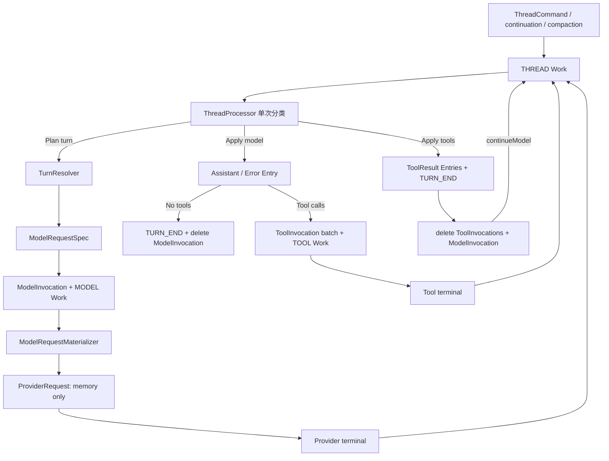

# Harness Runtime 长程 Agent Loop

本文定义 Harness Runtime Agent Loop 当前生效的 durable reducer、持久化形状、执行协议与验证约束；未覆盖的能力继续遵循其他 Harness Runtime 文档。

## 1. 目标

Harness Runtime 收敛为 durable event-driven reducer：

```text
Entry
  = append-only 永久语义事实

ThreadState
  = 当前 branch cursor 与 Thread 控制状态

ThreadCommand
  = durable 输入 mailbox 与幂等记录

ModelInvocation / ToolInvocation
  = 当前 turn 尚未被 Entry 完整吸收的 workflow state

Work
  = 唯一调度 mailbox
```

核心规则：

```text
one THREAD Work claim = one classified action
```

ThreadProcessor 不在一次 claim 中提交后重新读取自身刚写入的状态，也不维护内部 run loop。任何后续动作通过 durable Work wake 驱动。

长程运行依赖以下既有边界：

- PostgreSQL 是唯一 durable truth。
- Work lease、heartbeat、wakeVersion 与 periodic poll 提供崩溃恢复。
- Provider/Tool retry 有界，业务 Agent turn 数不设硬上限。
- 用户 Stop 是 durable 控制操作。
- Tool permission、YOLO、非幂等 Tool 不重放规则保持 fail-closed。
- Context compaction 控制模型上下文大小，但不删除 Entry 历史。

## 2. 总体结构



## 3. Durable 数据职责

| 数据 | 职责 | 生命周期 |
| --- | --- | --- |
| `harness_entry` | 对话、Tool outcome、compaction、turn boundary 等永久事实 | Session 删除前 |
| `harness_thread` | 当前 head、YOLO、command cursor、revision | Thread 删除前 |
| `harness_thread_command` | 有序输入、请求幂等与终态命令记录 | Thread 删除前 |
| `harness_model_invocation` | 当前 turn 的模型执行及其未完成 Tool batch 的共享父上下文 | 本 turn `TURN_END` 前 |
| `harness_tool_invocation` | 当前 Tool batch 中尚未写入 ToolResult Entry 的调用槽位 | Tool batch apply 前 |
| `harness_work` | THREAD/MODEL/TOOL 可 claim mailbox | complete 后删除 |

Closed turn 的展示、Provider context、compaction、branch relocation 与审计不得查询历史 Invocation。

## 4. Entry 与 Turn 元数据

### 4.1 Entry Tree

Entry 继续使用：

```java
public record Entry(
    UUID id,
    UUID sessionId,
    UUID parentEntryId,
    EntryPayload payload,
    Instant createdAt) {}
```

Entry append-only；`headEntryId` 唯一确定 root-to-head path。

### 4.2 TurnStartPayload

`TURN_START` 增加 closed-turn correctness 所需的最小元数据：

```java
public record TurnStartPayload(
    TurnStartReason reason,
    BranchSettings settings,
    UUID ownerThreadId,
    Integer contextWindow)
    implements EntryPayload {}
```

约束：

- `ownerThreadId` 始终非空，记录创建该 turn 的 Thread。
- Resolver 成功时 `contextWindow` 为冻结的正整数。
- Resolver rejected、没有创建 ModelInvocation 时 `contextWindow` 为 null。
- `contextWindow` 只在 TurnStart 中持久化，不在 ModelRequestSpec 中重复保存。
- `ownerThreadId` 用于共享历史与 compaction ownership barrier。

候选 path 在 Resolver 调用前可以使用 `contextWindow=null`；第二阶段 commit 在 Entry 插入前以 Resolver 结果补齐。

### 4.3 Closed-turn 事实

Closed turn 所需事实来源固定为：

| 事实 | Entry 来源 |
| --- | --- |
| branch settings / model selection | `TurnStartPayload.settings` |
| turn owner | `TurnStartPayload.ownerThreadId` |
| model context window | `TurnStartPayload.contextWindow` |
| generation stop / usage / cost | `AssistantMessageMetadata` |
| Provider terminal error | `AssistantErrorPayload.error` |
| retry attempt audit | `MODEL_ATTEMPT_FAILURE` |
| Tool call | Assistant `ToolCallMessageContent` |
| Tool outcome | Tool `MessagePayload` + `ToolResultMetadata` |
| compaction split / summary | `CompactionPayload` |
| turn outcome / continuation | `TurnEndPayload` |

## 5. Thread 控制面与 YOLO

YOLO 是 Thread 级控制流策略：

```java
public record ThreadState(
    UUID id,
    UUID sessionId,        // 创建后不可变；head 必须属于该 Session
    UUID headEntryId,
    boolean yoloEnabled,
    long nextCommandSequence,
    long revision,
    String materializationHash, // 创建请求 canonical SHA-256，仅用于首次 materialization replay
    Instant createdAt,
    Instant updatedAt) {}
```

### 5.1 直接更新

YOLO 不再通过 ThreadCommand 排队。Runtime 提供直接控制操作：

```text
setThreadYolo(threadId, expectedRevision, enabled)
```

事务语义：

```text
lock Thread
  -> 值相同：在 revision CAS 前 no-op，支持网络重试
  -> revision CAS
  -> 值变化：更新 yoloEnabled，revision +1
  -> commit
```

删除：

- `ThreadCommandType.SET_YOLO`
- `SetYoloCommandPayload`
- Command codec/DTO 中的 SET_YOLO
- TurnPlan 的 source/final YOLO
- TurnResolver 的 YOLO 参数
- ResolvedRequestValidator 的 YOLO 校验
- ModelRequestSpec / ModelInvocation / ToolInvocation 中的 YOLO 副本

Resolver 两阶段 commit 必须使用第二事务中锁到的 `ThreadState.yoloEnabled` 更新 Thread，不能把 speculative plan 创建时的旧值写回。YOLO 变化不影响 ModelRequestSpec，因此不使进行中的 Resolver plan 失效。

### 5.2 Tool permission 检查

ToolProcessor 在每次 READY Tool 的 preflight 边界读取已锁定的当前 Thread：

```java
ToolGateway.PreflightResult result =
    thread.yoloEnabled()
        ? new ToolGateway.Allow()
        : toolGateway.preflight(executableRequest);
```

`ToolGateway.preflight` 不接收 YOLO，也不查询 HarnessStore。

YOLO 的控制语义：

- 切换只影响切换后发生的 permission preflight。
- 已经 DISPATCHING/RUNNING 的 Tool 不因关闭 YOLO 被撤销。
- 已经进入 WAITING_APPROVAL 的 Tool 保留原审批请求，不因打开 YOLO 自动重写审批事实。
- 每次 preflight 以锁内读取的 YOLO 快照做一次控制决定；后续切换不追溯已完成的 admission。

## 6. Compact ModelRequestSpec

### 6.1 持久化形状

ModelInvocation 不再持久化完整 ProviderRequest：

```java
public record ModelRequestSpec(
    ProviderType providerType,
    ModelDescriptor model,
    ModelVariant variant,
    List<AgentMessage> preambleMessages,
    List<ToolBinding> toolBindings,
    List<SkillBinding> skillBindings,
    List<SubagentBinding> subagentBindings,
    ProviderCacheControl cacheControl,
    CompactionRequest compaction) {}
```

不持久化：

- 历史 `ProviderRequest.messages`
- 可由 `toolBindings` 派生的 `ProviderRequest.tools`
- 顶层 EnvironmentBinding 副本
- YOLO
- contextWindow
- Provider credential、base URL、timeout
- attempt-only Resource URL

### 6.2 字段语义

#### ProviderType

Provider protocol type 影响 adapter 与 finish/error 归一化，必须随 invocation 冻结。每次 attempt 仍读取当前 Provider 行的 credential、base URL 与 timeout，但当前 Provider 行的 type 必须与 spec 一致；不一致时本次 attempt 确定性失败，不允许在同一 invocation 中切换协议。

#### ModelDescriptor / ModelVariant

冻结本次模型调用真正使用的：

- provider/model identity
- input modalities
- tool/reasoning capability
- pricing
- output/sampling/reasoning 参数

不按名称重新读取可变 Model config。

#### preambleMessages

只保存不能从 EntryPath 重建的 Resolver 输出：

- composed Agent system prompt
- 当前 Environment/date/note 的 prompt 投影
- skill/subagent prompt 描述
- Plugin ContextProjector 输出

Resolver 冻结投影结果，不持久化 Agent/Environment/Plugin 的完整输入快照。

Preamble 只允许承载非历史的 bounded 上下文。ContextProjector 不得复制完整 transcript；普通对话历史必须由 EntryPath 重建。

#### toolBindings

完整 ToolBinding 是本次调用唯一 tool contract，同时用于：

- Provider tool definition
- ModelResponsePlanner schema validation
- renderer
- side-effect/retry policy
- execution name/version
- Environment route
- Plugin provenance/state access

Provider tool definitions每次由 bindings 派生，不保存第二份。

#### skillBindings / subagentBindings

继续复用现有小型 binding：

- `load_skill` 从 skillBindings 获取允许的 name/source Environment。
- `task` 从 subagentBindings 获取允许的 Agent allowlist。
- Tool 执行期间父 ModelInvocation 保留，因此不向每个 ToolInvocation 复制这些共享事实。

#### cacheControl

保存 Resolver 生成的 compact cache control。每次 attempt 仍按当前 Provider capability 做现有规范化。

#### compaction

普通请求为 null。Compaction 请求冻结（`CompactionStart`，存于 TURN_START）：

```text
phase
trigger
executionModel
cutEntryId
turnPrefixStartEntryId
historyCompactionEntryId
```

`CompactionRequest` 只携带 `summaryText`（最终 payload 唯一字段）；不保存 `messagesToSummarize`、`previousSummary` 或最终大字符串 prompt。`tokensBefore` / `firstKeptEntryId` / `complete` 在最终模型中删除（complete 由 phase != HISTORY 派生）。

## 7. ModelRequestMaterializer

新增唯一请求重建边界：

```java
public final class ModelRequestMaterializer {

  public ProviderRequest materialize(
      EntryPath path,
      ModelRequestSpec spec) {
    // pure projection
  }
}
```

### 7.1 普通请求

```text
preambleMessages
  + compaction-aware Entry history projection
  -> ProviderMessageProjector
  -> ProviderRequest.messages
```

历史投影只接受：

- MESSAGE
- CUSTOM_MESSAGE
- ASSISTANT_ABORTED
- complete compaction summary 及其 retained suffix
- Plugin 已冻结在 preamble 中的上下文消息

`MODEL_ATTEMPT_FAILURE`、`ASSISTANT_ERROR`、Turn boundary 与内部 COMPACTION turn 不进入 Provider messages。

### 7.2 Compaction 请求

Compaction materialization 只使用：

```text
EntryPath
+ CompactionRequest
+ compaction prompt templates
```

它按已冻结的 Entry IDs 取出对应消息，不重新运行 cut selection。

### 7.3 执行边界

ModelRequestMaterializer：

- 不访问 Agent/Model/Tool/Skill/Subagent catalog。
- 不执行 Plugin ContextProjector。
- 不访问 Environment registry。
- 不持有数据库事务或 Thread 行锁执行 Provider I/O。
- 只在 MODEL Work claim 有效期间加载 immutable EntryPath 并构建内存 ProviderRequest。

`ModelGateway.Execution` 接收内存 ProviderRequest：

```java
record Execution(
    UUID invocationId,
    int proposedAttempt,
    ProviderType providerType,
    ProviderRequest request) {}
```

每次 retry 重新从相同 `basisHeadEntryId + ModelRequestSpec` materialize logical request。Provider resolution 必须校验当前 Provider 行的 type 等于 execution 中冻结的 type；credential、endpoint、timeout 与 Resource signed URL 保持 attempt-time live。

## 8. Canonical generation model

Canonical stop reason：

```java
public enum GenerationStopReason {
  COMPLETE,
  LENGTH,
  FILTERED
}
```

Tool intent 由独立字段表达：

```java
public record ProviderResponse(
    String text,
    String thinking,
    List<ProviderToolCall> toolCalls,
    GenerationStopReason stopReason,
    ModelUsage usage,
    ModelCost cost,
    String requestId,
    String serviceTier,
    String rawUsageJson) {}
```

约束：

- `COMPLETE` 可以有或没有 tool calls。
- `LENGTH` 可以有或没有已观测 tool calls，tool presence 不覆盖 LENGTH。
- `FILTERED` canonical response 的 toolCalls 必须为空。
- Provider null/unknown/impossible terminal shape 不构成成功 ProviderResponse。
- Stream 中的 tool-call fragment 只属于 attempt-local partial；只有最终 ProviderResponse 中经过完整校验的 calls 可以创建 ToolInvocation。

Provider adapter 各自显式做 finish mapping；公共层不得根据 `hasToolCalls` 覆盖 generation stop reason。

增加：

```java
ProviderErrorKind.INVALID_RESPONSE
```

它复用 Model InvocationRetryPolicy；retry 耗尽后 ModelInvocation FAILED。

## 9. ModelResponseValidator 与 Planner

### 9.1 Validator

ModelResponseValidator 只校验 canonical response：

- stop reason 非空
- tool call ID 唯一
- call ID/name 非空
- arguments 是合法 JSON object
- usage/cost 合法
- FILTERED 无 calls
- stream/final reconcile 一致

它不做 Tool schema validation，不维护 `toolCalls <=> TOOL_CALLS` 约束。

### 9.2 Planner

新增纯函数：

```java
public final class ModelResponsePlanner {

  public ModelResponsePlan plan(
      ProviderResponse response,
      List<ToolBinding> frozenBindings) {
    // generation reason first, then per-call binding/schema
  }
}
```

决策顺序：

```text
1. generation stop reason
2. tool binding lookup
3. tool schema validation
```

稳定 Tool error kind：

```text
INVALID_TOOL_ARGUMENTS
UNKNOWN_TOOL
MODEL_OUTPUT_TRUNCATED
```

决策矩阵：

| 输入 | ToolInvocation | TOOL Work | Turn 后续 |
| --- | ---: | ---: | --- |
| COMPLETE，无 calls | 0 | 0 | completed |
| COMPLETE，valid calls | 每 call 1 READY | READY 数量 | batch 后 continue model |
| COMPLETE，schema-invalid | 每 call 1 FAILED | 0 | 反馈模型 |
| COMPLETE，unknown | 每 call 1 FAILED | 0 | 反馈模型 |
| COMPLETE，mixed | 每 call 1 | 仅 READY | batch 后 continue model |
| LENGTH，无 calls | 0 | 0 | failed/output truncated |
| LENGTH，有 calls | 每 call 1 FAILED | 0 | 全部不执行，反馈截断错误后继续 |
| FILTERED | 0 | 0 | failed/content filtered |
| invalid response | 0 | 0 | Model retry |

每个 observed tool call 都有一个 ToolInvocation 槽位，以保持 mixed batch 的完整 ordinal。

`ToolResult` 不携带 terminate 标志。普通 Tool batch 完成后固定反馈模型；主 Agent 是否结束只由后续模型结果或显式控制事实决定。

TurnEnd 增加并使用稳定原因：

```text
OUTPUT_TRUNCATED
CONTENT_FILTERED
```

`LENGTH` 无 calls 使用 FAILED/OUTPUT_TRUNCATED；`FILTERED` 使用 FAILED/CONTENT_FILTERED。

## 10. ToolInvocation

ToolInvocation 改为直接持有 observed call 与可空 binding：

```java
public record ToolInvocation(
    UUID id,
    UUID modelInvocationId,
    UUID assistantEntryId,
    int ordinal,
    ToolCall call,
    ToolBinding binding,
    ToolInvocationStatus status,
    int attempt,
    ToolApproval approval,
    ToolResult result,
    ToolEffectBatch effects,
    ToolInvocationError error,
    Instant createdAt,
    Instant updatedAt) {}
```

删除持久化 `ToolInvocationRequest` 包装。只有 READY Tool 在 ToolProcessor/Gateway 边界临时构造 executable request。

Binding 约束：

```text
READY / WAITING_APPROVAL / DISPATCHING / RUNNING
/ SUCCEEDED / UNKNOWN / CANCELLED
  -> binding 非空

FAILED + attempt=0
  -> binding 可空，error 非空
```

具体语义：

| 情况 | binding | 初始状态 |
| --- | --- | --- |
| valid known call | 非空 | READY |
| schema-invalid known call | 非空 | FAILED |
| unknown tool | null | FAILED |
| LENGTH call | 可空 | FAILED |

Unknown tool 的 durable renderer fallback 固定为 `tool`。

ToolInvocation 删除 `resultEntryId`。Terminal Tool 行始终表示 outcome 尚未进入 ToolResult Entry；batch apply 后物理删除。

## 11. ModelInvocation 生命周期

ModelInvocation 持久化：

```text
id
threadId
turnStartEntryId
basisHeadEntryId
ModelRequestSpec
status / attempt
streamCheckpoint / failedAttempts
result / error
resultEntryId
timestamps
```

`resultEntryId` 只属于当前 open Tool phase：

```text
resultEntryId == null
  -> model outcome 尚未被 Thread apply

resultEntryId == current Assistant head
  -> Assistant 已写入，当前等待 Tool batch
```

只有 SUCCEEDED 且 response 含 tool calls 的活跃 ModelInvocation 可以持有 `resultEntryId`。Attach 时清空已物化的 stream checkpoint 与 failedAttempts。

生命周期：

```text
READY
  -> DISPATCHING
  -> RUNNING
  -> terminal pending
  -> [no tools] TURN_END + delete ModelInvocation
  -> [tools] Assistant + child ToolInvocations
             -> Tool batch terminal
             -> TURN_END + delete children + parent
```

Closed turn 不保留 ModelInvocation。

## 12. ThreadContextClassifier

Classifier 只根据当前 head path 和当前 open turn 的 active Invocation 分类：

```text
IdleOrHistorical
ContinuationDue
ModelActive
ModelTerminalPending
ToolActive
ToolTerminalPending
```

规则：

1. 无 open turn：
   - head 是 `continueModel=true` TURN_END -> `ContinuationDue`
   - 否则 -> `IdleOrHistorical`
2. 有 open turn且本 Thread 无 ModelInvocation -> `IdleOrHistorical`
3. Model `resultEntryId == null` 且 head == basis：
   - non-terminal -> `ModelActive`
   - terminal -> `ModelTerminalPending`
4. Model `resultEntryId == head` 且 head 是 Assistant：
   - tool calls、siblings count、ordinal、model ownership、assistant ownership 必须精确一致
   - 任一 sibling non-terminal -> `ToolActive`
   - 全部 terminal -> `ToolTerminalPending`
5. 其他关系为 historical 或持久化不变量错误。

Tool siblings 不再存在“terminal 且已 attach”的历史状态。

## 13. Single-action ThreadProcessor

ThreadProcessor 每次 claim 只执行一次分类动作。

### 13.1 ModelTerminalPending

同一事务（锁序含 queued Commands，与 `HarnessRuntime` 全局锁序一致 `Thread → Commands → Model → Work`）：

```text
lock Thread / Commands / Model / Work
  -> append MODEL_ATTEMPT_FAILURE
  -> ModelResponsePlanner
  -> append Assistant / AssistantError / Compaction
  -> no tools:
       append TURN_END
       validate Model attempt/result materialization
       delete ModelInvocation
       (基于新 head EntryPath 判定下一 action，见下「后续 wake」)
  -> tool batch:
       attach Model resultEntryId
       insert all ToolInvocations
       request READY TOOL Work
       all immediate terminal 时 request THREAD Work
  -> update Thread
  -> complete current THREAD Work
```

no-tools 闭合后基于新 head EntryPath 判定下一步，actionable 则同事务 `requestWork(THREAD)`；绝不 always wake / self-poll：

| 结果 | wake |
| --- | --- |
| COMPLETE 无 calls | 无 queued `USER/CUSTOM_MESSAGE` 且无 compaction due → 无；否则 THREAD |
| FILTERED / LENGTH 无 calls / terminal failure/cancel | 同上（普通 turn 闭合同一判定） |
| 有 READY tools | TOOL Work |
| 全部 immediate FAILED | THREAD self-wake |
| compaction 下一阶段（HISTORY → TURN_PREFIX） | THREAD self-wake |

compaction due 判定只对普通（非 compaction）turn 闭合生效（claim 内压缩到期优先于 queued input）：threshold FULL 压缩 complete 已消费 freshness 不再 due；FAILED/STOPPED/CANCELLED/incomplete 压缩阻止立即原地重试、不得从 due self-wake 自旋；HISTORY 下一阶段与 complete OVERFLOW 的 continuation 由显式 THREAD wake 驱动。

### 13.2 ToolTerminalPending

同一事务：

```text
lock Thread / Model / Tool siblings / Work
  -> 按 ordinal append CUSTOM effects + ToolResult
  -> append TURN_END(COMPLETED, continueModel=true)
  -> update Thread
  -> request THREAD Work
  -> delete ToolInvocations
  -> delete parent ModelInvocation
  -> complete current THREAD Work
```

下一次 claim 处理 `ContinuationDue`。

### 13.3 ModelActive / ToolActive

```text
complete current THREAD Work
```

不 reschedule。Model/Tool terminal 时重新 wake。

每个 Tool terminal 都可以 request THREAD Work，Work mailbox 负责合并；Thread 提前 claim 时分类为 ToolActive 并完成，不产生业务 mutation。

### 13.4 ContinuationDue / Input / Compaction

保留 Resolver 两阶段协议：

```text
transaction 1:
  lock Thread/Commands/Work
  capture source head + command cutoff
  build speculative candidate path

outside transaction:
  TurnResolver.resolve(...)
  heartbeat lease

transaction 2:
  CAS source head + command snapshot + claim
  insert candidate Entries
  insert ModelInvocation + MODEL Work
  or append Rejected barrier
  complete THREAD Work
```

Resolver Rejected 追加 barrier 闭合 turn 后：有 deferred input 或闭合后 compaction due 时同事务 request THREAD Work；否则结束（不 always wake、不 self-poll）。compaction due 分支同样遵守 threshold FULL 不 spin 规则（complete 已消费 freshness，FAILED/STOPPED 阻止立即原地重试）。

第二事务推进 head 时始终保留锁内读取到的当前 Thread YOLO，不写入 speculative plan 中的控制状态。

### 13.5 IdleOrHistorical

```text
complete current THREAD Work
```

不 self-poll。

## 14. ThreadProcessResult

Processor 返回值收敛为：

```java
public enum ThreadProcessResult {
  COMPLETED,
  RESCHEDULED,
  LOST_OWNERSHIP
}
```

- `COMPLETED`：当前 claim 已正确消费，是否仍有 Work 由 mailbox 决定。
- `RESCHEDULED`：Resolver 等确定未产生外部副作用的临时失败。
- `LOST_OWNERSHIP`：claim、lease 或 CAS 已失效，零 durable mutation。

删除：

- ThreadProcessor 内部 run loop
- LoopStep
- Continue

## 15. Work、lease 与 crash recovery

任何使 Thread 重新 actionable 的 durable mutation，必须在同一事务中 `requestWork(THREAD)`。

```text
requestWork(THREAD)
+ completeWork(currentClaim)
```

依赖 wakeVersion 保留新 wake。

Model/Tool terminal processor：

- terminal state 与 THREAD wake 同事务提交。
- stale/duplicate callback 通过 attempt、terminal state 与 Work lease fence no-op。
- DISPATCHING/RUNNING 在 lease 过期后按现有 certainty 规则收敛 UNKNOWN；不重放可能产生副作用的 Tool。

Model request materialization发生在有效 MODEL claim 内，但不持有长事务。EntryPath 是 immutable snapshot；Provider stream 在事务外执行。

## 16. Stop、approval 与直接控制

### 16.1 Stop

Stop 的 durable replay key 是「被关闭 turn 的 TURN_START.ownerThreadId + closeRequestId」：Thread 锁内 Session 级
不可变查找使 owning Thread 在 head move 到同 Session 的兄弟分支后仍能精确 replay，另一 Thread 的相同 raw id 被忽略
而非冲突；revision 只用于未 replay 的首发 CAS。

Stop 成功关闭 live turn 的同一事务必须：

```text
锁 Thread + context（Model / Tool Invocation）
锁并净化全部相关 Work mailbox（canonical：THREAD < MODEL < TOOL）
cancel queued commands
append safe AssistantAborted / AssistantError
append Tool CANCELLED/UNKNOWN outcomes
append TURN_END(STOPPED)
advance Thread
delete ToolInvocations
delete ModelInvocation
```

Work mailbox 的净化必须放在展开（append / advance / 删除 Invocation）之前：`deleteWork` 的 owner 校验会反查对应
Model/Tool Invocation 行，而关闭 live turn 时这些行也要被物理删除。在 Invocation 行删除后删除指向它们的
mailbox 会形成悬挂 mailbox，Store 刻意以 IAE 拒绝该状态。整个 Stop 仍是单事务，Work 提前删除不改变原子性，
锁顺序保持 THREAD < MODEL < TOOL。

事务提交后再 best-effort 取消本地 Provider/Tool handle。迟到 callback 因 Invocation 已删除或 claim 失效而 no-op。

删除 ModelInvocation 前必须执行与现有 `ModelAttemptMaterialization` 等价的严格校验，确保 EntryPath 中的 failed attempts、terminal partial/error 与 invocation 完全一致。实现可以使用专用 consume primitive，也可以在同一事务内先 attach 再 delete；不得通过直接 delete 绕过该校验。

### 16.2 Approval

Approval decisionId replay 与 ALLOW/DENY 语义保持不变。

YOLO 不重写已创建的 WAITING_APPROVAL；审批事实只能由 approval API 决定。

### 16.3 Head relocation 不存在

**不存在 MOVE_HEAD / PUT head / standalone Thread create**：`/tree` 选择历史 Entry 只把 Pane 切换为 `ENTRY_DRAFT(sessionId,startEntryId)`（零数据库写入）；第一次 durable batch 以 ENTRY target 提交时原子 materialize 新 Thread（`headEntryId = startEntryId`，不复制 Entry、不修改任何已有 Thread），旧 Thread 永不 relocation。现有 Thread 的 head 只能由 Runtime 在 turn/compaction/stop 执行中推进到当前 head 的新 descendant；Active Invocation 不允许任何形式的 head 变更。

## 17. Command 与长程输入

删除 SET_YOLO 后，ThreadCommand 固定为六类：

```text
USER_MESSAGE
CUSTOM_MESSAGE
SET_ENVIRONMENT
SET_AGENT
SET_MODEL
SET_ACTIVE_TOOLS
```

命令到达 Model/Tool active 阶段时保持 durable queued：

- USER/CUSTOM USER message 在当前 turn/continuation 完成后进入下一 INPUT turn。
- SYSTEM CUSTOM_MESSAGE 可按现有 continuation steering 规则消费。
- settings diff 在新 turn planning 时应用。
- command exact replay 继续依赖 clientCommandId/requestHash/sequence。

无需新增 steering/follow-up 表或队列。

INPUT 从 historical open turn 分支继续时，继续使用 Entry-only normalization：对 Assistant 中缺失结果的 tool calls 追加 synthetic UNKNOWN/HISTORY_CUT ToolResult，再追加 CANCELLED TURN_END。Normalization 不读取旧 Invocation 或 descendant outcome，保证 materialized Provider history 不出现悬空 tool call。

## 18. Durable compaction

Closed-turn compaction 不得读取历史 Invocation。

### 18.1 Threshold

从最新 closed turn 向前扫描：

- complete CompactionPayload 是 freshness barrier。
- 只使用 `ownerThreadId == currentThreadId` 且 `contextWindow != null` 的成功 Assistant usage。
- 遇到 `ownerThreadId != currentThreadId` 的 shared turn 时停止向前借用 usage（Entry-only 事实，不查询其它 Thread 的 Invocation 行）。
- threshold 为 `softThreshold = max(effectiveKeepRecentTokens, contextWindow - effectiveReserve)`，其中 `effectiveKeepRecentTokens = min(keepRecentTokens, floor(contextWindow / 2))`、`effectiveReserve = min(16384, maxOutputTokens)`（配置只有 `keepRecentTokens` 默认 20000 与可空 `fallbackModel`）。

### 18.2 Overflow

最新本 Thread turn 的 AssistantError code 为 OVERFLOW 时，可启动一次 durable overflow compaction。Complete overflow compaction 产生一次 immediate continuation；再次 overflow 后保留失败并停止该次恢复链。

### 18.3 Split turn

HISTORY/TURN_PREFIX 继续使用 CompactionStart 冻结的 Entry IDs（`cutEntryId` / `turnPrefixStartEntryId` / `historyCompactionEntryId`）。HISTORY 成功后下一阶段由显式 THREAD self-wake 驱动。

### 18.4 Manual compaction

`compactThread(CompactThreadCommand{threadId, expectedRevision})`：锁 Thread 校验 expectedRevision → `manualDecision` 计算 availability（THREAD_BUSY / OWNERSHIP_BARRIER / NO_RESOLVED_CONTEXT / MODEL_CHANGED / BELOW_MINIMUM / NOTHING_TO_COMPACT）→ 以 `CompactionTrigger.MANUAL` 构建 plan → 事务外 Resolver → 第二事务提交 COMPACTION Turn + MODEL Work（commitManual 再次校验 revision + source head + queued 快照，消费零 Command）。与自动触发共用 MODEL Work、一次 fallback 与 crash recovery。snapshot 的 `manualCompaction` availability 是瞬时 advisory sidecar，提交成功以 expectedRevision CAS 守护。

### 18.5 Context projection

下一次正常 ModelRequestMaterializer：

- 以最新 complete CompactionPayload 的 summary 代替被压缩前缀。
- 从 `cutEntryId` 本身继续保留上下文。
- 屏蔽完整 COMPACTION control turn。

## 19. Subagent

`task` 继续作为普通 PLATFORM Tool：

- 父 ToolInvocation 由父 ModelInvocation 持有的 frozen subagentBindings 做 allowlist。
- 子 Agent 是普通 durable Thread/Session，复用 Work、Stop、approval、compaction。
- 父 ModelInvocation 保留到父 Tool batch TURN_END，因此 task/load_skill 不需要复制共享 request context。
- 子 Agent 主循环不设硬 max turns；现有 soft reminder budget 保持独立。

## 20. 长程停止条件

主 Agent 不设置 model turn、tool round 或语义循环次数上限。

自动运行只在以下确定事实出现时结束：

```text
COMPLETE 且无 tool calls
LENGTH 且无 tool calls
FILTERED
Provider fatal error / retry exhausted
用户 Stop
取消或不可恢复的 durable failure
```

不增加 doom-loop fingerprint、连续 LENGTH 阈值、重复 Tool error 阈值或 `shouldStopAfterTurn`。Provider/Tool transport retry 仍受已有 retry policy 限制。

## 21. Persistence shape

表数量保持七张。

### harness_thread

- 含 `session_id`、`materialization_hash char(64)` 与 `head_entry_id`（同 Session FK `(session_id, head_entry_id)`）。
- 保留 `yolo_enabled`。
- 直接控制 API 更新。

### harness_thread_command

- command type check 删除 SET_YOLO。

### harness_model_invocation

- `request` JSON 改为严格 `ModelRequestSpec`。
- 不再包含完整 history messages。
- `result_entry_id` 只用于当前 open Tool phase。
- closed turn 后行必须不存在。

### harness_tool_invocation

- `request` 拆为 `call` 与可空 `binding`，或以等价严格 JSON 形状保存。
- 删除 `result_entry_id` 列与 partial unique index。
- batch apply 后行必须不存在。

### harness_work

- 协议不变。

项目采用 clean-slate schema；不保留旧 request codec、旧 enum、旧配置字段或双读兼容。

## 22. 稳态与写放大

一个已关闭 10,000 个 turn 的空闲 Thread：

```text
Entry              O(history)
ThreadState         1
ThreadCommand       O(commands)
ModelInvocation     0
ToolInvocation      0
Work                0
```

一次 active ModelInvocation 的持久化体积只与以下内容相关：

```text
model/variant
preamble
tool bindings
skill/subagent bindings
cache control
compaction metadata
attempt state
```

它不随 Entry 历史长度增长。完整 Provider messages 只在 attempt 内存中存在。

## 23. 验证矩阵

### 23.1 Request materialization

- 在 resolved preamble/tool bindings 相同的前提下，1 条与 10,000 条普通对话 Entry 产生相同大小的持久化 ModelRequestSpec。
- 相同 basis head/spec 在进程重启后 materialize 相同 logical ProviderRequest。
- Resolver 后修改 Agent prompt、Environment note、Plugin projector、Model config，不改变既有 invocation 的 preamble/model/variant。
- Provider type 被同名更新时既有 invocation 确定性拒绝协议漂移。
- credential/base URL/timeout 更新在下一 attempt 生效。
- Tool catalog 更新不改变 frozen ToolBinding。
- Resource URL 每 attempt 刷新，但 durable Resource block 不变。
- CompactionStart 冻结的 Entry IDs（cut/prefix/history anchor）可从 TURN_START 重建相同 summary input；`CompactionPayload` 只含 `summaryText`。

### 23.2 Provider / Planner

- OpenAI tool calls 与 compatible STOP+calls。
- MiniMax OTHER+calls 特例只在对应 adapter 生效。
- OpenAI Responses incomplete。
- Anthropic tool_use/max_tokens。
- Gemini STOP/function/MAX_TOKENS/safety。
- null/unknown/impossible response -> INVALID_RESPONSE retry。
- COMPLETE no calls / valid / schema-invalid / unknown / mixed batch。
- LENGTH no calls / LENGTH 20 calls。
- FILTERED 清空 calls。
- duplicate IDs / malformed JSON。

### 23.3 Reducer

- one claim one action。
- Model complete no calls：TURN_END、删除 Model；无 queued/compaction due 时无 Work，否则 THREAD。
- Model tools：保留 parent Model、创建完整 siblings、只 request READY。
- all immediate FAILED：THREAD self-wake。
- mixed batch：按 ordinal 一次 apply。
- Tool batch TURN_END：删除 children+parent，恰好建立 continuation wake。
- active/idle claim：complete、不 reschedule。
- Resolver rejected：deferred input 或闭合后 compaction due 时同事务 THREAD，否则无 Work。
- compaction HISTORY/TURN_PREFIX 独立 wake。
- concurrent newer wake 不被旧 complete 删除。

### 23.4 Lifecycle / crash

- commit 前 crash：Entries 与 delete 一起 rollback。
- commit 后 ack 前 crash：Invocation 已删除，重复 claim 不重复 apply。
- TurnEnd 后 Model/Tool invocation count 为 0。
- 最后一轮没有下一 TurnStart 仍完成清理。
- Stop 与 terminal callback 并发。
- approval replay。
- ENTRY target materialization 从 startEntry 创建新 Thread，不复制 Entry、不修改 sibling；不存在 head relocation（moveHead 无此能力）。
- lease expired MODEL/TOOL certainty 语义。

### 23.5 YOLO

- direct update 修改 Thread revision，不创建 Command/Entry/Work。
- Model request/spec 不含 YOLO。
- Tool READY preflight 读取最新 Thread YOLO。
- YOLO=true 不调用 permission evaluator。
- 已 WAITING_APPROVAL 不被切换自动改变。
- 已 DISPATCHING/RUNNING 不被关闭 YOLO 撤销。

### 23.6 Long-running / subagent

- 长程主 Agent 不因 turn 数停止。
- bounded dispatcher 下多 Thread 公平 claim。
- queued user input 在 active Model/Tool 后保持 durable。
- task/load_skill 在 Tool phase 读取父 compact spec。
- 子 Thread Stop/approval/compaction 独立恢复。

关键 reducer、planner、materializer 与 invocation lifecycle 路径的 JaCoCo 行覆盖目标不低于 90%；分支覆盖作为辅助指标。
