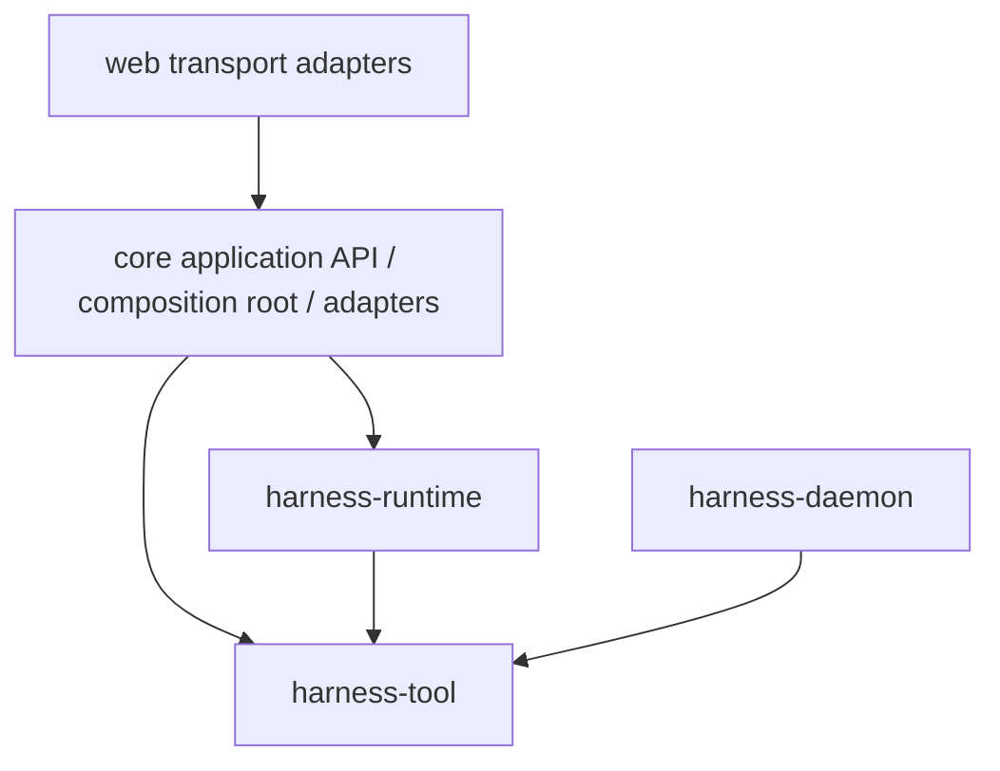
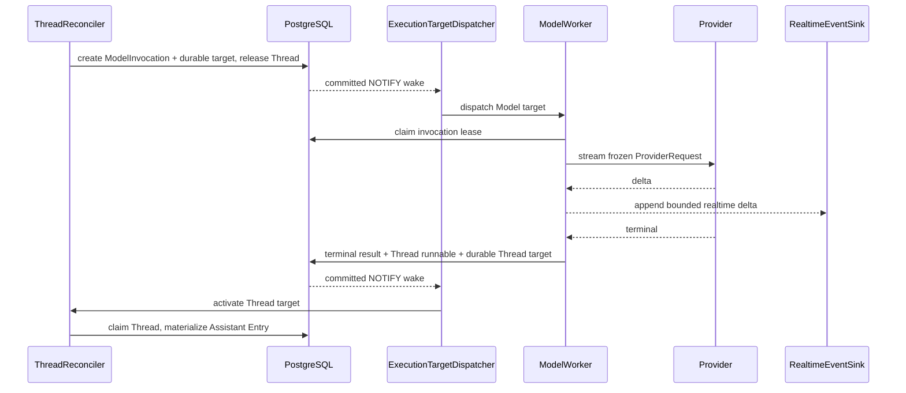
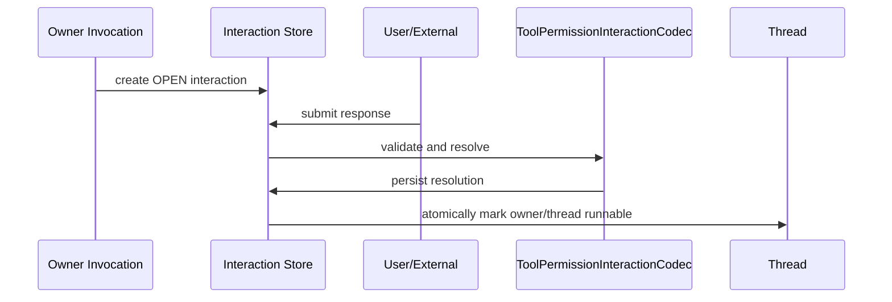

# Harness Runtime 架构

本文是当前已落地的 Harness 执行架构事实源。只描述现行模块、durable 事实、写者边界与 activation 协议。

## 1. 目标

Harness 是 PostgreSQL 持久化、可水平扩展的 Agent 执行 runtime：

- PostgreSQL 是唯一 durable truth；`harness_execution_target` 是唯一 durable activation queue。
- Thread 内 Entry/head 推进严格串行；Model、Tool、Interaction 可独立并发。
- Thread activation 只做短时状态收敛，不在 activation 内等待外部 I/O。
- PostgreSQL listener、dispatcher startup/reconnect wake 与 nearest-due timer 驱动 activation；Redis 只提供可丢失、有界的 realtime projection。
- Runtime domain 不包含 Spring、数据库、Redis、HTTP、WebSocket、Provider SDK 或业务 Tool 实现。

## 2. 模块与依赖

Harness 代码模块只有三个，聚合于 `harness/pom.xml`：

```text
harness/
├── tool/       # location-neutral Tool API / schema / RemoteTool / Daemon 协议
├── runtime/    # Session/Entry/Thread/Invocation/Interaction/Reconciler/Model 契约
└── daemon/     # 独立 Environment 进程适配器，仅依赖 tool
```



| 模块 | 职责 | 禁止 |
| --- | --- | --- |
| `harness-tool` | `ToolDescriptor`、异步 `Tool` API、schema、`RemoteTool`、transport-neutral Daemon wire | Runtime 状态机、Session/Thread、Spring |
| `harness-runtime` | Session/Entry/HarnessThread/ThreadInput、execution 类型、Reconciler、Model/Tool Invocation、Interaction、retry/realtime ports；Model/provider 契约与 codec（包 `fun.fengwk.kkstudio.harness.runtime.model`） | Provider SDK、Spring、MyBatis、HTTP |
| `harness-daemon` | Environment 进程：连接、本地 Tool 执行、invocation journal、coding tools | 依赖 runtime / core / Spring |
| `core` | 薄 application boundary、Spring composition、PostgreSQL durable dispatcher、Redis realtime adapter、LangChain4j Provider adapter、业务扩展 | 第二套领域状态机 |
| `web` | HTTP / SSE / WebSocket 适配，只消费 Core API 与 share DTO | Harness 类型和领域状态机 |

Model 契约收敛在 runtime 模块的 `harness.runtime.model` 子树；LangChain4j adapter 与 SDK 依赖位于 `core`。

### 2.1 API / SPI 接入

依赖方向按调用方向区分：

```text
web -> Core application API / share DTO

Core composition root -> Runtime inbound API
  ThreadCommandCoordinator / InteractionCoordinator
  ThreadReconciler / ModelWorker / ToolWorker

Runtime -> outbound SPI <- Core adapters
  transaction ports / RuntimeConfigSource / Model execution
  RealtimeEventSink / ArtifactStore / RemoteToolTransport
```

Core composition root 直接构造 Runtime concrete coordinator/worker 是正常的 inbound API 使用，不需要再套同义接口。业务编排与状态机留在 Runtime；Core 只保留 Spring 事务、PostgreSQL execution-target composition、live resource 解析、DTO/十进制 ID 映射与基础设施实现。Web 生产代码和 POM 不直接依赖 Harness 模块。

## 3. Durable 事实所有权

PostgreSQL 是唯一 durable truth。表集合固定为：

```text
harness_entry
harness_session
harness_thread
harness_thread_input
harness_model_invocation
harness_tool_invocation
harness_execution_target
harness_interaction
harness_retry_policy
harness_thread_goal
harness_artifact
harness_model_usage
```

### 3.1 Session 与 Entry Tree

Session 只组织一份 append-only Entry Tree，不持有 Thread，也不形成父子层级。Runtime Session 只包含 `id`、`title`、`createdAt`。

Entry 是 transcript 与运行配置的唯一语义事实，类型：

- `ROOT`
- `RUNTIME_CONFIG`
- `MESSAGE`
- `CUSTOM_MESSAGE`
- `ASSISTANT_ERROR`
- `ASSISTANT_ABORTED`（用户 `/stop` 触发，仅含安全 text/thinking，是 Provider 上下文中完整的 partial assistant turn 与 debt barrier）

`RUNTIME_CONFIG` 保存一次完整、不可变、已解析的有效运行快照：Agent identity、system prompt、effective model/variant、Tool descriptors/bindings、selected skills 与 yolo 开关。不保存 secret value；credential 只存稳定 reference。

配置修改不是 patch fold。每次配置命令都解析并追加完整 `RUNTIME_CONFIG`。任意 Entry head 可独立恢复有效配置。

### 3.2 Thread

`HarnessThread` 是可在 Session Entry Tree 之间复用的 durable runtime process，只保存：

- 可空 `headEntryId`
- mailbox `inputSequence`
- `runnable`
- `executionEpoch`
- processor lease（token/until）
- 创建与更新时间

Thread 不保存 Session 归属：当前 Session 由 head Entry 派生，`headEntryId` 为空即 UNBOUND。也不保存 Agent/Model 投影、system prompt、tools/skills、流式状态或组合运行态。

展示状态由 query 从 durable facts 派生（`DerivedThreadStatus`），优先级固定为 `RUNNING > WAITING > RUNNABLE > UNBOUND/IDLE`：

```text
有效 processor lease                                      -> RUNNING
open Interaction / 同 epoch 非终态 Model|Tool / QUEUED input -> WAITING
runnable=true 且非上述                                    -> RUNNABLE
上述皆否且 headEntryId 为空                                -> UNBOUND
其他                                                      -> IDLE
```

Invocation 自动重试等待落在非终态 Model/Tool 事实内，因此 Thread 展示为 `WAITING`；重试细节从 Invocation facts 查询。

Branch 不是独立实体：从历史 Entry 继续对话，就是把某个 Thread 的 head 重定位到该 Entry。

### 3.3 ThreadInput

有序 mailbox，只接收 `USER_MESSAGE`、`CUSTOM_MESSAGE`、`SET_AGENT`、`SET_MODEL`、`SET_YOLO`。外部 Invocation terminal 不进 mailbox；通过 `runnable` 让 Reconciler 优先收敛 continuation debt。

Mailbox 采用 TURN_INPUT_BATCH（turn-start batch）：

```text
snapshot 中全部 queued Input 按 sequence 原子物化
  = 一个 turn-start batch
```

config 与 USER/CUSTOM message 可以任意交错，允许一个 batch 包含多个 message。batch harvest 后重新读取
snapshot；最终 head 最多创建一次 ModelInvocation。snapshot 后到达的 Input 保持 QUEUED，进入下一 turn。

### 3.4 ModelInvocation

`ModelInvocationPlanner` 从完整 root-to-head Entry path 判定 response debt，从 debt 前缀与最近 `RUNTIME_CONFIG` 构造并冻结完整 `ProviderRequest`（含 Prompt Cache finalization）。worker 只回放该冻结请求：`providerType` / `providerResourceId` / model 等均来自 snapshot，不 live 重建 Agent。

ModelInvocation 负责 source head、execution epoch、request snapshot、状态、worker lease、deadline/activity/retry、terminal result/error 与 `appliedAt`。

`ModelWorker` 只写 ModelInvocation 与 realtime delta，不写 Entry/head。

### 3.5 ToolInvocation

一次 Assistant ToolCall 的 durable 执行事实：Assistant Entry、ordinal、toolCallId、descriptor/arguments snapshot、`ToolExecutionLocation`（`PLATFORM` | `ENVIRONMENT`）、状态、worker lease、deadline/retry、result/error、`appliedAt`、permission state 与冻结的 YOLO 开关。

`ToolExecutionLocation` 与 `ToolBinding` 是 runtime 路由状态，不属于 tool 模块的功能描述。

统一 `ToolWorker` 只写 ToolInvocation 与 realtime partial，不写 Entry/head。

权限边界在任何 Tool registry lookup、remote send 或 `Tool.execute` 之前执行：

```text
QUEUED + PENDING
  -> ALLOW: persist final plan + ALLOWED -> external Tool I/O
  -> ASK: WAITING_INTERACTION + ASKED + OPEN tool-permission Interaction + parked target
  -> DENY: FAILED + DENIED -> delete Tool target + schedule Thread target
```

批准只把 `WAITING_INTERACTION + ASKED` 恢复为 `QUEUED + ALLOWED`，并通过原 PLATFORM target 或 ENVIRONMENT route FIFO head 启用；它不会再次运行 permission evaluator。ASKED target 保持 route queue 成员身份，因此不能让后续 sibling 越过等待用户决定的 head。

执行路径：

```text
PLATFORM
  ToolWorker -> Tool.execute(...)

ENVIRONMENT
  ToolWorker -> RemoteTool -> transport -> Daemon inbound -> 同一 Tool API
```

Gateway 只拥有连接与协议，不是第二套 durable 状态机。

`harness_execution_target` 为每个 durable Thread/Model/Tool target 保留唯一队列行，并以
`dispatch_enabled` 作为显式 gate。PLATFORM Tool target 由 `schedule` 创建为 enabled；ENVIRONMENT
Tool target 由 Reconciler materialization 先 `park`，同一事务完成后只 enable 每个 route 的 oldest
queued head。route FIFO 使用 Tool invocation 的 `created_at, assistant_entry_id, ordinal, id`，
RUNNING、RETRY_WAIT 和 WAITING_INTERACTION head 会阻塞后续 sibling。`PostgresqlExecutionTargetDispatcher`
只查询 due enabled row；nearest-due timing 忽略 disabled row，但 inspection/ownership `findAll` 与 `lock` 仍可见 parked state。

### 3.6 Interaction

Tool permission 的 durable 请求/响应事实：明确的 `toolInvocationId`、request/response、`OPEN/RESOLVED`、version。

Tool permission request 持久化 preview 与审计 ids，客户端只能提交严格的 `{"approved": true|false}`。专用 codec 产生批准或拒绝决定；transaction adapter 在 Thread → ToolInvocation → ExecutionTarget 锁序中应用状态和 target 变更。

### 3.7 Goal / Usage / Artifact / Retry

| 事实 | 表 | 说明 |
| --- | --- | --- |
| Thread Goal | `harness_thread_goal` | 按 thread 持久 objective/status；平台 Tool 读写 |
| Usage | `harness_model_usage` | 每个 Assistant Entry 一条不可变账本（持久 token/pricing/created_at；`ModelCost` 由 `ModelCost.calculate(pricing, usage)` 重建） |
| Artifact | `harness_artifact` | 全局不可变 Tool 输出 bytes |
| Retry policy | `harness_retry_policy` | 全局自动重试策略（id=1 单行；不持久化时间戳） |
| Realtime Stream policy | `harness_realtime_stream_policy` | 全局 Redis Stream 容量策略（id=1 单行；`max_length` 默认 5000） |

Thread active 视图由 durable facts 即时查询投影。

## 4. 写者边界

| 写者 | 可写 | 不可写 |
| --- | --- | --- |
| Thread command coordinator | 新建 Thread；`bootstrapThread` 内部创建 Session / 初始 ROOT/RUNTIME_CONFIG Entry、静止 Thread 的 head 重定位、typed Input | 推进运行中 Thread 的语义 head |
| `ThreadReconciler` | 已有 Thread 的 Entry/head 推进、Input apply、ModelInvocation 创建、ToolInvocation 创建、Usage apply 路径；`activate()` 合并本进程 Thread wake | 外部 Provider/Tool I/O |
| `ModelWorker` | ModelInvocation 状态 / lease / terminal / realtime | Entry/head |
| `ToolWorker` | ToolInvocation 状态 / lease / terminal / realtime | Entry/head |
| Interaction transaction | Interaction 与 owner dispatchable/runnable | 越权改 Entry |
| Thread command transaction | Thread 创建、Session 私有 bootstrap bundle、head rebind、Input enqueue、Stop epoch | 绕过 Reconciler 推进语义 head |

command 侧只负责 bootstrap 与 head 重定位；`ThreadReconciler` 是执行过程中语义推进的唯一写者。`PostgresqlExecutionTargetDispatcher` 对 Thread target 调用 `ThreadReconciler.activate()`；Environment READY 只触发 dispatcher wake，并在 drain 时按 `LiveEnvironmentRegistry.listReady()` 重新判定 route。一次 activation：

1. claim Thread reconcile lease
2. 校验 execution epoch 与 fencing token
3. apply terminal ModelInvocation
4. apply terminal sibling ToolInvocations
5. 有 durable blocker 时 suspend/recheck
6. planner 计算已有 response debt，并在需要时创建冻结 ProviderRequest 的 ModelInvocation
7. 无已有 response debt 时按 TURN_INPUT_BATCH harvest snapshot 中的全部 queued mailbox Input
8. reload snapshot；从最终 head 最多创建一次 ModelInvocation，snapshot 后到达的 Input 留给下一 turn
9. 无工作则事务性 quiesce 并释放 lease


## 5. Model 执行



- terminal 事务原子设置 Thread `runnable=true`
- 已过期 started execution 保守收敛为 `UNKNOWN`，不重放未知外部副作用
- realtime 失败永不改变 durable outcome

## 6. Tool 执行

Reconciler apply terminal Model 时原子写 Assistant Entry、Usage、ToolInvocations 与 head。

`ToolWorker` 领取 `QUEUED` Invocation：本地 `Tool` 或 `RemoteTool`。全部 sibling terminal 后，Reconciler 按 ordinal 追加 Tool Result Entry，产生下一次 response debt。

## 7. Interaction 与 durable suspend/resume



resolution、owner 领域结果与 runnable 标记在同一 PostgreSQL 事务中完成。

## 8. Stop、rebind 与 fencing

Stop 是立即控制面，不进入普通 mailbox：

1. 锁 Thread 并校验 `expectedExecutionEpoch`
2. 沿用 Reconciler 的 `ModelInvocationPlanner` 判定当前 head 是否仍有未终结 response debt
3. 若存在 response debt 且 head-scoped `findSafeStreamSnapshotByHead(threadId, epoch, sourceHeadEntryId)` 在 `safe_stream_snapshot is not null AND applied_at is null` 谓词下读出该 invocation 的安全快照：写仅含 text/thinking 的 `ASSISTANT_ABORTED` Entry 并 rebind head 上去，否则写 `ASSISTANT_ERROR(CANCELLED)` barrier
4. `executionEpoch++`
5. 清 processor lease 与 `runnable`
6. 取消旧 epoch 可安全取消的 Invocation；已开始执行只由 epoch fencing 拒绝 late callback
7. 取消 queued Inputs
8. 取消该 Thread 的 OPEN Interaction，使逻辑 stop 后不再被永不解决的 blocker 阻塞
9. 同事务 target mutation 的 PostgreSQL NOTIFY 唤醒 dispatcher（需要时让 Reconciler harvest 新 head/新 epoch）

`ASSISTANT_ABORTED` 与 `ASSISTANT_ERROR` 共享 barrier contract：都是当前 epoch 内追加的 terminal Entry，不会让 pre-existing `RUNNING`/`SUCCEEDED` invocation 转 CANCELLED。Tool/empty partial 不进入 `ASSISTANT_ABORTED`。`ModelWorker.Execution.onDelta` 在 fence 写入 `safe_stream_snapshot` 返回 `LOST_OWNERSHIP` 时，离开 Execution monitor 之后本地 `abandon()` 释放 handle 并清 timers / map，后续 Provider 回调不再被 publish；该释放属于 worker 进程本地清理，与 stop transaction 内的 epoch fence 是两个独立步骤。

head 重定位（bootstrap / rebind / unbind）是外部修改 head 的唯一入口，要求 Thread 当前逻辑静止：

```text
无有效 processor lease
runnable = false
无 QUEUED Input
当前 epoch 无非终态 Model/Tool Invocation
无相关 OPEN Interaction
```

满足后以 `expectedExecutionEpoch` CAS 写入新 head：成功则 `executionEpoch++` 并清 lease/`runnable`。因此 stop 之后 Thread 立即可 rebind。

所有 Thread/Invocation terminal 写入携带创建时的 execution epoch 与 lease token；Stop 或 rebind 后旧 epoch 的 late callback 无法提交。

## 9. Redis realtime projection

| 通道 | 用途 | 丢失后果 |
| --- | --- | --- |
| Streams realtime | Model delta / Tool partial 有界投影 | 客户端重新 REST snapshot |

activation 只经 PostgreSQL execution-target dispatcher 完成。客户端顺序：REST snapshot（Thread/Entries/Inputs/Invocations/Interactions）→ SSE 事件名 `realtime`，cursor 为 Redis stream-id。realtime 失败不改变 durable outcome。

## 10. 并发不变量

1. 执行过程中的 Entry/head 推进只由持有有效 Thread token 的 Reconciler 写入；外部改 head 必须走静止校验 + epoch CAS 的 rebind。
2. Invocation result 只由持有有效 Invocation token 的 worker 写入。
3. terminal result 与下一推进者的 durable runnable/dispatchable 同事务提交。
4. execution-target trigger 的 PostgreSQL NOTIFY 只在事务 commit 后投递。
5. quiesce 必须锁 Thread 并 recheck work。
6. dispatcher wake 可重复、乱序或丢失；每次 activation 从 PostgreSQL 重读 durable target 与领域事实。
7. 外部副作用以 invocation id（及 attempt）为幂等键。

## 11. 能力装配

当前直接装配的能力：

- `BeforeToolCallInterceptor` / `AfterToolCallInterceptor`
- `ProviderFactory` / `ToolFactory`

## 12. 相关文档

| 文档 | 用途 |
| --- | --- |
| [harness-runtime-contracts.md](harness-runtime-contracts.md) | 类型、状态机、端口与事务契约 |
| [harness-storage-runtime.md](harness-storage-runtime.md) | PostgreSQL durable activation / Redis realtime |
| [harness-capability-wiring.md](harness-capability-wiring.md) | 能力装配 |
| [environment-daemon-gateway.md](environment-daemon-gateway.md) | Daemon 连接与远程 Tool |
| [storage-models.md](storage-models.md) | 表结构摘要 |
