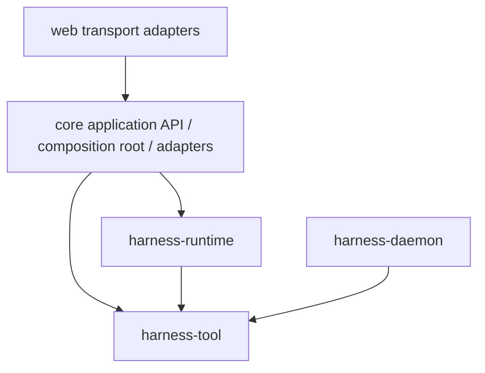
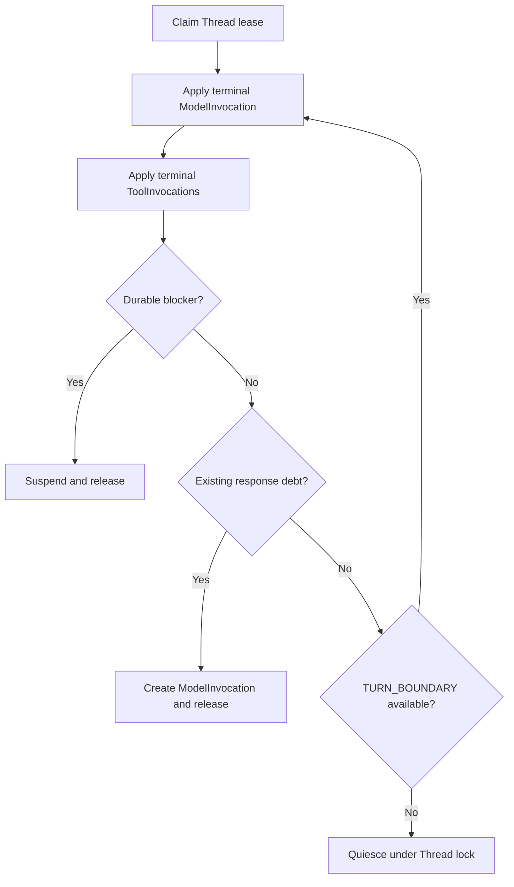
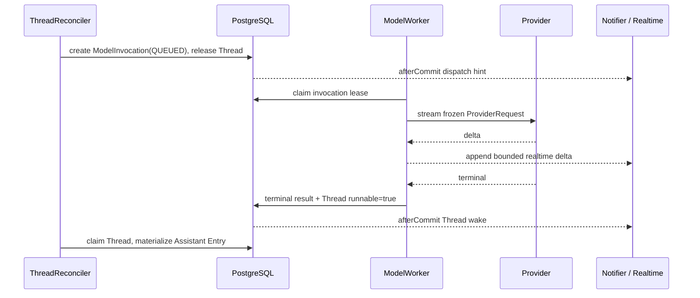
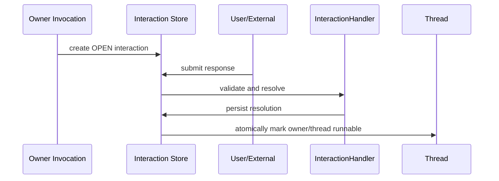

# Harness Runtime 架构

本文是当前已落地的 Harness 执行架构事实源。只描述现行模块、durable 事实、写者边界与恢复协议。

## 1. 目标

Harness 是 PostgreSQL 持久化、可恢复、可水平扩展的 Agent 执行 runtime：

- 任意应用实例退出后，其他实例仅依赖 PostgreSQL durable facts 恢复执行。
- Thread 内 Entry/head 推进严格串行；Model、Tool、Interaction 可独立并发。
- Thread activation 只做短时状态收敛，不在 activation 内等待外部 I/O。
- Redis 只提供可丢失的低延迟 wake 与有界 realtime projection；Redis 全部丢失不影响 durable 正确性。
- Runtime domain 不包含 Spring、数据库、Redis、HTTP、WebSocket、Provider SDK 或业务 Tool 实现。

## 2. 模块与依赖

Harness 代码模块只有三个，聚合于 `harness/pom.xml`：

```text
harness/
├── tool/       # location-neutral Tool API / schema / RemoteTool / Daemon 协议
├── runtime/    # Session/Entry/Thread/Invocation/Interaction/Reconciler/Model 契约
└── daemon/     # 独立 Environment 进程适配器，仅依赖 tool
```



| 模块 | 职责 | 禁止 |
| --- | --- | --- |
| `harness-tool` | `ToolDescriptor`、异步 `Tool` API、schema、`RemoteTool`、transport-neutral Daemon wire | Runtime 状态机、Session/Thread、Spring |
| `harness-runtime` | Session/Entry/HarnessThread/ThreadInput、execution 类型、Reconciler、Model/Tool Invocation、Interaction、retry/realtime ports；Model/provider 契约与 codec（包 `fun.fengwk.kkstudio.harness.runtime.model`） | Provider SDK、Spring、MyBatis、HTTP |
| `harness-daemon` | Environment 进程：连接、本地 Tool 执行、invocation journal、coding tools | 依赖 runtime / core / Spring |
| `core` | 薄 application boundary、Spring composition、PostgreSQL/Redis adapter、worker lifecycle、LangChain4j Provider adapter、业务扩展 | 第二套领域状态机 |
| `web` | HTTP / SSE / WebSocket 适配，只消费 Core API 与 share DTO | Harness 类型和领域状态机 |

Model 契约收敛在 runtime 模块的 `harness.runtime.model` 子树；LangChain4j adapter 与 SDK 依赖位于 `core`。

### 2.1 API / SPI 接入

依赖方向按调用方向区分：

```text
web -> Core application API / share DTO

Core composition root -> Runtime inbound API
  ThreadCommandCoordinator / SessionCommandCoordinator / InteractionCoordinator
  ThreadReconciler / ModelWorker / ToolWorker

Runtime -> outbound SPI <- Core adapters
  transaction ports / RuntimeConfigSource / Model execution
  ActivationNotifier / RealtimeEventSink / ArtifactStore / RemoteToolTransport
```

Core composition root 直接构造 Runtime concrete coordinator/worker 是正常的 inbound API 使用，不需要再套同义接口。业务编排与状态机留在 Runtime；Core 只保留 Spring 事务和 after-commit bridge、live resource 解析、DTO/十进制 ID 映射与基础设施实现。Web 生产代码和 POM 不直接依赖 Harness 模块。

## 3. Durable 事实所有权

PostgreSQL 是唯一 durable truth。表集合固定为：

```text
harness_entry
harness_session
harness_thread
harness_thread_input
harness_model_invocation
harness_tool_invocation
harness_interaction
harness_retry_policy
harness_thread_goal
harness_artifact
harness_model_usage
```

### 3.1 Session 与 Entry Tree

Session 是 append-only Entry Tree 的边界，持有稳定 `mainThreadId`。schema 允许 `parentSessionId`/`parentInvocationId` 表示父子 Session，但当前**未实现** Child Session / task 产品工作流。

Entry 是 transcript 与运行配置的唯一语义事实，类型：

- `ROOT`
- `RUNTIME_CONFIG`
- `MESSAGE`
- `CUSTOM_MESSAGE`
- `COMPACTION`
- `ASSISTANT_ERROR`
- `LABEL`
- `BRANCH_SUMMARY`

`RUNTIME_CONFIG` 保存一次完整、不可变、已解析的有效运行快照：Agent identity、system prompt、effective model/variant、Tool descriptors/bindings、selected skills、execution/interaction policy、environment/workspace 引用。不保存 secret value；credential 只存稳定 reference。

配置修改不是 patch fold。每次配置命令都解析并追加完整 `RUNTIME_CONFIG`。任意 Entry head 可独立恢复有效配置。

### 3.2 Thread

`HarnessThread` 是 Entry Tree 上某个 head 的 durable actor 控制面，只保存：

- Session 与当前 `headEntryId`
- mailbox `inputSequence`
- `runnable`
- `executionEpoch`
- processor lease（token/until）
- 创建与更新时间

不保存 Agent/Model 投影、system prompt、tools/skills、流式状态或组合运行态。

展示状态由 query 从 durable facts 派生（`DerivedThreadStatus`），优先级固定为 `RUNNING > WAITING > RUNNABLE > IDLE`：

```text
有效 processor lease                                      -> RUNNING
open Interaction / 同 epoch 非终态 Model|Tool / QUEUED input -> WAITING
runnable=true 且非上述                                    -> RUNNABLE
其他                                                      -> IDLE
```

Invocation 自动重试等待落在非终态 Model/Tool 事实内，因此 Thread 展示为 `WAITING`；重试细节从 Invocation facts 查询。

### 3.3 ThreadInput

有序 mailbox，只接收 `USER_MESSAGE`、`CUSTOM_MESSAGE`、`SET_AGENT`、`SET_MODEL`、`SET_YOLO`。外部 Invocation terminal 不进 mailbox；通过 `runnable` 让 Reconciler 优先收敛 continuation debt。

Mailbox 采用 TURN_BOUNDARY：

```text
零到多个连续配置命令
  + 最多一个 USER/CUSTOM message
  = 一个 Provider response boundary
```

消息之后到达的配置不能改变该消息对应 ModelInvocation 的冻结快照。

### 3.4 ModelInvocation

`ModelInvocationPlanner` 从完整 root-to-head Entry path 判定 response debt，从 debt 前缀与最近 `RUNTIME_CONFIG` 构造并冻结完整 `ProviderRequest`（含 Prompt Cache finalization）。worker 只回放该冻结请求：`providerType` / `providerResourceId` / model 等均来自 snapshot，不 live 重建 Agent。

ModelInvocation 负责 source head、execution epoch、request snapshot、状态、worker lease、deadline/activity/retry、terminal result/error 与 `appliedAt`。

`ModelWorker` 只写 ModelInvocation 与 realtime delta，不写 Entry/head。

### 3.5 ToolInvocation

一次 Assistant ToolCall 的 durable 执行事实：Assistant Entry、ordinal、toolCallId、descriptor/arguments snapshot、`ToolExecutionLocation`（`PLATFORM` | `ENVIRONMENT`）、状态、worker lease、deadline/retry、result/error、`appliedAt`。

`ToolExecutionLocation` 与 `ToolBinding` 是 runtime 路由状态，不属于 tool 模块的功能描述。

统一 `ToolWorker` 只写 ToolInvocation 与 realtime partial，不写 Entry/head。

执行路径：

```text
PLATFORM
  ToolWorker -> Tool.execute(...)

ENVIRONMENT
  ToolWorker -> RemoteTool -> transport -> Daemon inbound -> 同一 Tool API
```

Gateway 只拥有连接与协议，不是第二套 durable 状态机。

### 3.6 Interaction

对外请求/响应的 durable 事实：owner、handler type、request/response、`OPEN/RESOLVED/CANCELLED/EXPIRED`、deadline/version。

Approval、clarification、resource selection 与 external callback 都是 InteractionHandler。不在 Thread 上建模 `WAITING_APPROVAL`/`ALLOW`/`DENY` 专用状态。

### 3.7 Goal / Usage / Artifact / Retry

| 事实 | 表 | 说明 |
| --- | --- | --- |
| Thread Goal | `harness_thread_goal` | 按 thread 持久 objective/status；平台 Tool 读写 |
| Usage | `harness_model_usage` | 每个 Assistant Entry 一条不可变账本 |
| Artifact | `harness_artifact` | 全局不可变 Tool 输出 bytes |
| Retry policy | `harness_retry_policy` | 全局自动重试策略 |

Root activity 由 durable facts 即时查询投影。

## 4. 写者边界

| 写者 | 可写 | 不可写 |
| --- | --- | --- |
| Session/Thread command coordinator | 新建 Session/Main Thread、初始 ROOT/RUNTIME_CONFIG Entry、Branch head 或 typed Input | 推进已有 Thread 的语义 head |
| `ThreadReconciler` | 已有 Thread 的 Entry/head 推进、Input apply、ModelInvocation 创建、ToolInvocation 创建、Usage apply 路径 | 外部 Provider/Tool I/O |
| `ModelWorker` | ModelInvocation 状态 / lease / terminal / realtime | Entry/head |
| `ToolWorker` | ToolInvocation 状态 / lease / terminal / realtime | Entry/head |
| Interaction transaction | Interaction 与 owner dispatchable/runnable | 越权改 Entry |
| Thread command transaction | Session 创建、Input enqueue、Stop epoch | 绕过 Reconciler 推进 head |

Session/Branch command 只负责 bootstrap；`ThreadReconciler` 是已有 Thread 语义推进的唯一写者。一次 activation：

1. claim Thread reconcile lease
2. 校验 execution epoch 与 fencing token
3. apply terminal ModelInvocation
4. apply terminal sibling ToolInvocations
5. 有 durable blocker 时 suspend/recheck
6. planner 计算已有 response debt，并在需要时创建冻结 ProviderRequest 的 ModelInvocation
7. 无已有 response debt 时按 TURN_BOUNDARY harvest mailbox
8. reload snapshot，使新消息边界在后续循环创建 ModelInvocation
9. 无工作则事务性 quiesce 并释放 lease



## 5. Model 执行



- terminal 事务原子设置 Thread `runnable=true`
- 已过期 started execution 保守收敛为 `UNKNOWN`，不重放未知外部副作用
- realtime 失败永不改变 durable outcome

## 6. Tool 执行

Reconciler apply terminal Model 时原子写 Assistant Entry、Usage、ToolInvocations 与 head。

`ToolWorker` 领取 `QUEUED` Invocation：本地 `Tool` 或 `RemoteTool`。全部 sibling terminal 后，Reconciler 按 ordinal 追加 Tool Result Entry，产生下一次 response debt。

## 7. Interaction 与 durable suspend/resume



resolution、owner 领域结果与 runnable 标记在同一 PostgreSQL 事务中完成。

## 8. Stop 与 fencing

Stop 是立即控制面，不进入普通 mailbox：

1. 锁 Thread
2. `executionEpoch++`
3. 清 processor lease
4. 取消旧 epoch 尚未开始的 Invocation；已开始执行只由 epoch fencing 拒绝 late callback
5. 取消 queued Inputs
6. afterCommit best-effort 取消本地 Provider/Tool/RPC handle

所有 Thread/Invocation terminal 写入携带创建时的 execution epoch 与 lease token；Stop 后 late callback 无法提交。

## 9. Redis

| 通道 | 用途 | 丢失后果 |
| --- | --- | --- |
| Pub/Sub wake | `THREAD` / `MODEL_INVOCATION` / `TOOL_INVOCATION` 提示 | recovery 按 PostgreSQL 扫描补偿 |
| Streams realtime | Model delta / Tool partial 有界投影 | 客户端重新 REST snapshot |

客户端顺序：REST snapshot（Thread/Entries/Inputs/Invocations/Interactions）→ SSE 事件名 `realtime`，cursor 为 Redis stream-id。realtime 失败不改变 durable outcome。

## 10. 并发不变量

1. Entry/head 只由持有有效 Thread token 的 Reconciler 写入。
2. Invocation result 只由持有有效 Invocation token 的 worker 写入。
3. terminal result 与下一推进者的 durable runnable/dispatchable 同事务提交。
4. Redis notify 只在 PostgreSQL commit 之后。
5. quiesce 必须锁 Thread 并 recheck work。
6. Redis 可重复、乱序或丢失；每次 activation 从 PostgreSQL 重读事实。
7. 外部副作用以 invocation id（及 attempt）为幂等键。

## 11. 扩展点

当前实际贡献仅：

- `BeforeToolCallInterceptor` / `AfterToolCallInterceptor`
- `HarnessLifecycleObserver`
- `ProviderFactory` / `ToolFactory`
- disposer

## 12. 相关文档

| 文档 | 用途 |
| --- | --- |
| [harness-runtime-contracts.md](harness-runtime-contracts.md) | 类型、状态机、端口与事务契约 |
| [harness-storage-runtime.md](harness-storage-runtime.md) | PostgreSQL / Redis / recovery |
| [harness-extensions.md](harness-extensions.md) | 扩展注册表 |
| [environment-daemon-gateway.md](environment-daemon-gateway.md) | Daemon 连接与远程 Tool |
| [storage-models.md](storage-models.md) | 表结构摘要 |
