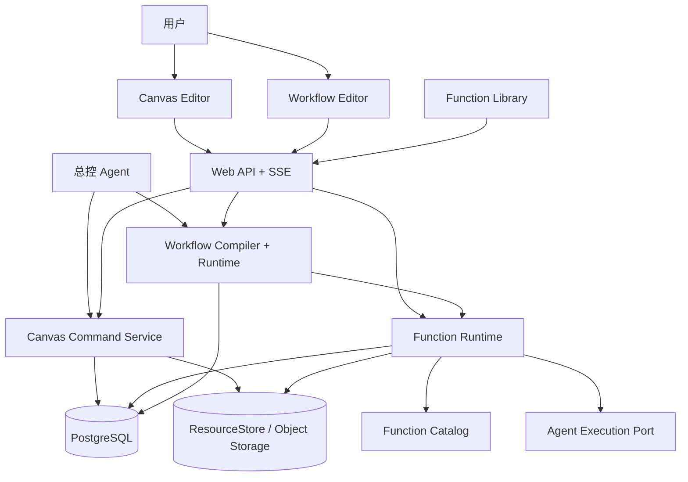
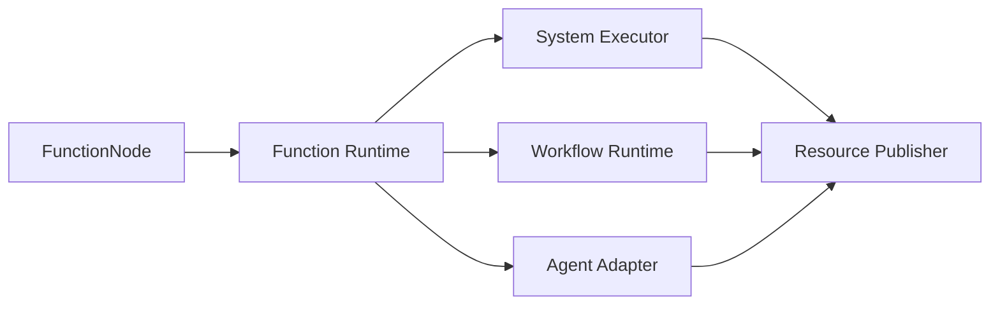
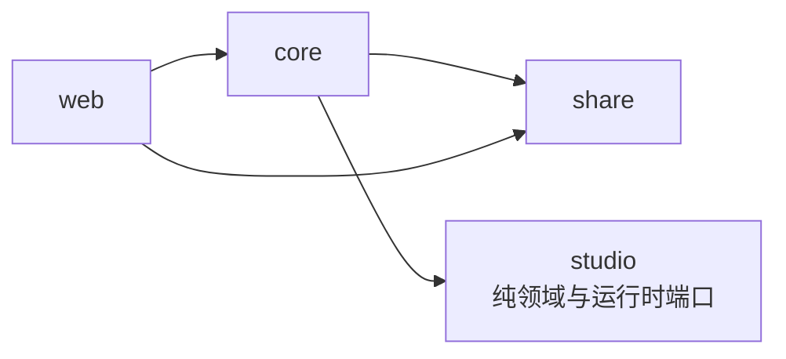

# 无限画布与 Workflow 落地设计

本文定义无限画布、Resource、Function、Workflow 的目标落地契约，以及 Agent 基座稳定后应遵守的低耦合接入边界。产品语义见 [`infinite-canvas-product-logic.md`](../product-design/infinite-canvas-product-logic.md)，交互与视觉见 [`infinite-canvas-prototype.md`](../product-design/infinite-canvas-prototype.md)。

## 1. 实现摘要

| 主题 | 方案 |
| --- | --- |
| 核心原语 | Node、Resource、Link、ResourceReference、Function |
| Canvas 语义 | Link 控制资源可见性，ResourceReference 表达实际依赖 |
| Resource | 稳定逻辑身份 + 不可变 ResourceVersion |
| Function | 命名输入、配置、命名输出和统一 FunctionRun |
| Workflow | 独立 Draft/Version/Run，发布后成为 Function |
| Agent | 通过 Catalog/Execution Port 和 Tool Adapter 接入，不依赖 Harness 内部类型 |
| 持久化 | PostgreSQL 元数据与 Command/Run/Event，Payload 使用可替换 ResourceStore |
| 前端 | React 页面扩展，Canvas 与 Workflow 复用图形基础设施但使用独立领域 Store |
| 并发 | Revision + Command 幂等键 + 数据库状态机 + Worker lease |
| 事件 | Append-only Event + cursor SSE，刷新和断线可恢复 |

### 1.1 代码落地进度（当前）

| 项 | 状态 |
| --- | --- |
| Maven module `studio` | 已注册；纯领域包 `model` / `canvas` / `workflow` / `runtime` |
| core Studio 适配 | `DurableCanvasService` + 内存 FunctionCatalog；Resource/Workflow/Function Runtime 仍为 stub |
| share DTO | `share.model.studio.*` |
| web API | `/api/canvases`、`/api/functions`、`/api/workflows` |
| Canvas DB schema | PostgreSQL 已落地 `canvas_document` / `canvas_node` / `canvas_link` / `canvas_command` |
| Canvas Command | 已支持 create text/generate-text/link、move nodes、delete node；revision 与幂等冲突已落地 |
| Canvas 前端 | Library/Create 已接真实 API；Editor snapshot 与 command 闭环待接 |
| 生成 Provider | **未实现**（`system.generate-*` 仅 Catalog 定义） |
| Agent Function Adapter | **未实现**（`system.agent.execute` 仅 Catalog 定义） |
| Resource / FunctionRun / Workflow schema 与 Worker | **未实现** |

## 2. 核心原则

### 2.1 Canvas 与 Workflow 分离

```text
Canvas
  操作当前已经存在的 Resource
  Link 可提前建立
  @ResourceReference 必须引用实际 Resource

Workflow
  定义未来如何执行
  Binding 可引用未来 Step 输出
  Runtime 自动调度依赖已满足的 Step
```

两者可以复用平移、缩放、选择、节点布局和渲染组件，但领域对象、命令、校验、状态机和存储必须独立。

### 2.2 Resource 与 Payload 分离

```text
Resource
  稳定产品身份、名称、类型、当前版本和来源

ResourceVersion
  某次不可变内容及元数据

Payload
  文本、JSON、对象存储对象、Artifact 或外部 URI
```

Resource 不以 URI 或文件名作为身份。Payload 迁移存储位置不会改变 ResourceReference。

### 2.3 Link 与依赖分离

```text
CanvasLink
  Source 的 Resource 对 Target 可见

ResourceReference
  Target 的某个输入实际使用 Source Resource
```

传播索引只基于 ResourceReference，不基于所有 CanvasLink。

### 2.4 Function 闭包

系统 Function、Agent Function 和 Workflow Function 使用同一 FunctionDefinition 与 FunctionRun 接口：

```text
Function(Resource[], Config) -> Resource[]

Workflow(Function[]) -> Function
```

Canvas 只认识 FunctionRef，不感知 Function 的具体实现。

### 2.5 数据库是真相来源

- Canvas/Workflow revision、Command、Resource current version、FunctionRun、Workflow StepRun 和事件均持久化。
- Worker 进程、浏览器 Store 和内存定时器不是状态事实源。
- 进程退出后可从数据库恢复 queued/running/waiting 状态。

### 2.6 版本不可变

- ResourceVersion 不更新。
- Function Version 不更新。
- Workflow Version 不更新。
- Run 输入快照不更新。
- 更新通过创建新版本和移动当前指针完成。

## 3. 总体拓扑



### 3.1 执行拓扑



## 4. 模块与依赖

领域代码使用一个独立 `studio` Maven module，先通过 package 保持边界，避免起步阶段拆出不必要的 module，也避免 Canvas/Workflow 反向依赖 Agent Harness：

```text
studio/
└── src/main/java/fun/fengwk/kkstudio/studio
    ├── model/       Resource、Function、Run、公共 schema
    ├── canvas/      CanvasDocument、Node、Link、Reference、Command
    ├── workflow/    Workflow Draft、AST、Compiler、Runtime contract
    └── runtime/     Function Catalog、Executor、Scheduler、ResourceStore port

core/
├── studio persistence adapters
├── system function adapters
├── agent function adapter
├── worker / transaction / event publisher
└── application services

share/           Web DTO
web/             HTTP + SSE adapters
frontend/        Canvas / Workflow / Function extensions
```

依赖方向：



约束：

- `studio` 不依赖 Spring、MyBatis、HTTP、React 或 Agent Harness。
- `studio.canvas` 不依赖 `studio.workflow`；Canvas 仅通过 FunctionRef 使用 Workflow Function。
- `studio.workflow` 不依赖 CanvasDocument。
- Agent 适配只存在于 `core` 组合层。
- 只有出现独立发布、编译隔离或构建性能需求时才拆分 `studio`。
- 根 `pom.xml` 注册 `studio` 并在 dependency management 中管理其版本，`core` 显式依赖 `studio`。

## 5. 公共领域契约

### 5.1 标识

所有持久化业务 ID 由 PostgreSQL sequence 分配，Web DTO 序列化为十进制字符串。Function 系统标识使用不可变引用：

```java
public record FunctionRef(String functionId, String version) {}
```

Function ID 使用命名空间：

```text
system.generate-image
system.generate-video
system.ocr
workflow.storyboard-production
system.agent.execute
```

### 5.2 ResourceKind

```java
public enum ResourceKind {
  TEXT,
  IMAGE,
  VIDEO,
  AUDIO,
  DOCUMENT,
  JSON,
  BUNDLE
}
```

扩展类型通过 `mediaType` 和 schema metadata 描述，不为每个业务 JSON 新增枚举值。

### 5.3 ResourceOwner 与 ResourceAddress

```java
public sealed interface ResourceOwner {
  record CanvasNode(long canvasId, long nodeId) implements ResourceOwner {}
  record FunctionRun(long runId) implements ResourceOwner {}
}

public record ResourceAddress(
    ResourceOwner owner,
    String channelKey,
    String itemKey) {}
```

Canvas Node 所属地址稳定指向画布逻辑 Resource；FunctionRun 所属地址用于 Workflow 中间值和执行历史。执行快照始终使用 ResourceVersion ID。

### 5.4 ResourceSelector

```java
public sealed interface ResourceSelector {
  record ResourceItem(long resourceId) implements ResourceSelector {}
  record ResourceChannel(long ownerNodeId, String channelKey) implements ResourceSelector {}
  record GroupResources(long groupNodeId) implements ResourceSelector {}
}
```

`ResourceItem` 引用一个逻辑 item，`ResourceChannel` 引用某个 Node 通道的当前集合，`GroupResources` 引用 Group 当前递归成员集合。

## 6. Canvas 领域模型

### 6.1 CanvasDocument

```java
public record CanvasDocument(
    long id,
    long workspaceId,
    String title,
    int schemaVersion,
    long revision,
    CanvasLifecycle lifecycle,
    String homeViewportJson) {}
```

Canvas schema 与 Node subtype 迁移由显式 Migration Service 在锁定文档后批量执行、递增 revision 并记录系统 Command；读取路径可以解码旧版本，但不能产生无审计的 lazy write。

### 6.2 CanvasNode

```java
public record CanvasNode(
    long id,
    long canvasId,
    CanvasNodeKind kind,
    String nodeType,
    int nodeTypeVersion,
    String name,
    Long parentGroupId,
    NodeTransform transform,
    long zIndex,
    boolean locked,
    boolean hidden,
    NodeValidity validity,
    long revision,
    String dataJson) {}
```

`dataJson` 必须通过 `nodeType + nodeTypeVersion` 对应的 NodeDefinition codec 校验，业务代码不能直接拼接任意 JSON。

`NodeValidity` 只表达资源与输入一致性，按 `BROKEN > STALE > EMPTY > CURRENT` 的条件优先级计算；FunctionRun status 单独查询。FunctionNode 的 `dataJson` 只保存 FunctionRef、Config 和 configRevision，ResourceReference、输出 Resource 和 Run 不在其中重复保存。

### 6.3 NodeDefinition Registry

```java
public interface CanvasNodeDefinition {
  String type();
  CanvasNodeKind kind();
  int currentVersion();
  Object decode(int version, String dataJson);
  Object migrate(int fromVersion, Object data);
  void validate(Object data);
  NodePresentation describe(Object data);
}
```

Registry 负责：

- subtype data codec。
- nodeTypeVersion 顺序迁移。
- 默认尺寸。
- Inspector schema。
- Resource preview renderer key。
- 可用动作。

它不负责持久化、执行 Function 或修改 Store。

缺少 NodeDefinition 或迁移失败时保留原始 `dataJson`，Node 以只读 fallback 打开并标记 broken；允许导出或删除，不允许用未知 schema 覆盖数据。

### 6.4 CanvasLink

```java
public record CanvasLink(
    long id,
    long canvasId,
    long sourceNodeId,
    long targetNodeId,
    long revision) {}
```

唯一约束：

```text
unique(canvas_id, source_node_id, target_node_id)
```

禁止自连接。Target NodeDefinition 必须声明可绑定 targetPath；首期 GroupNode 不作为 Link Target。Link 图不参与 Function 调度，不要求无环。

### 6.5 CanvasResourceReference

```java
public record CanvasResourceReference(
    long id,
    long canvasId,
    long targetNodeId,
    String targetPath,
    long visibilityLinkId,
    long dependencySourceNodeId,
    ResourceSelector selector,
    long revision) {}
```

`targetPath` 是 Function input key、Prompt mention path 或结构化配置路径。`visibilityLinkId` 表示通过哪条 Link 获得可见性，`dependencySourceNodeId` 是从 selector 推导出的传播索引。通过 Group Link 选择成员 Resource 时，两者分别指向 Group Link 和实际成员 Node。

### 6.6 Group 层级

Group 使用 `parent_group_id` 保存单父关系。服务端在移动层级时验证：

- 父节点存在且 kind 为 GROUP。
- 父子属于同一 Canvas。
- 新父不是当前节点或后代。
- 新的 `member -> parentGroup` 聚合边不会让有效依赖图形成环。
- 最大嵌套深度不超过 Workspace 策略。

MVP 在 Canvas 规模上限内一次加载 `id + parent_group_id` 构建内存邻接表，用于后代移动、Group 展开和环校验；所有结果仍在同一 Canvas revision 事务中提交。

`RemoveGroup` 默认在同一 Command 中把直接成员 reparent 到被删 Group 的父级、保持世界坐标并重算相关 Group selector；递归删除使用独立破坏性命令。

## 7. Resource 与版本

### 7.1 Resource

```java
public record Resource(
    long id,
    long workspaceId,
    ResourceOwner owner,
    String channelKey,
    String itemKey,
    ResourceKind kind,
    String displayName,
    Long currentVersionId,
    ResourceAvailability availability,
    long revision) {}
```

唯一约束：

```text
unique(owner_type, owner_id, channel_key, item_key)
```

Canvas 可见与引用的 Resource 使用 `CanvasNode` owner。每次成功 FunctionRun 的输出先保存为 `FunctionRun` owner，供 Workflow Binding、运行历史和直接 Function 调用消费；只有满足 Canvas 发布条件时才为 FunctionNode owner 创建新 ResourceVersion。

### 7.2 ResourceVersion

```java
public record ResourceVersion(
    long id,
    long resourceId,
    long version,
    PayloadRef payload,
    String metadataJson,
    String contentHash,
    Long producedByRunId,
    Instant createdAt) {}
```

唯一约束：

```text
unique(resource_id, version)
```

### 7.3 PayloadRef

```java
public sealed interface PayloadRef {
  record InlineText(String text) implements PayloadRef {}
  record InlineJson(String json) implements PayloadRef {}
  record StoredObject(String objectId, String mediaType, long sizeBytes) implements PayloadRef {}
  record ExternalUri(String uri, String mediaType) implements PayloadRef {}
}
```

数据库只内联小型文本和 JSON。图片、视频、音频、文档和大结果使用 ResourceStore。

### 7.4 ResourceStore

```java
public interface ResourceStore {
  StoredObject put(ResourceWriteRequest request);
  ResourceReadHandle open(String objectId);
  void retain(String objectId);
  void release(String objectId);
}
```

首期生产 Adapter 复用现有 `S3StorageService`，在其上补齐私有读取、删除和引用计数；H2 测试使用内存或临时文件 Adapter。ResourceStore 不向领域层暴露公开 URL。

### 7.5 输出发布

Function Executor 返回：

```java
public record OutputPublication(
    String channelKey,
    String itemKey,
    ResourceKind kind,
    String displayName,
    PayloadRef payload,
    String metadataJson) {}
```

Runtime 先校验输出并为当前 FunctionRun 创建 Resource/ResourceVersion。Canvas 发布事务随后：

1. 锁定 FunctionRun、CanvasDocument 和 FunctionNode。
2. 验证 Node 仍引用相同 Function Version，Config revision、Reference 集合、当前 ResourceVersion 及 semanticHash 与 Run 快照完全一致，执行主体仍有发布权限，且未请求取消。
3. 按 `channelKey + itemKey` 创建或读取 Node 所属 Resource。
4. 复用 Run 输出 Payload 创建不可变 ResourceVersion。
5. 更新 Resource.currentVersionId。
6. 将本次未出现且属于完整替换通道的 item 标记 unavailable。
7. 重新计算 FunctionNode validity。
8. 递增 Canvas revision。
9. 传播实际依赖后代。
10. 写入 FunctionRunEvent 和 CanvasEvent。

任一发布条件不匹配时，Run 仍可成功，但 `publication_status = NOT_PUBLISHED` 并记录 superseded、permission-revoked 或 node-deleted reason；输出只保留在 Run 所属 Resource 中，不改变 Canvas 当前 Resource。

通道完整替换后，channel selector 的依赖目标标记 stale；指向本次缺失 item 的 ResourceItem selector 标记 broken。

同一 Run 使用由 `runId + functionNodeId` 确定生成的 `PublishFunctionOutputs` commandId，重复回调不创建重复版本。

### 7.6 Resource GC

Payload 可回收条件：

- 不再被任何 ResourceVersion 引用。
- 不在 Command 保留期、Run 审计或 Workflow Fixture 中。
- 超过 Workspace retention policy。

Resource 和 ResourceVersion 元数据按审计策略保留，Payload 可以分层归档。

## 8. Link、Reference 与解析

### 8.1 可见资源查询

```java
public interface VisibleResourceResolver {
  List<VisibleResource> resolve(long canvasId, long targetNodeId, Subject subject);
}
```

解析步骤：

1. 查询 Target 的 incoming Link。
2. 对普通 Source 返回当前有效 Resource。
3. 对 Group Source 递归展开成员当前有效 Resource。
4. individual candidate 过滤 hidden、权限不可见、unavailable，以及 owner Node 为 stale/broken 的 Resource。
5. Source Group 自身 hidden 时不提供新 candidate；否则 GroupResources candidate 使用全部当前成员，包括 hidden 成员。已有 selector 的解析始终忽略 hidden，避免展示开关改变执行输入。
6. 按 Target FunctionInput 类型和 cardinality 标记兼容性。
7. Group 集合按 ResourceAddress 规范序排序，不能使用画布位置或 zIndex 作为执行顺序。
8. 返回名称、缩略图、Group path、`visibilityLinkId` 和 ResourceSelector。

结果是 UI 选择列表，不直接改变 Target 依赖。

### 8.2 Reference 创建

创建 ResourceReference 时在同一事务校验：

- `visibilityLinkId` 指向 Target，且 Link Source 是 selector 所有者或包含它的祖先 Group。
- selector 当前可解析；Resource/Channel 必须存在有效版本，Group 集合必须非空。
- Target path 存在。
- kind、cardinality 和 schema 兼容。
- Channel/Group selector 的全部当前成员都兼容，不执行隐式过滤。
- Workspace 与 Canvas 一致。
- 新依赖不形成环。
- 服务端从 selector 推导并保存 `dependencySourceNodeId`，客户端不能覆盖。

### 8.3 Reference DAG

DAG 顶点是 Canvas Node，边由 ResourceReference 和 Group 聚合共同派生：

```text
ResourceReference: dependencySourceNodeId -> targetNodeId
Group aggregation: memberNodeId -> parentGroupId
```

环检测使用当前 Canvas 的有效依赖邻接索引。创建 Reference 和移动 Group 层级都必须校验；MVP 在单次命令事务中执行 DFS/BFS，后续可替换为拓扑序索引。

### 8.4 Link 删除

`DeleteLink` 默认在存在以该 Link 为 `visibilityLinkId` 的 Reference 时失败，返回受影响引用。`DeleteLinkAndReferences` 在一个事务内：

1. 删除相关 ResourceReference。
2. 删除 Link。
3. 重新计算 Target validity。
4. 向后传播 stale/broken。
5. 写一条可撤销 Command。

## 9. 传播引擎

### 9.1 传播输入

```java
public record PropagationCause(
    Set<ResourceAddress> changedResources,
    Set<Long> semanticallyChangedNodes,
    Set<Long> brokenNodes) {}
```

### 9.2 传播算法

```text
affected = all descendants reachable from changed dependency sources
order = topologicalSort(affected reference subgraph)

for target in order:
  revalidate all current references and required inputs
  recompute target validity from all predecessors
  record validity change and downstream cause
```

规则：

- 收集完整受影响子图后按拓扑序处理，保证汇合节点看到全部上游最终状态。
- validity 按 `broken > stale > empty > current` 的条件优先级计算，Run 状态独立保存。
- ResourceNode 新版本使直接引用者 stale。
- FunctionNode Config 或 input binding 变化使自身 stale，再传播其现有输出的引用后代。
- Link 创建不触发传播。
- Group 成员变化需要重新校验通过该 Group Link 获得可见性的成员引用，并等价于 Group 聚合资源变化。

### 9.3 更新计划

`PlanUpdateToNode` 根据 Reference DAG 生成拓扑计划：

```java
public record FunctionExecutionPlan(
    List<PlannedRun> runs,
    CostEstimate cost,
    List<ApprovalRequirement> approvals) {}
```

计划按拓扑序包含需要更新的 stale FunctionNode，并在目标 FunctionNode 为 empty/stale 时包含目标本身；遇到 stale ResourceNode 时标记为人工编辑边界，遇到 broken ResourceNode、缺失引用或无法解析的 Function Version 时停止并返回诊断。

## 10. Canvas Command 与 revision

### 10.1 Command Envelope

```java
public record CanvasCommandEnvelope(
    String commandId,
    long workspaceId,
    long canvasId,
    long baseRevision,
    Actor actor,
    int payloadVersion,
    List<CanvasCommand> commands) {}
```

Batch 中所有 Command 原子执行。

### 10.2 Command 类型

```text
UpdateCanvasMetadata
SetCanvasLifecycle
CreateNodes
UpdateNodeData
MoveNodes
ResizeNodes
DuplicateNodes
SetNodeLock
CreateLinks
DeleteLinks
BindResourceReferences
UnbindResourceReferences
CreateGroup
MoveNodesIntoGroup
RemoveGroup
DeleteNodes
UpgradeFunctionVersion
PublishFunctionOutputs
RestoreResourceVersion
```

### 10.3 Command 结果

```java
public record CanvasCommandResult(
    long revision,
    Map<String, Long> createdNodeIds,
    Set<Long> changedNodeIds,
    Set<Long> staleNodeIds,
    Set<Long> brokenNodeIds,
    List<CommandWarning> warnings) {}
```

Create Command 为每个新对象携带 command-local `localRef`；同一 Batch 后续命令可以引用该 localRef。服务端分配业务 ID、在事务内解析引用，并在结果中返回映射，支持原子“创建 Node + Link + Reference”和前端 optimistic temp ID 替换。

### 10.4 幂等与并发

- `command_id` 在 Workspace 内唯一，客户端使用 UUID/ULID；服务端不要求客户端生成数据库业务 ID。
- 相同 commandId 且 requestHash 相同的重复提交返回第一次结果；payload 不同则返回 idempotency conflict。
- `baseRevision != currentRevision` 返回 conflict，不执行部分命令。
- 服务端以 CanvasDocument 行锁或 CAS 更新 revision。
- Agent 和用户使用同一 Command Service。

### 10.5 Undo/Redo

Command Journal 保存规范化 payload 与 inverse payload。Undo 创建新的补偿 Command，不回滚数据库事务历史。

用户显式 `RestoreResourceVersion` 复用历史 Payload 创建新版本，保持版本号单调；`PublishFunctionOutputs` 的内部 inverse 可以恢复前一 current pointer，但不删除任何版本。

不进入 Undo：

- Function 外部副作用。
- Run、费用和审计。
- 用户 viewport。
- SSE Activity。

Command payload/inverse 由 `command_type + payload_version` codec 解码。Canvas/Workflow schema migration 关闭迁移前的交互 Undo 栈；旧 Command 继续用于审计，不把旧 inverse 直接应用到新 schema。
Inverse 携带 touched-field precondition；协作场景下如果当前值已不是原 Command 的结果，补偿命令返回 conflict，不覆盖后续编辑。

## 11. Function Catalog

### 11.1 FunctionDefinition

```java
public record FunctionDefinition(
    FunctionRef ref,
    String name,
    String description,
    FunctionKind kind,
    FunctionScope scope,
    Long workspaceId,
    List<FunctionInputDefinition> inputs,
    List<FunctionOutputDefinition> outputs,
    String configSchemaJson,
    FunctionExecutionPolicy policy,
    String rendererKey) {}
```

`FunctionInputDefinition` 除 kind、cardinality 和 required 外，可以声明 JSON Schema 与参与输入语义的 Resource 字段；默认只有 ResourceVersion 内容参与，displayName 等展示字段不影响缓存与 stale。`FunctionOutputDefinition` 同样可声明 schema，并使用 `required + cardinality` 表达 0、1、N：required one 为 1，optional one 为 0..1，required many 为 1..N，optional many 为 0..N。

### 11.2 FunctionCatalog

```java
public interface FunctionCatalog {
  Optional<FunctionDefinition> find(long workspaceId, FunctionRef ref);
  Page<FunctionDefinition> search(FunctionQuery query);
}
```

Catalog 查询必须携带 Workspace：SYSTEM Function 对所有 Workspace 可见，WORKSPACE Function 只在所属 Workspace 可见。

Catalog 聚合：

- `SystemFunctionRegistry`：代码注册的基础 Function。
- `WorkflowFunctionCatalog`：已发布 WorkflowVersion。
- `AgentFunctionProvider`：未来注册唯一 `system.agent.execute`。

### 11.3 System Function Registry

```java
public interface SystemFunctionExecutor {
  FunctionDefinition definition();
  FunctionExecutionHandle execute(FunctionExecutionRequest request);
}
```

系统 Function 必须声明输入、输出、Config schema、side effect、timeout、cacheability 和 rendererKey。
Registry 启动时拒绝重复 `functionId + version`，Runtime 只按精确 FunctionRef 解析；缺少旧 Version Executor 时相关 Node 进入 broken，不能静默切换到最新版本。

### 11.4 FunctionNode 创建

创建时读取 FunctionDefinition：

- 生成默认 Node 名称和尺寸。
- 初始化 Config 默认值。
- 保存具体 FunctionRef；同一 Function 的版本升级必须走 `UpgradeFunctionVersion`，更换 Function ID 使用替换 Node 命令。
- 不创建空 Resource。
- 可以立即建立 Link。

`UpgradeFunctionVersion` 先生成 migration preview，校验新旧 input/output key、schema、现有 ResourceReference 和 Config；只有无歧义迁移或用户确认映射后才提交，并将 Node 及实际依赖后代标记 stale/broken。

## 12. Function Runtime

### 12.1 FunctionRun 状态机

```text
QUEUED -> RUNNING | CANCELLED
RUNNING -> WAITING | SUCCEEDED | FAILED | CANCELLED
WAITING -> RUNNING | FAILED | CANCELLED
```

`WAITING` 用于：

- Provider callback。
- Workflow child runs。
- Agent execution。
- Permission/approval。

### 12.2 FunctionExecutionRequest

```java
public record FunctionExecutionRequest(
    long workspaceId,
    Long canvasId,
    Long functionNodeId,
    FunctionRef functionRef,
    String configSnapshotJson,
    Long configRevision,
    List<FunctionInputSnapshot> inputSnapshot,
    Long parentRunId,
    String idempotencyKey,
    ExecutionSubject subject) {}
```

### 12.3 Executor Dispatch

```java
public interface FunctionExecutorRegistry {
  FunctionExecutor resolve(FunctionDefinition definition);
}
```

实现：

- System Function Executor。
- Workflow Function Executor。
- Agent Function Adapter。

### 12.4 Run lease

Worker 使用：

```text
lease_owner
gmt_lease_expire
attempt
gmt_next_attempt
```

状态和输出在数据库中，Worker 崩溃后由新 Worker claim。非幂等执行出现未知副作用时进入等待人工处理，不自动重复调用。
`attempt` 记录同一 Run 内由执行策略允许的自动尝试；用户或 Workflow policy 在终态后重试时创建新 FunctionRun，并使用 `retry_of_run_id` 关联。

MVP 使用数据库轮询，不引入 MQ。Worker 先分页读取 due Run ID，再以 `status + gmt_lease_expire + version` 条件 CAS claim。同一模式用于 Workflow 父 Run 恢复。

### 12.5 输入快照

运行前将每个命名输入解析为有序 ResourceVersionRef 集合：

```java
public record FunctionInputSnapshot(
    String inputKey,
    List<Long> referenceIds,
    List<ResourceVersionRef> values) {}

public record ResourceVersionRef(
    long resourceId,
    long resourceVersionId,
    ResourceKind kind,
    String payloadRef,
    String semanticHash) {}
```

Canvas 调用保存 ResourceReference ID；Workflow 调用的 `referenceIds` 为空并由 Binding 来源记录。`semanticHash` 默认只包含 ResourceVersion，FunctionInput 额外声明 displayName 或 metadata 字段参与语义时一并计算。集合顺序在快照中固定，运行期间 Canvas Resource 或 Workflow 上游状态变化不改变当前 Run。

### 12.6 Cache

Cache key：

```text
functionRef
+ normalized config hash
+ ordered input resource version ids and semantic hashes
```

Config 先按 Function config schema 补默认值、移除不允许字段并编码为 key-sorted canonical JSON；执行快照、input signature 和 cache key 使用同一规范化结果。

只有 `policy.cacheable = true` 的 Function 使用缓存。AI Function 是否复用缓存由 FunctionDefinition 显式声明。缓存保存不可变输出 Payload 描述；命中后仍创建当前 Run 所属 Resource，并在 Canvas 场景通过统一 Publisher 创建 Node 所属 ResourceVersion，不能跨 Node 复用逻辑 Resource ID。

### 12.7 输出校验

Runtime 在发布前验证：

- channel key 已声明。
- kind 与输出定义兼容。
- required 与 one/many 数量约束。
- itemKey 唯一。
- 未提供语义 itemKey 时，Executor Adapter 已将 Provider 结果规范化为确定顺序。
- JSON/structured Payload 满足输出 schema。
- Payload 可读取。
- Resource metadata JSON 合法。

校验通过后，Runtime 先以当前 Run 为 owner 持久化输出 Resource。Workflow child run 直接把这些 ResourceVersion 交给后续 Binding；Canvas FunctionNode 只在发布 barrier 通过后生成 Node 所属版本。

Run 输出原子可见：所有 required/channel 校验通过后统一提交。failed/cancelled Run 的部分结果只能进入诊断 Artifact，不创建可被下游消费的 Run Resource。

## 13. Workflow Definition

### 13.1 Draft

Workflow Draft 是可编辑 AST，使用独立 revision：

```java
public record WorkflowDraft(
    long workflowId,
    long workspaceId,
    String name,
    String description,
    int schemaVersion,
    long revision,
    WorkflowAst ast,
    String presentationJson) {}
```

`presentationJson` 按 stable Step ID 保存位置、尺寸和折叠状态，不参与 Compiler、执行计划和 Function contentHash。
Workflow Draft schema 迁移与 Canvas 相同，使用显式系统 Workflow Command；已发布 WorkflowVersion 永不迁移，旧 Runtime 必须按原 schemaVersion 读取或明确报告不可执行。

### 13.2 AST

```java
public record WorkflowAst(
    List<WorkflowInput> inputs,
    List<WorkflowStep> steps,
    List<WorkflowBinding> bindings,
    List<WorkflowOutput> outputs,
    WorkflowPolicy policy) {}
```

Step 使用 sealed hierarchy：

```text
FunctionCallStep
ForEachStep
ConditionStep
ApprovalStep
```

Input/Output 在编辑器中有可视 Node，但 AST 中属于 Workflow signature。

`ForEachStep` 拥有一个受限的嵌套 WorkflowGraph，使用显式 item input 和 aggregate output 与外层通信；内部 Step ID 在整个 WorkflowVersion 内唯一，Binding 不能绕过该边界跨层连接。

### 13.3 WorkflowBinding

```java
public record WorkflowBinding(
    WorkflowValueSource source,
    WorkflowValueTarget target) {}
```

Source：

```text
WorkflowInput
FunctionStep Output
ForEach Output
Condition Output
```

Target：

```text
FunctionStep Input
ForEach Collection
Condition Input
WorkflowOutput
```

### 13.4 Compiler

```java
public interface WorkflowCompiler {
  WorkflowCompilation compile(WorkflowAst ast, FunctionCatalog catalog);
}
```

Compiler 输出：

- 规范化 AST。
- 拓扑序。
- 类型检查结果。
- Cost graph。
- Function dependency graph。
- Runtime execution plan template。
- 发布签名。

校验：

- Step ID、Input key、Output key 唯一。
- Binding source/target 存在。
- Function Version 存在。
- kind、cardinality 和 schema 兼容。
- 必填输入可达。
- 图无环。
- Workflow Function 依赖无递归环。
- ForEach body 输出可聚合。
- ForEach maxItems/maxConcurrency 为正且不超过 Workspace policy。
- Approval 覆盖必要风险动作。

### 13.5 WorkflowVersion

```java
public record WorkflowVersion(
    long id,
    long workflowId,
    long version,
    int schemaVersion,
    String definitionJson,
    String signatureJson,
    String contentHash,
    Instant publishedAt) {}
```

发布事务：

1. 锁 Draft 并验证 revision。
2. Compiler 全量校验。
3. 当前规范化语义 contentHash 对应的 Test Summary 满足发布策略。
4. 创建 WorkflowVersion。
5. 生成 `functionId = workflow.{workflowId}`、`version = {version}` 的 FunctionDefinition。
6. 发布 Catalog invalidation event。

### 13.6 DSL

DSL parser 和 formatter 只读写 Workflow AST，不读写 Workflow Canvas presentation：

```text
DSL text
-> parse
-> Workflow AST
-> validate
-> canonical format
```

禁止 DSL 执行任意 JavaScript、Java、Shell 或表达式反射。Condition 使用受限表达式语言，仅支持字段读取、比较、布尔运算和集合长度。
Workflow Test Assertion 使用相同受限字段读取与比较能力，不执行用户脚本。

## 14. Workflow Runtime

### 14.1 父子 Run

Workflow FunctionRun 是父 Run，Step 使用 child FunctionRun：

```text
parent_function_run_id
workflow_step_id
iteration_key
```

### 14.2 Scheduler

Scheduler 每次从持久状态计算 ready Step：

```text
PENDING -> READY -> RUNNING -> SUCCEEDED | FAILED | CANCELLED | WAITING
PENDING -> SKIPPED
```

FunctionCallStep 的输入全部有值后创建 child FunctionRun。无依赖 Step 可以并行。Condition 未选中的分支及其仅可达 Step 标记 SKIPPED，不伪造空输出。

child FunctionRun 的 idempotency key 由 `parentRunId + stepId + iterationKey + logicalAttempt` 确定生成，Scheduler 重复扫描不会创建重复 Run。

### 14.3 ForEach

ForEach 运行时：

1. 解析输入集合快照。
2. 校验实际项目数不超过 ForEachStep.maxItems。
3. 使用输入 Resource 的稳定 itemKey；冲突时组合 Resource ID，形成稳定 `iteration_key`。
4. 按 maxConcurrency 创建 child FunctionRun。
5. 保存每项状态和输出。
6. 按输入顺序或 key 聚合。
7. 根据 policy 处理部分失败。

重新恢复时只创建缺失 iteration，不重复已 terminal 项。

### 14.4 Condition

Condition 对结构化 ResourceVersion 执行纯表达式，结果和选中分支写入 StepRun。Condition 不调用外部服务。

### 14.5 Approval

ApprovalStep 持久化：

- reason。
- estimated cost。
- side effect。
- requestedAt。
- decision。
- decidedBy。

Worker 释放 lease，决定完成后父 Run 重新入队。

### 14.6 Step Retry

Retry policy 作用于 child FunctionRun：

- read-only/idempotent 允许自动重试。
- non-idempotent 只有明确未开始时允许重试。
- 同一输入和 config 的成功缓存可以直接复用。

取消父 Workflow FunctionRun 时向所有非 terminal child Run 传播 cancel request；无法中止的外部调用可以完成审计，但父 Run 不再聚合或发布其晚到输出。

### 14.7 Workflow 输出

Workflow Output 聚合 Step 的 Run 所属 Resource 后，创建父 FunctionRun 所属 Resource；如果父 Run 来自 Canvas FunctionNode，再经过相同 Canvas 发布 barrier。Canvas 不需要 Workflow 专用输出模型。

## 15. Agent 接入边界

Agent Harness 已以 Session Entry Tree 与 HarnessThread 落地；Studio Agent Adapter 仍由 `core` 提供，`studio` 不依赖其实现。本方案只冻结端口职责，不冻结 AgentRef、Snapshot、HTTP API 或 Harness 类型。

本节 Java 片段表示 studio 侧所需的最小归一化语义，不是对未来 Agent Harness API 的签名要求；Adapter 可以按最终 Harness 契约转换。

### 15.1 Agent Catalog Port

```java
public interface AgentCatalogPort {
  List<AgentDescriptor> search(long workspaceId, AgentQuery query);
  ResolvedAgentHandle resolve(long workspaceId, AgentRef agentRef);
}
```

`AgentRef` 和 `ResolvedAgentHandle` 对 studio 为不透明值。默认产品体验优先引用 Workspace Agent Library；是否支持内联 Agent Spec 由未来 Adapter 决定，不能扩散到 Canvas/Workflow schema。

Agent FunctionRun 创建时由 Adapter 解析 AgentRef，并把不可变 snapshot reference 或 fingerprint 保存到 `function_run.implementation_ref`；后续恢复使用该冻结结果，不能重新解析到变化后的 Agent 配置。

### 15.2 Agent Execution Port

```java
public interface AgentExecutionPort {
  AgentExecutionHandle execute(AgentExecutionRequest request);
}
```

```java
public record AgentExecutionRequest(
    long workspaceId,
    ResolvedAgentHandle agent,
    String instruction,
    List<FunctionInputSnapshot> resources,
    AgentExecutionScope scope) {}
```

`AgentExecutionScope` 保存 Canvas/Workflow ID、提交 revision、contextMode、选中 Node ID 和允许调用的 Command 边界。选区资源在提交时解析为 ResourceVersionRef；整图模式只提供结构摘要与受限 inspect Tool，由 Agent 按需读取，避免无界上下文注入。

默认结果：

```java
public record AgentExecutionResult(
    String finalReport,
    List<OutputPublication> resources,
    String activityRef) {}
```

Harness ArtifactRef 由 Adapter 读取或转存到 ResourceStore，再生成 OutputPublication；Artifact ID 不作为 studio Resource ID。
Dock 直接调用的 finalReport 保持 Studio FunctionRun owner，并由 Agent activity adapter 展示；用户选择放入 Canvas 时通过 `CreateNodes` 提取。FunctionNode 调用才进入 Canvas output publication barrier。

### 15.3 Tool Registration

Canvas、Workflow 和 Function 模块通过 Adapter 注册 Tool。以下名称表示稳定领域意图，最终 ToolDescriptor、版本冻结和 Registry SPI 由 Agent 基座适配层决定：

```text
canvas.inspect
canvas.apply
workflow.inspect
workflow.apply
workflow.validate
workflow.test
workflow.publish
function.search
function.execute
```

Tool 只能调用 Application Service。执行 Scope 绑定 Workspace 和目标 Canvas/Workflow，Agent 不自由传递任意目标 ID。

### 15.4 Agent Function

Function Catalog 只注册一个 Agent Function：

```text
system.agent.execute
```

Function Config 保存 Adapter 可解析的 AgentRef 及其公开配置；最终字段在 Agent 基座稳定后确定。Agent Session、Run、Tool 和前端 Activity 由 Adapter 映射，不进入 Canvas/Workflow 核心模型。

`system.agent.execute` 的 FunctionRun 与 Agent 内部 `task` Subagent 委派是两条路径：前者由 studio 发起，后者完全由 Harness 管理并只通过 Activity/Result 投影返回。

### 15.5 Tool 与 Function

Function 是领域能力，Tool 是 Agent 调用协议。`FunctionToolAdapter` 可以把 FunctionDefinition 投影为 ToolDescriptor，但 Tool Registry 不作为 Function Catalog 的事实源。

## 16. 后端包结构

```text
studio/src/main/java/fun/fengwk/kkstudio/studio
├── model
├── canvas
├── resource
├── function
├── workflow
└── runtime

core/src/main/java/fun/fengwk/kkstudio/core/studio
├── canvas
│   ├── application
│   ├── persistence
│   └── event
├── resource
│   ├── persistence
│   └── storage
├── function
│   ├── catalog
│   ├── runtime
│   ├── worker
│   └── system
├── workflow
│   ├── application
│   ├── persistence
│   ├── compiler
│   └── worker
└── agentadapter
```

`studio` 保存纯领域对象、校验和端口；`core` 保存 Spring application service、事务、MyBatis、Worker 和外部 Adapter。`web` 只做 DTO 转换、HTTP、SSE 和错误映射。MyBatis model 不进入 studio domain。

## 17. 存储模型

本节定义完整目标 schema；当前仅落地 `canvas_document`、`canvas_node`、`canvas_link` 与 `canvas_command`，具体当前字段以 [storage-models.md](storage-models.md) 和 `schema-postgresql.sql` 为准。结构化 payload 使用 `jsonb` 并在 application/domain codec 中校验；业务 ID 使用 BIGINT，Web 层序列化为字符串；时间字段使用 `timestamptz(3)`。除 append-only Event/Version 表外，可更新表统一带 `version` 行版本用于持久化 CAS，它与 Canvas/Workflow 业务 revision 不同。

### 17.1 表清单

| 表 | 职责 |
| --- | --- |
| `canvas_document` | Canvas 聚合根和 revision |
| `canvas_node` | Node 通用字段和 subtype data |
| `canvas_link` | 资源可见 Link |
| `studio_resource` | Canvas Node 或 FunctionRun 所属的稳定逻辑 Resource |
| `studio_resource_version` | 不可变内容版本 |
| `canvas_resource_reference` | 实际资源依赖 |
| `canvas_command` | 幂等命令、结果和 inverse |
| `canvas_user_view` | 用户 viewport 和偏好 |
| `function_run` | 统一 Function 执行 |
| `function_run_event` | append-only Activity |
| `workflow_definition` | Workflow Draft |
| `workflow_command` | Workflow Draft 幂等命令与 inverse |
| `workflow_version` | 不可变发布版本 |
| `workflow_step_run` | Step/iteration 持久状态 |
| `studio_event` | Canvas/Workflow 聚合事件与 SSE cursor |
| `workspace_event_sequence` | Workspace 内严格递增事件序列 |
| `resource_object` | Payload 对象元数据、存储 key、校验和与引用计数 |

### 17.2 `canvas_document`

```text
id
workspace_id
name
schema_version
revision
lifecycle
home_viewport_json
gmt_create
gmt_modified
```

索引：

```text
index(workspace_id, gmt_modified)
```

### 17.3 `canvas_node`

```text
id
canvas_id
kind
node_type
node_type_version
name
parent_group_id
x
y
width
height
rotation
z_index
locked
hidden
validity
data_json
revision
gmt_deleted
gmt_create
gmt_modified
```

索引：

```text
index(canvas_id, parent_group_id, gmt_deleted)
index(canvas_id, kind, gmt_deleted)
```

Node 删除使用 tombstone，避免破坏 FunctionRun、Command 和审计引用；默认查询排除 `gmt_deleted` 非空记录。

### 17.4 `canvas_link`

```text
id
canvas_id
source_node_id
target_node_id
revision
gmt_create
```

约束：

```text
unique(canvas_id, source_node_id, target_node_id)
```

### 17.5 `studio_resource`

```text
id
workspace_id
owner_type
owner_id
channel_key
item_key
kind
display_name
current_version_id
availability
revision
gmt_deleted
gmt_create
gmt_modified
```

约束：

```text
unique(owner_type, owner_id, channel_key, item_key)
index(workspace_id, owner_type, owner_id)
```

`owner_type` 为 `CANVAS_NODE` 或 `FUNCTION_RUN`。Canvas Reference 只能选择 `CANVAS_NODE` owner；Workflow Binding 可以消费 `FUNCTION_RUN` owner 的版本。

### 17.6 `studio_resource_version`

```text
id
resource_id
version
payload_type
payload_ref_json
metadata_json
content_hash
produced_by_run_id
gmt_create
```

约束：

```text
unique(resource_id, version)
index(produced_by_run_id)
```

### 17.7 `canvas_resource_reference`

```text
id
canvas_id
target_node_id
target_path
visibility_link_id
dependency_source_node_id
selector_type
selected_resource_id
selected_owner_node_id
selected_channel_key
selected_group_node_id
revision
gmt_create
```

索引：

```text
index(visibility_link_id)
index(dependency_source_node_id)
index(target_node_id)
index(selected_resource_id)
index(selected_owner_node_id, selected_channel_key)
index(selected_group_node_id)
```

selector 使用互斥列保存，服务端按 `selector_type` 校验只有对应列非空；不把传播与删除查询依赖放进不可索引的 JSON。

### 17.8 `canvas_command`

```text
id
command_id
workspace_id
canvas_id
base_revision
result_revision
actor_type
actor_id
command_type
payload_version
request_hash
payload_json
inverse_json
result_json
gmt_create
```

约束：

```text
unique(workspace_id, command_id)
```

`id` 是服务端内部业务 ID，`command_id` 是客户端幂等键。

### 17.9 `function_run`

```text
id
workspace_id
canvas_id
function_node_id
parent_run_id
retry_of_run_id
function_id
function_version
implementation_kind
implementation_ref
status
config_revision
config_snapshot_json
input_snapshot_json
input_signature_hash
output_json
publication_status
publication_reason
idempotency_key
lease_owner
gmt_lease_expire
attempt
gmt_next_attempt
gmt_cancel_requested
error_code
error_message
estimated_cost
actual_cost
gmt_create
gmt_started
gmt_finished
gmt_modified
```

约束：

```text
unique(workspace_id, idempotency_key)
index(status, gmt_next_attempt)
index(parent_run_id)
index(retry_of_run_id)
```

`output_json` 保存 Run 所属 ResourceVersion 引用；`publication_status` 区分 `NOT_APPLICABLE`、`PUBLISHED` 和 `NOT_PUBLISHED`，后者通过 `publication_reason` 说明原因。
`input_signature_hash` 由 FunctionRef、规范化 Config、Reference ID 集合、有序 ResourceVersion ID 及 semanticHash 计算，用于发布 barrier 和缓存键校验。
`canvas_id`、`function_node_id` 和 `config_revision` 仅 Canvas FunctionNode 调用时有值；Workflow child 或直接 Function 调用保持空值。

### 17.10 `function_run_event`

```text
id
run_id
sequence
event_type
payload_json
gmt_create
```

约束：

```text
unique(run_id, sequence)
```

### 17.11 `workflow_definition`

```text
id
workspace_id
name
description
schema_version
draft_revision
draft_json
test_cases_json
gmt_create
gmt_modified
```

索引：

```text
index(workspace_id, gmt_modified)
```

`draft_json` 保存 AST 与 presentation envelope；`test_cases_json` 保存固定 ResourceVersion/内联标量 Fixture 及结构化 Assertion。发布 contentHash 只覆盖规范化 AST、签名和执行策略。

### 17.12 `workflow_command`

```text
id
command_id
workspace_id
workflow_id
base_revision
result_revision
actor_type
actor_id
command_type
payload_version
request_hash
payload_json
inverse_json
result_json
gmt_create
```

约束：

```text
unique(workspace_id, command_id)
```

`id` 是服务端内部业务 ID，`command_id` 是客户端幂等键；其余语义与 Canvas Command 相同但聚合根和命令类型独立。

### 17.13 `workflow_version`

```text
id
workflow_id
version
schema_version
definition_json
signature_json
content_hash
test_summary_json
gmt_published
```

约束：

```text
unique(workflow_id, version)
unique(workflow_id, content_hash)
```

### 17.14 `workflow_step_run`

```text
id
parent_function_run_id
step_id
iteration_key
status
child_function_run_id
input_json
output_json
approval_json
error_json
gmt_create
gmt_modified
```

约束：

```text
unique(parent_function_run_id, step_id, iteration_key)
```

`iteration_key` 非空；普通 Step 固定为 `value`，ForEach 使用稳定 item key，避免唯一索引对 NULL 的多值语义破坏幂等。

### 17.15 `studio_event`

```text
cursor
event_id
workspace_id
aggregate_type
aggregate_id
sequence
event_type
payload_json
gmt_create
```

约束：

```text
unique(aggregate_type, aggregate_id, sequence)
unique(event_id)
unique(workspace_id, cursor)
```

写 Event 的事务锁定对应 `workspace_event_sequence` 行并递增 cursor，因此同一 Workspace 的 cursor 与提交顺序一致；`event_id` 使用业务 ID 生成器，`sequence` 用于单聚合顺序校验。全局业务 ID 序列允许间隙且不表达 Workspace 提交顺序，不能替代 cursor。

高频 Run progress 保存在 `function_run_event`；只把 queued、waiting、terminal、approval 和 output publication 等 Workspace 需要观察的摘要投影到 `studio_event`。

### 17.16 `workspace_event_sequence`

```text
workspace_id
current_cursor
gmt_modified
version
```

`workspace_id` 是主键。所有写入 `studio_event` 的事务按统一顺序在提交前获取该行锁，避免并发事务产生 cursor/commit inversion。

### 17.17 `resource_object`

```text
id
workspace_id
storage_type
object_key
media_type
size_bytes
content_hash
reference_count
status
gmt_create
gmt_modified
```

`object_key` 由服务端生成；`status` 覆盖 staging、available 和 deleting。Payload 先写 staging，元数据事务提交后转 available，孤立 staging 对象由定时清理任务回收。

### 17.18 `canvas_user_view`

```text
id
workspace_id
canvas_id
user_id
viewport_json
preferences_json
gmt_create
gmt_modified
```

约束：

```text
unique(canvas_id, user_id)
```

用户视图不参与 Canvas revision、Command 或 Undo；写入使用独立 debounce 和行版本。

## 18. Web API

所有 API 使用 Workspace scope。

### 18.1 Canvas

```text
GET    /api/workspaces/{workspaceId}/canvases
POST   /api/workspaces/{workspaceId}/canvases
POST   /api/workspaces/{workspaceId}/canvas-imports
GET    /api/workspaces/{workspaceId}/canvases/{canvasId}
POST   /api/workspaces/{workspaceId}/canvases/{canvasId}/commands
GET    /api/workspaces/{workspaceId}/canvases/{canvasId}/events
GET    /api/workspaces/{workspaceId}/canvases/{canvasId}/events/stream
GET    /api/workspaces/{workspaceId}/canvases/{canvasId}/nodes/{nodeId}/visible-resources
POST   /api/workspaces/{workspaceId}/canvases/{canvasId}/update-plans
POST   /api/workspaces/{workspaceId}/canvases/{canvasId}/exports
PUT    /api/workspaces/{workspaceId}/canvases/{canvasId}/user-view
```

Canvas 重命名、归档、删除 Node 和从历史版本创建 ResourceNode 均通过 Canvas Command，不提供绕过 revision 的聚合更新接口。
`SetCanvasLifecycle(ARCHIVED)` 在存在 active FunctionRun 时返回 conflict；发布 barrier 同时要求 Canvas lifecycle 为 ACTIVE。

### 18.2 Resource

```text
POST /api/workspaces/{workspaceId}/resource-objects/uploads
POST /api/workspaces/{workspaceId}/resource-objects/uploads/{uploadId}/complete
GET  /api/workspaces/{workspaceId}/resources/{resourceId}
GET  /api/workspaces/{workspaceId}/resources/{resourceId}/versions
GET  /api/workspaces/{workspaceId}/resource-objects/{objectId}
```

上传接口只产生 staging/available ResourceObject；把对象变成 Canvas Resource 必须再提交 `CreateNodes` 或导入 Function Command。complete 阶段校验大小、mediaType 和 contentHash，重复 complete 幂等。
对象读取返回短期签名 URL 或受控流，并支持媒体 Range 请求；列表与 Canvas snapshot 只返回缩略图和元数据，不内联大 Payload。

### 18.3 Function

```text
GET  /api/workspaces/{workspaceId}/functions
GET  /api/workspaces/{workspaceId}/functions/{functionId}/versions/{version}
POST /api/workspaces/{workspaceId}/function-runs
GET  /api/workspaces/{workspaceId}/function-runs/{runId}
POST /api/workspaces/{workspaceId}/function-runs/{runId}/cancel
POST /api/workspaces/{workspaceId}/function-runs/{runId}/retry
POST /api/workspaces/{workspaceId}/function-runs/{runId}/approvals/{approvalId}/resolve
GET  /api/workspaces/{workspaceId}/function-runs/{runId}/events/stream
```

### 18.4 Workflow

```text
GET    /api/workspaces/{workspaceId}/workflows
POST   /api/workspaces/{workspaceId}/workflows
GET    /api/workspaces/{workspaceId}/workflows/{workflowId}
POST   /api/workspaces/{workspaceId}/workflows/{workflowId}/commands
POST   /api/workspaces/{workspaceId}/workflows/{workflowId}/validate
POST   /api/workspaces/{workspaceId}/workflows/{workflowId}/test-runs
POST   /api/workspaces/{workspaceId}/workflows/{workflowId}/publish
GET    /api/workspaces/{workspaceId}/workflows/{workflowId}/versions
GET    /api/workspaces/{workspaceId}/workflows/{workflowId}/versions/{version}
```

### 18.5 Command Request

```json
{
  "commandId": "123",
  "baseRevision": 42,
  "payloadVersion": 1,
  "commands": [
    {
      "type": "createLink",
      "sourceNodeId": "1001",
      "targetNodeId": "1002"
    }
  ]
}
```

冲突返回当前 revision 和最小变更摘要，不返回部分成功。

### 18.6 错误语义

| HTTP | code | 场景 |
| --- | --- | --- |
| 400 | `INVALID_REQUEST` | DTO、payloadVersion 或 JSON 格式错误 |
| 403 | `PERMISSION_DENIED` | Workspace、Function、Payload 或风险动作权限不足 |
| 404 | `NOT_FOUND` | 目标聚合或可见资源不存在 |
| 409 | `REVISION_CONFLICT` | baseRevision 落后 |
| 409 | `IDEMPOTENCY_CONFLICT` | 相同幂等键对应不同 requestHash |
| 409 | `ACTIVE_RUN_CONFLICT` | FunctionNode 已有 active Run |
| 422 | `DOMAIN_VALIDATION_FAILED` | 环、类型、schema、cardinality、Group 或 Workflow 校验失败 |
| 429 | `COST_OR_CONCURRENCY_LIMIT` | Workspace 成本、ForEach 或并发限制 |

错误响应携带稳定 `code`、可读 message、field/path diagnostics 和当前 revision；前端不依赖服务端异常类名。

## 19. Event 与 SSE

### 19.1 CanvasEvent

```text
canvas_created
canvas_updated
command_committed
node_created
node_updated
node_deleted
link_created
link_deleted
reference_bound
reference_unbound
resource_published
node_validity_changed
```

### 19.2 FunctionRunEvent

```text
run_queued
run_started
run_waiting
run_progress
run_output_published
run_succeeded
run_failed
run_cancel_requested
run_cancelled
child_run_started
child_run_completed
approval_requested
approval_resolved
```

### 19.3 WorkflowEvent

```text
workflow_draft_updated
workflow_validation_completed
workflow_test_started
workflow_test_completed
workflow_version_published
```

单聚合使用 `sequence` 保证顺序，Workspace SSE 使用 `studio_event.cursor` 作为 cursor。Snapshot API 在同一 repeatable-read 事务中返回 document revision 与对应 `eventCursor`，客户端从该 cursor 之后订阅；断线重连携带最后 cursor，避免 GET 与 SSE 之间丢事件。

客户端 cursor 早于事件保留窗口时，服务端返回 `reset-required`，客户端重新拉取 snapshot 后从新 cursor 订阅，不能假装补齐已回收事件。

可靠状态从数据库快照恢复，EventBus 只用于进程内通知。

## 20. 前端架构

### 20.1 路由

```text
/workspaces/:workspaceId/canvases
/workspaces/:workspaceId/canvases/:canvasId
/workspaces/:workspaceId/workflows
/workspaces/:workspaceId/workflows/:workflowId
/workspaces/:workspaceId/functions
```

以 built-in extension 注册 Page、Navigation、Inspector、Command、Status 和 Overlay。

### 20.2 目录

```text
frontend/src/features
├── canvas
│   ├── pages
│   ├── graph
│   ├── nodes
│   ├── inspector
│   ├── commands
│   ├── resources
│   └── runtime
├── workflow
│   ├── pages
│   ├── graph
│   ├── steps
│   ├── compiler
│   └── runs
└── functions
    ├── catalog
    └── inspector
```

### 20.3 状态分层

| 状态 | 管理方式 |
| --- | --- |
| Canvas/Workflow snapshot | React Query |
| Command mutation | Mutation + optimistic patch + revision rollback |
| Run/Activity | SSE cursor store，不把高频 delta 仅放 Query cache |
| viewport/selection/drag | feature-local interaction store |
| undo stack | Command result/inverse projection |
| open panels/dialogs | local UI state |

### 20.4 图形渲染

正式实现优先使用 React Flow 承担：

- viewport。
- Node/Edge 渲染。
- selection。
- drag/resize。
- keyboard focus。

领域模型不保存 React Flow Node/Edge 类型。Adapter 单向投影：

```text
CanvasDocument -> React Flow View Model
WorkflowAst -> React Flow View Model
```

Canvas Link 与 Workflow Binding 使用不同 renderer 和 interaction policy。
Canvas 的持久 Edge 只表示 CanvasLink；ResourceReference 主要渲染为输入 token、Inspector 明细和按需高亮，不再创建第二条常驻 Edge。Workflow Editor 的 Edge 只表示 WorkflowBinding。

### 20.5 Renderer Registry

```ts
interface NodeRendererContribution {
  nodeType: string
  component: ComponentType<NodeRendererProps>
  inspector: ComponentType<NodeInspectorProps>
}
```

Function renderer 根据 `rendererKey` 选择生成、Agent、Workflow 或通用 FunctionNode UI。未知类型使用可检查的 fallback，不阻止打开文档。

Agent Activity 通过前端 Adapter DTO 和可选 `AgentActivityContribution` 嵌入，只接收不透明 `activityRef` 与只读 activity stream；Canvas feature 不导入 Harness Thread Store、Timeline builder 或 Tool renderer 实现。Contribution 不可用时显示通用 FunctionRun 状态和跳转链接。

### 20.6 Resource Mention

`@` 选择器调用 `visible-resources` API，显示：

- displayName。
- Resource kind。
- 缩略图。
- Source Node 名称。
- Group path。
- 兼容性。

编辑器保存结构化 token，不把显示文本当作引用事实源。

### 20.7 Workflow Editor

Workflow Editor 复用：

- viewport。
- Node shell。
- selection。
- minimap。
- keyboard accessibility。

独立实现：

- Param/Output ports。
- Workflow Binding 校验。
- Step Inspector。
- ForEach scope。
- Validation panel。
- DSL panel。
- Test Run timeline。

## 21. 事务与并发不变量

### 21.1 Canvas Command

单事务：

1. 查询或幂等返回 Command。
2. 锁 CanvasDocument。
3. 校验 baseRevision。
4. 校验所有 Command。
5. 执行 Node/Link/Reference 变更。
6. 执行传播。
7. revision + 1。
8. 写 Command、inverse 和 Event。
9. 提交后发布 SSE 通知。

### 21.2 Workflow Command

Workflow Command 使用相同幂等、localRef 与 revision 流程，但锁定 `workflow_definition`、校验 `baseDraftRevision`、执行 AST 变更并写入 `workflow_command`。Workflow 校验可以在命令后返回 diagnostics，发布前仍执行全量 Compiler 校验。

### 21.3 FunctionRun 创建

单事务：

1. 锁 FunctionNode。
2. 确认无 active Run。
3. 解析并冻结输入版本。
4. 校验 Function/Config。
5. 创建 QUEUED Run。

active Run 通过 `function_run(function_node_id, status)` 查询和 Node 行锁保证，不在 Node data 中重复保存 currentRunId。

### 21.4 Function output publish

单事务或可验证 barrier：

1. Executor 输出先保存为 Run 所属 Resource，Run 进入可完成状态。
2. 锁 Run、Node、Canvas。
3. 确认 Run status、Function Version、Config revision、Reference 集合、当前输入版本、semanticHash 和发布权限仍匹配。
4. 匹配时通过 `PublishFunctionOutputs` 系统 Command 创建 Node 所属 ResourceVersion 并移动 current pointer。
5. 不匹配时标记 `NOT_PUBLISHED` 并记录原因，不改变 Canvas Resource。
6. 重新计算 Node validity；只有实际发布时传播后代。
7. Run terminal，写 FunctionRunEvent 与 studio_event。

任何外部副作用必须发生在 Run 持久化之后。

### 21.5 Workflow publish

同一 Draft revision 只能产生一个相同 contentHash 的 WorkflowVersion。重复发布返回已存在版本。

## 22. 权限、成本与安全

### 22.1 Workspace 引用

- Canvas、Resource、Workflow、FunctionRun 必须属于同一 Workspace。
- 跨 Workspace Link、Reference、Function input 和 Workflow Binding 被拒绝。
- FunctionRef 只能解析 SYSTEM Function 或当前 Workspace 的 WORKSPACE Function。
- Payload 下载通过权限校验和短期签名 URL。
- `ExternalUri` 只保存经过 Importer 校验的来源引用；服务端抓取统一经过协议、DNS、私网地址、大小、重定向和媒体类型限制，Preview 不能直接发起任意 URL 请求。
- Function Config、Workflow Definition 和 Canvas Command 不保存 API key 或 Provider secret，只保存 Workspace 内受权限控制的 credential/model/agent reference。
- 异步 Provider callback 必须校验签名或不可猜测的 run token，并使用 provider event ID 与 publication commandId 双重幂等。

### 22.2 Function side effect

FunctionDefinition 声明：

```text
READ_ONLY
IDEMPOTENT
NON_IDEMPOTENT
```

执行策略决定自动重试、确认和未知状态处理。

### 22.3 Agent Tool Scope

Agent Tool Adapter 从绑定 Scope 解析目标 Canvas/Workflow，Tool 参数不接受任意 Workspace ID。所有写操作携带 revision 和幂等 commandId。

### 22.4 成本

FunctionRun 保存 estimated/actual cost。Workflow Compiler 生成上界：

```text
固定 Step 成本
+ ForEach 单项成本 × 最大项目数
+ 嵌套 Workflow 成本
```

超过 Workspace 阈值进入 Approval。

## 23. 恢复与异常

| 场景 | 恢复 |
| --- | --- |
| Command 请求重试 | commandId 幂等返回原结果 |
| 浏览器断线 | Snapshot + cursor SSE 补齐 |
| 浏览器离线编辑 | 本地按顺序保留 Command；恢复后从原 baseRevision 提交，冲突时停止自动重放并进入合并 UI |
| Worker 崩溃 | lease 过期后重新 claim |
| Function callback 重复 | publication idempotency key 去重 |
| Provider 结果未知 | non-idempotent Run 等待人工确认 |
| Config、Reference 或上游版本在运行中变化 | Run 输出保留，publication 标记 NOT_PUBLISHED/superseded，Node 按当前状态重算 |
| Resource Payload 丢失 | Resource unavailable，依赖传播 broken |
| Workflow Worker 崩溃 | 从 StepRun 和 child FunctionRun 恢复 |
| ForEach 部分完成 | 只创建未 terminal iteration |
| Agent adapter 不可用 | FunctionRun waiting/failed，不影响 Canvas 数据 |
| Workflow Version 缺失 | FunctionNode broken，旧输出仍可查看 |

## 24. 扩展点

| 扩展 | 接口 |
| --- | --- |
| Node 类型 | `CanvasNodeDefinition` |
| System Function | `SystemFunctionExecutor` |
| Function Catalog | `FunctionCatalog` 聚合源 |
| Payload 存储 | `ResourceStore` |
| Preview | `ResourcePreviewer` |
| Import / Export / Index | `SystemFunctionExecutor` + 受限 I/O Adapter |
| Workflow 控制结构 | 核心 sealed hierarchy + schema/compiler migration，不作为运行时插件 |
| Agent | `AgentCatalogPort` / `AgentExecutionPort` |
| Backend interception | Command/Run interceptor |
| Frontend Node | NodeRenderer contribution |
| Frontend Function | rendererKey contribution |
| Tool UI | Tool renderer contribution |

扩展不能绕过 Workspace、Command、revision、Resource version、FunctionRun 和权限校验。

## 25. 测试与质量

### 25.1 Domain 单元测试

- Link 与 Reference 语义分离。
- 可见 Resource 过滤。
- Reference DAG 环检测。
- Group 层级环检测。
- Group 聚合边与 Reference 组合环检测。
- Resource current/version 行为。
- Canvas Node owner 与 FunctionRun owner 的 Resource 隔离。
- 多资源 channel/item key。
- Group Link 的 visibilityLink 与实际 dependency source 分离。
- stale/broken 传播。
- Function output publication。
- semanticHash 与 not-published publication barrier。
- Workflow compiler 类型与 DAG 校验。
- ForEach 展开和聚合。

关键 domain class 行覆盖率目标不低于 90%，分支覆盖率作为补充指标。

### 25.2 Persistence 集成测试

- PostgreSQL schema 与代码契约一致。
- revision 并发冲突。
- Command 幂等。
- Run lease reclaim。
- output publish 回滚。
- Run output 已提交但 Canvas publish 前崩溃的恢复。
- Workflow publish contentHash 幂等。
- ForEach 恢复。
- Resource GC 引用保护。

### 25.3 Web 测试

- Workspace scope。
- Command conflict/error mapping。
- SSE cursor reconnect。
- Run cancel/retry。
- Workflow validate/test/publish。
- Payload 权限。
- staging upload complete 幂等与校验。

### 25.4 Frontend 测试

- Link 可提前建立。
- 空 Source 不出现 `@` Resource。
- Resource 发布后选择器更新。
- Link 删除引用确认。
- stale/broken 可视状态。
- 多资源整体/单项选择。
- Workflow Binding 类型校验。
- ForEach UI。
- viewport 与 document state 隔离。
- keyboard/focus/accessibility。

### 25.5 性能目标

MVP 基线：

- 500 Node / 1000 Link 的 Canvas 基本操作保持可交互。
- 200 Node 传播在单事务内完成。
- 超过经过基准验证的文档上限时拒绝继续扩张并提示拆分 Canvas；传播保持事务内一致，不以后台延迟标记换取表面吞吐。
- Resource 列表分页和缩略图按需加载。
- Run delta 批量写入和渲染。

## 26. 实施顺序

### 26.1 领域地基

- studio model/canvas package。
- CanvasDocument、Node、Link、Reference、Command。
- Resource/ResourceVersion/ResourceStore。
- PostgreSQL schema、repository 和 API。
- 前端 Canvas snapshot、interaction store 和 Node renderer。

### 26.2 Function 闭环

- Function Catalog 与 System Function Registry。
- FunctionNode、FunctionRun、worker 和 output publication。
- 生成、导入和格式转换 Function。
- stale 传播、更新计划、成本与取消。

### 26.3 Workflow 闭环

- Workflow Draft/AST/Compiler。
- Workflow Editor。
- Workflow 父 FunctionRun、StepRun、FunctionCallStep 和 ForEach。
- test/publish/version/function catalog。
- Canvas 提取 Workflow。

### 26.4 Agent 接入

- Agent Catalog/Execution adapter。
- 唯一 Agent Function。
- Canvas/Workflow Tool Adapter。
- finalReport 与 Resource projection。
- Agent Activity 嵌入。

### 26.5 协作与生态

- 实时协作。
- Comment/Review。
- Function/Workflow 市场。
- 模板和 Skill。
- 高级 Condition、Approval 和回放。

实时协作仍以 Command/revision 作为 Node、Link、Reference 和 Workflow AST 的事实源；如为富文本引入 CRDT，其范围只覆盖 ResourceNode 编辑内容和 Presence，不能绕过领域 Command 修改依赖或执行状态。

## 27. 验证命令

后端：

```bash
env JAVA_HOME=$JAVA_HOME_21 mvn clean verify
```

定向模块：

```bash
env JAVA_HOME=$JAVA_HOME_21 mvn -pl studio -am test
env JAVA_HOME=$JAVA_HOME_21 mvn -pl web -am test
```

前端：

```bash
cd frontend
npm run lint
npm run coverage
npm run build
```

文档：

```bash
git diff --check
```
