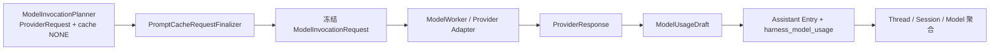

# Prompt Cache、Usage 与 Cost Ledger

本文描述当前提示缓存控制、模型用量归一化、价格快照、不可变账本和聚合 API。一次 Provider 调用使用冻结 `ModelInvocationRequest.providerRequest()` 与 `ProviderResponse` 生成 Assistant Entry 和一条 `harness_model_usage` 记录。

## 1. 端到端链路



事实边界：

1. Planner 先生成包含 `ProviderCacheControl.none()` 的 ProviderRequest。
2. `PromptCacheRequestFinalizer` 是最终 cache control 的唯一生成点，保留 model、variant、messages 和 tools。
3. `ModelInvocationRequest` 同时冻结 ProviderRequest、ToolBinding、SkillBinding 与 YOLO。
4. ModelWorker 只使用冻结 ProviderRequest。
5. `ModelUsageDraft.from(finalRequest, response)` 从最终 request 和 ProviderResponse 生成 ledger facts。
6. Reconciler 在 Assistant Entry、Usage、ToolInvocation 与 head 的同一事务中提交完成事实。

## 2. Prompt Cache

### Capability 与 policy

`PromptCacheCapability` 描述 Provider 的能力：

| capability | 语义 |
| --- | --- |
| `UNKNOWN` / `UNSUPPORTED` | 只使用 `NONE` |
| `AUTOMATIC` | Provider 自动处理缓存 |
| `AFFINITY` | 通过 affinity key 复用前缀 |
| `BREAKPOINTS` | 通过 SYSTEM/TOOLS breakpoint 标记前缀 |

`ProviderCacheControl` 约束：

- `NONE` 没有 affinity key 和 breakpoint；
- 非 `NONE` 必须有非空 affinity key；
- `AFFINITY` 不携带 breakpoint；
- `BREAKPOINTS` 至少携带一个能力允许且实际存在的 breakpoint。

Finalizer 的规则：

| 情况 | 最终 control |
| --- | --- |
| retention 为 `NONE` | `ProviderCacheControl.none()` |
| capability 为 `UNKNOWN`、`UNSUPPORTED` 或 `AUTOMATIC` | `none()` |
| `AFFINITY` | 生成 affinity key |
| `BREAKPOINTS` | capability 与当前 SYSTEM/TOOLS 内容求交集；空交集为 `none()` |

### Affinity key

格式固定为：

```text
pc1-<SHA-256 Base64URL without padding>
```

digest 使用独立长度帧，输入包括：

1. key format version；
2. `sessionId`；
3. `providerName`、`modelName`、`providerType`；
4. 连续 leading SYSTEM messages 的完整 typed content；
5. 请求顺序中的所有 tool definition 的 name、description、input schema。

动态 USER/ASSISTANT/TOOL history 与 sampling 参数不进入 key。独立长度帧允许字段值包含 NUL，避免跨字段拼接歧义。

### Provider 映射

| ProviderType | capability | adapter 形态 | ledger 缓存事实 |
| --- | --- | --- | --- |
| `OPENAI` | `AFFINITY + SHORT` | Chat Completions `prompt_cache_key` | cached input → `cacheReadTokens` |
| `OPENAI_RESPONSES` | `AFFINITY + SHORT` | Responses `promptCacheKey` | cached input → `cacheReadTokens` |
| `ANTHROPIC` | `BREAKPOINTS + SHORT + SYSTEM/TOOLS` | system/tools `cache_control` | creation/read 分别归入 write/read |
| `GOOGLE` | `AUTOMATIC` | 不发送显式 cache control | Provider cached count → `cacheReadTokens` |

## 3. Usage 归一化

`ModelUsage` 包含七个非负 token 字段：

| 字段 | 语义 |
| --- | --- |
| `inputTokens` | 普通输入 token |
| `outputTokens` | 普通输出 token |
| `cacheReadTokens` | 从提示缓存读取 |
| `cacheWriteTokens` | 写入短期缓存 |
| `cacheWriteLongTokens` | 写入长期缓存 |
| `reasoningTokens` | reasoning/thoughts token |
| `providerTotalTokens` | Provider 原样报告的 total |

前六项是互斥计费类别；`providerTotalTokens` 是独立观测值，不由前六项补造。

| Provider | 归一化 |
| --- | --- |
| OpenAI Chat/Responses | cached 从 input 分离，reasoning 从 output 分离 |
| Google Gemini | `cachedContentTokenCount` 从 input 分离，`thoughtsTokenCount` 从 output 分离 |
| Anthropic | input/output 原样；cache creation/read 分别计入 write/read |
| 类型与 typed usage 不匹配 | 使用通用 input/output，其他分类为 0，total 只取 Provider total |

负值、cached 大于 input、reasoning 大于 output 都在归一化边界失败。`rawUsageJson` 只保存 usage metadata；缺失时为 `{}`，且必须是 JSON object 或 array。

## 4. Pricing 与 Cost

`ModelPricing` 是请求使用的不可变价格快照：

```text
currency
pricingTier
serviceTier
serviceTierMultiplier
version
inputPerMillionTokens
outputPerMillionTokens
cacheReadPerMillionTokens
cacheWritePerMillionTokens
cacheWriteLongPerMillionTokens
reasoningPerMillionTokens
```

六个成本分项按：

```text
pricePerMillionTokens * tokens / 1_000_000 * serviceTierMultiplier
```

计算使用 scale 12、`HALF_UP`；`total` 是六个已舍入分项之和。聚合按 currency 分组，不跨币种相加。

## 5. Ledger

`ModelUsageDraft` 保存：

```text
providerName
modelName
providerType
promptCacheMode
promptCacheRetention
cacheEligible
cacheAffinityKey
stopReason
usage
cost
pricing
requestId
reportedServiceTier
rawUsageJson
```

`ModelUsageRecord` 再增加：

```text
id
sessionId
threadId
assistantEntryId
createdAt
```

`harness_model_usage` 以 `assistant_entry_id` 唯一保证每个 Assistant Entry 一条账本。账本持久化 `provider_name`、`model_name`、Provider type、Usage token、cache facts、pricing snapshot 与 metadata；这些名称是历史事实，不随 Catalog 当前内容变化。账本不对 Catalog 建 FK。

成本分项在读取账本时由 `ModelCost.calculate(pricing, usage)` 重建，物理表保存 pricing 与 usage 原子事实。

## 6. 聚合 API

| 范围 | Endpoint | 查询 |
| --- | --- | --- |
| Thread | `GET /api/ai/runtime/threads/{threadId}/snapshot` 的 `usage` 字段 | 当前 head path 上的 Assistant Entry |
| Session | `GET /api/ai/runtime/usage/sessions/{sessionId}` | Session 全部账本 |
| Model | `GET /api/ai/runtime/usage/models?providerName=&modelName=` | 按 `(providerName, modelName)` 查询 |

Model endpoint 通过独立的 `providerName`、`modelName` 查询参数接收复合名称，`modelName`
中的 `/` 按普通查询参数值处理。聚合响应包含：

```text
scopeType
scopeId
recordCount
inputTokens / outputTokens
cacheReadTokens / cacheWriteTokens / cacheWriteLongTokens
reasoningTokens / providerTotalTokens
cacheEligibleRecordCount
cacheHitRecordCount
cacheHitRatio
tokenReadRatio
unamortizedCacheWriteTokens
costs[]
```

`cacheHitRatio`、`tokenReadRatio` 使用 scale 6、`HALF_UP`；空 scope 返回零值与空 costs。不同 affinity key 的 cache write/read 不互相抵消。

## 7. Model config 与运行时解析

Model config 写入时严格校验：

- `limit.context`、`limit.output` 为正整数且 output 不超过 context；
- `abilities.tools`、`abilities.reasoning` 为 boolean；
- `inputModalities` 非空且只包含受支持 enum；
- `variants` 非空、variant id 唯一且命中 `defaultVariant`；
- pricing 字段完整，单价非负，multiplier 为正。

Agent config 的 tools/skills 也在写入时校验。每次 planning 由 `DatabaseTurnExecutionResolver` 重新读取最新 Agent、Provider、Model、Variant 与 READY Environment，并把结果冻结进 ModelInvocationRequest。缺失 Agent、Provider、Model、Variant、Environment、Tool 或 Skill 写入 `ASSISTANT_ERROR`，不创建 Provider 调用。

## 8. 实现与测试入口

| 能力 | 文件 |
| --- | --- |
| Cache affinity | [`PromptCacheAffinityKeyFactory`](../../harness/runtime/src/main/java/fun/fengwk/kkstudio/harness/runtime/cache/PromptCacheAffinityKeyFactory.java) |
| Cache finalizer | [`PromptCacheRequestFinalizer`](../../harness/runtime/src/main/java/fun/fengwk/kkstudio/harness/runtime/cache/PromptCacheRequestFinalizer.java) |
| Request planner | [`ModelInvocationPlanner`](../../harness/runtime/src/main/java/fun/fengwk/kkstudio/harness/runtime/model/plan/ModelInvocationPlanner.java) |
| Usage draft | [`ModelUsageDraft`](../../harness/runtime/src/main/java/fun/fengwk/kkstudio/harness/runtime/usage/ModelUsageDraft.java) |
| Usage store | [`PostgresqlModelUsageRecordStore`](../../core/src/main/java/fun/fengwk/kkstudio/core/ai/runtime/usage/store/PostgresqlModelUsageRecordStore.java) |
| Usage controller | [`StudioModelUsageController`](../../web/src/main/java/fun/fengwk/kkstudio/web/controller/StudioModelUsageController.java) |
| Usage schema | [`V1__schema.sql`](../../core/src/main/resources/db/migration/V1__schema.sql) |
