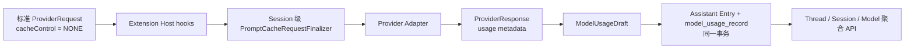

# Prompt Cache、Usage 与 Cost Ledger

本文描述 Harness 当前生效的提示缓存控制、模型用量归一化、成本快照、原子账本和聚合查询方案。一次成功的 Provider 调用以最终 `ProviderRequest` 和完成时 `ProviderResponse` 为输入，生成 Assistant Entry 与一条不可变 `model_usage_record`；聚合层再按 Thread、Session 或 Model 读取账本。

## 端到端链路



链路中的事实边界如下：

1. `DefaultAgentTurnEngine` 先构造 `cacheControl = NONE` 的标准请求。
2. Extension Host 提供的 `BeforeProviderRequestInterceptor` 按注册顺序串行修改请求。
3. `ThreadProcessor` 为当前 Thread 的 Session 在全部 hooks 之后追加绑定 `sessionId` 的 `PromptCacheRequestFinalizer`。
4. Finalizer 覆盖请求中已有的 cache control，Provider Adapter 只接收最终控制结果。
5. Provider 完成后，Turn handler 保留实际发送的最终请求；`ModelUsageDraft.from(...)` 从该请求和响应冻结缓存、模型、用量、成本与 Provider metadata。
6. `HarnessThreadTransactionService` 在 processor token fencing 下将 Assistant Entry、`model_usage_record`、Thread head 与对应 ThreadEvents 原子提交；工具调用路径还在同一事务中写 Tool Invocations。

## Prompt Cache 控制

### Policy、Capability 与最终 Control

`ModelDescriptor.promptCachePolicy` 由 `PromptCacheCapability` 和请求采用的 `PromptCacheRetention` 组成：

- `UNKNOWN`、`UNSUPPORTED`、`AUTOMATIC` 的 capability 不声明 retention 或 breakpoint；`NONE` retention 始终合法。
- `AFFINITY` 至少支持一个非 `NONE` retention，且不声明 breakpoint。
- `BREAKPOINTS` 至少支持一个非 `NONE` retention，并声明 `SYSTEM`、`TOOLS` 中至少一项。

`ProviderCacheControl` 是交给 Adapter 的最终不可变快照：

- retention 为 `NONE` 时，`affinityKey = null` 且 `breakpoints` 为空。
- retention 非 `NONE` 时，`affinityKey` 必须非空白。
- `AFFINITY` control 的 `breakpoints` 为空。
- `BREAKPOINTS` control 至少包含一个 breakpoint。

### Session Finalizer

`PromptCacheRequestFinalizer` 是 Provider request 链上唯一可信的 cache control 生成点。它在所有 hooks 之后执行，并始终覆盖 hook 写入的 control：

| Policy 状态 | 最终 control |
| --- | --- |
| retention 为 `NONE` | `ProviderCacheControl.none()` |
| capability 为 `UNKNOWN`、`UNSUPPORTED`、`AUTOMATIC` | `ProviderCacheControl.none()` |
| `AFFINITY` | 生成 affinity key；即使没有 SYSTEM 消息和 tools 也启用 |
| `BREAKPOINTS` | capability 支持项与当前请求实际内容求交集；交集为空时返回 `none()`，否则生成 key 和 breakpoint 集合 |

`BREAKPOINTS` 的有效范围为：

- `SYSTEM`：请求第一条消息必须是 `SYSTEM`，且 capability 支持 `SYSTEM`。
- `TOOLS`：请求 tools 列表必须非空，且 capability 支持 `TOOLS`。

Finalizer 只替换 `cacheControl`，保留最终 hook 产出的 model、variant、messages 和 tools。

### Affinity Key

Affinity key 格式固定为：

```text
pc1-<SHA-256 Base64URL without padding>
```

SHA-256 编码部分为 43 个 Base64URL 字符。每个 digest 字段都以独立二进制长度帧写入：

```text
type: 1 byte
nameLength: 4-byte big-endian
name: UTF-8 bytes
valueLength: 4-byte big-endian
value: UTF-8 bytes
```

长度帧使字段值可以包含 NUL，且不会因字符串分隔或跨字段拼接产生边界歧义。

Digest 输入按确定顺序包含：

1. key format version。
2. `sessionId`。
3. `providerResourceId`、`modelResourceId`。
4. `providerType`、Provider API 使用的 `modelId`。
5. 从消息索引 0 开始的连续 leading SYSTEM 消息。
6. 请求顺序中的全部 tool definitions。

连续 leading SYSTEM 范围在遇到第一条非 SYSTEM 消息时结束。每条 SYSTEM 消息写入 role、content 数量和每个 typed content 的完整字段；合法内容类型为：

| Content 类型 | 进入 digest 的字段 |
| --- | --- |
| `TEXT` | `text` |
| `IMAGE` | `mediaType`、`source` |
| `AUDIO` | `mediaType`、`source` |
| `VIDEO` | `mediaType`、`source` |
| `THINKING` | `thinking` |
| `JSON` | `json` |

每个 tool definition 写入 `name`、`description`、`inputSchemaJson`，并保留请求中的 tool 顺序。动态 `USER`、`ASSISTANT`、`TOOL` 历史和 sampling 参数不进入 affinity key。

### Provider Capability 与映射

Core 内置 Provider factory 暴露可信的 prompt cache capability；Adapter 对最终 control 再做协议形态校验后映射到 SDK：

| ProviderType | Capability | 最终请求映射 | Usage 中的缓存事实 |
| --- | --- | --- | --- |
| `OPENAI` | `AFFINITY + SHORT` | Chat Completions custom parameter `prompt_cache_key = affinityKey` | cached input 归入 `cacheReadTokens`；cache write 为 0 |
| `OPENAI_RESPONSES` | `AFFINITY + SHORT` | Responses SDK `promptCacheKey(affinityKey)` | cached input 归入 `cacheReadTokens`；cache write 为 0 |
| `ANTHROPIC` | `BREAKPOINTS + SHORT + SYSTEM/TOOLS` | `SYSTEM` 映射为 system `cache_control: {type: ephemeral}`；`TOOLS` 映射为 tools `cache_control: {type: ephemeral}` | `cacheCreationInputTokens` 归入 `cacheWriteTokens`，`cacheReadInputTokens` 归入 `cacheReadTokens` |
| `GOOGLE` | `AUTOMATIC` | 不发送 cached-content resource、cache hint 或显式 control，由 Provider 自动处理 | 只从 usage 读取 `cachedContentTokenCount` 并归入 `cacheReadTokens`；cache write 为 0 |

OpenAI 的非 `NONE` control 必须是 `SHORT` 且 breakpoint 为空。Anthropic 的非 `NONE` control 必须是 `SHORT` 且至少包含 `SYSTEM` 或 `TOOLS`。Google Adapter 忽略 control，finalizer 对 `AUTOMATIC` policy 输出 `NONE`，账本仍将该调用标记为 cache eligible，以便统计 Provider 自动报告的缓存读取。

## ModelUsage 与 Provider Usage 归一化

### 七类用量

`ModelUsage` 包含七个非负 token 字段：

| 字段 | 语义 |
| --- | --- |
| `inputTokens` | 扣除独立 cache 类别后计费的输入 token |
| `outputTokens` | 扣除独立 reasoning 类别后计费的输出 token |
| `cacheReadTokens` | 从提示缓存读取的 token |
| `cacheWriteTokens` | 写入短期提示缓存的 token |
| `cacheWriteLongTokens` | 写入长期提示缓存的 token |
| `reasoningTokens` | 独立计费的 reasoning/thoughts token |
| `providerTotalTokens` | Provider 或 SDK 原样报告的 total token |

前六项是互斥计费类别，`categorizedTokens()` 使用 `Math.addExact` 汇总。`providerTotalTokens` 是独立观测值，`totalTokens()` 原样返回该字段；当 Provider 没有报告 total 时为 0，不使用前六项求和补造 total。

### Provider 归一化规则

| Provider | 归一化规则 |
| --- | --- |
| OpenAI Chat / Responses | `inputTokens = input - cached`；`outputTokens = output - reasoning`；cached 和 reasoning 分别进入独立类别；`providerTotalTokens` 只取 SDK total |
| Google Gemini | `inputTokens = input - cachedContentTokenCount`；`outputTokens = output - thoughtsTokenCount`；cached 进入 `cacheReadTokens`，thoughts 进入 `reasoningTokens`；total 只取 SDK total |
| Anthropic | input/output 原样保留；cache creation 进入 `cacheWriteTokens`；cache read 进入 `cacheReadTokens`；`cacheWriteLongTokens`、`reasoningTokens`、`providerTotalTokens` 为 0 |
| Provider 类型与 typed usage 不匹配 | 使用通用 `TokenUsage`：input/output 原样，其余五个计费类别为 0，total 只取 SDK total |

SDK 负值、cached 大于 input、reasoning/thoughts 大于 output 都在归一化边界失败。

### Raw Usage 边界

`rawUsageJson` 只保存 usage metadata，必须是 JSON object 或 array；无 usage 时规范化为 `{}`。它不保存 prompt、响应正文、choices、content blocks 或 OpenAI Responses 的完整 output。

- OpenAI Chat 与 Anthropic：从 SSE JSON 中递归提取名为 `usage` 的 object/array。一个节点直接保存，多个节点保存为 array；无节点时按 Provider API 字段名从 typed usage 生成 fallback。
- OpenAI Responses：只序列化 `rawResponse().usage()`；缺失时使用 typed usage fallback。
- Google：按 `promptTokenCount`、`candidatesTokenCount`、`cachedContentTokenCount`、`thoughtsTokenCount`、`totalTokenCount` 生成 usage object。

`requestId` 来自 response metadata id，空白转为 `null`。`reportedServiceTier` 只从 OpenAI Chat/Responses typed metadata 读取，其他 Provider 为 `null`。

## ModelPricing 与 ModelCost

### Pricing Snapshot

`ModelPricing` 是一次请求实际生效的不可变价格快照，包含：

- `currency`
- `pricingTier`
- `serviceTier`
- `serviceTierMultiplier`
- `version`
- 六类每百万 token 单价：`inputPerMillionTokens`、`outputPerMillionTokens`、`cacheReadPerMillionTokens`、`cacheWritePerMillionTokens`、`cacheWriteLongPerMillionTokens`、`reasoningPerMillionTokens`

币种、tier、service tier 和 version 必须非空白；multiplier 必须大于 0；所有单价必须非负。

### 六分项成本

`ModelCost` 包含 `currency`、六个分项和 `total`：

```text
input, output, cacheRead, cacheWrite, cacheWriteLong, reasoning
```

每个分项独立计算：

```text
pricePerMillionTokens * tokens / 1_000_000 * serviceTierMultiplier
```

计算规则为：

1. 除以一百万时使用 scale 12、`HALF_UP`。
2. 乘 `serviceTierMultiplier` 后再次使用 scale 12、`HALF_UP`。
3. `total` 是六个已舍入分项之和，并规范化为 scale 12、`HALF_UP`。
4. `ModelCost` 构造时要求 `total` 与六分项之和按数值相等。
5. cost currency 从 pricing currency 复制；`ModelUsageDraft` 再校验两者相等，并重新计算成本核对全部分项。

聚合时成本按 currency 分组，币种之间不相加；`costs[]` 按币种字符串稳定排序。

## Ledger 模型与原子提交

### ModelUsageDraft

`ModelUsageDraft` 冻结一次成功 Provider 完成的全部账本事实：

```text
providerResourceId, modelResourceId, providerType, providerModelId,
promptCacheMode, promptCacheRetention, cacheEligible, cacheAffinityKey,
stopReason, usage, cost, pricing,
requestId, reportedServiceTier, rawUsageJson
```

`cacheEligible` 的精确规则是：

```text
mode == AUTOMATIC
or
mode in {AFFINITY, BREAKPOINTS} and retention != NONE
```

Draft 从最终 `ProviderRequest` 读取 model、cache mode、最终 retention 和 affinity key，从 `ProviderResponse` 读取 stop reason、usage、cost 和 Provider metadata。

### ModelUsageRecord 与 Assistant Entry

`ModelUsageRecord` 在 Draft 外增加：

```text
id, sessionId, threadId, assistantEntryId, createdAt
```

Assistant Entry 的 `AssistantMessageMetadata` 同时保存 `stopReason`、`ModelUsage` 和 `ModelCost`。Assistant metadata 必须且只能出现在 ASSISTANT message 中；账本通过 `assistantEntryId` 与该 Entry 一一关联。

无工具完成路径与工具准备路径都由 `HarnessThreadTransactionService` 的事务方法提交：

```text
lock Thread and verify processor token
-> append Assistant Entry
-> insert model_usage_record with the same assistantEntryId
-> optional: insert Tool Invocations
-> advance Thread head with processor fencing
-> append terminal ThreadEvents
```

原子性规则：

- Thread 不存在或 `processorToken` 不匹配时，方法返回 `false`，不写 Assistant Entry、账本或 Invocation。
- Assistant Entry 和账本先写入；若 Thread head fencing advance 失败，抛出 `ConcurrentModificationException` 并回滚整个事务，禁止留下孤儿 Entry 或账本。
- 工具准备路径中的 Invocation 唯一键冲突，同样回滚 Assistant Entry、账本、Invocation、head 与 ThreadEvents。
- Provider 调用属于外部 at-least-once 边界；持久提交以 processor token、唯一 `assistant_entry_id` 和 Invocation 唯一键阻止同一成功事实重复落库。

账本由数据库唯一键保证每个成功完成事实只写一次：

- `unique (assistant_entry_id)`

## `model_usage_record` Schema

生产 H2 与 MySQL schema 包含同一组字段。除 `cache_affinity_key`、`request_id`、`reported_service_tier` 外，其余业务字段均为 `NOT NULL`。

| 分组 | 字段 | H2 类型 | MySQL 类型 |
| --- | --- | --- | --- |
| 标识 | `id` | `bigint` | `bigint` |
| 归属 | `session_id` | `bigint` | `bigint` |
| 归属 | `thread_id` | `bigint` | `bigint` |
| 归属 | `assistant_entry_id` | `bigint` | `bigint` |
| Provider | `provider_resource_id` | `bigint` | `bigint` |
| Model | `model_resource_id` | `bigint` | `bigint` |
| Provider | `provider_type` | `varchar(64)` | `varchar(64)` |
| Model | `provider_model_id` | `varchar(256)` | `varchar(256)` |
| Cache | `prompt_cache_mode` | `varchar(32)` | `varchar(32)` |
| Cache | `prompt_cache_retention` | `varchar(16)` | `varchar(16)` |
| Cache | `cache_eligible` | `boolean` | `tinyint(1)` |
| Cache | `cache_affinity_key` | `varchar(512) null` | `varchar(512) null` |
| 完成 | `stop_reason` | `varchar(32)` | `varchar(32)` |
| Usage | `usage_input_tokens` | `bigint` | `bigint` |
| Usage | `usage_output_tokens` | `bigint` | `bigint` |
| Usage | `usage_cache_read_tokens` | `bigint` | `bigint` |
| Usage | `usage_cache_write_tokens` | `bigint` | `bigint` |
| Usage | `usage_cache_write_long_tokens` | `bigint` | `bigint` |
| Usage | `usage_reasoning_tokens` | `bigint` | `bigint` |
| Usage | `usage_provider_total_tokens` | `bigint` | `bigint` |
| Cost | `cost_currency` | `varchar(16)` | `varchar(16)` |
| Cost | `cost_input` | `numeric(32,12)` | `decimal(32,12)` |
| Cost | `cost_output` | `numeric(32,12)` | `decimal(32,12)` |
| Cost | `cost_cache_read` | `numeric(32,12)` | `decimal(32,12)` |
| Cost | `cost_cache_write` | `numeric(32,12)` | `decimal(32,12)` |
| Cost | `cost_cache_write_long` | `numeric(32,12)` | `decimal(32,12)` |
| Cost | `cost_reasoning` | `numeric(32,12)` | `decimal(32,12)` |
| Cost | `cost_total` | `numeric(32,12)` | `decimal(32,12)` |
| Pricing | `pricing_currency` | `varchar(16)` | `varchar(16)` |
| Pricing | `pricing_tier` | `varchar(64)` | `varchar(64)` |
| Pricing | `pricing_service_tier` | `varchar(64)` | `varchar(64)` |
| Pricing | `pricing_service_tier_multiplier` | `numeric(32,12)` | `decimal(32,12)` |
| Pricing | `pricing_version` | `varchar(64)` | `varchar(64)` |
| Pricing | `pricing_input_per_million_tokens` | `numeric(32,12)` | `decimal(32,12)` |
| Pricing | `pricing_output_per_million_tokens` | `numeric(32,12)` | `decimal(32,12)` |
| Pricing | `pricing_cache_read_per_million_tokens` | `numeric(32,12)` | `decimal(32,12)` |
| Pricing | `pricing_cache_write_per_million_tokens` | `numeric(32,12)` | `decimal(32,12)` |
| Pricing | `pricing_cache_write_long_per_million_tokens` | `numeric(32,12)` | `decimal(32,12)` |
| Pricing | `pricing_reasoning_per_million_tokens` | `numeric(32,12)` | `decimal(32,12)` |
| Provider metadata | `request_id` | `varchar(256) null` | `varchar(256) null` |
| Provider metadata | `reported_service_tier` | `varchar(64) null` | `varchar(64) null` |
| Provider metadata | `raw_usage_json` | `clob` | `longtext` |
| 时间 | `gmt_create` | `timestamp(3)` | `datetime(3)` |

约束与查询索引：

```text
primary key (id)
unique (assistant_entry_id)
index (thread_id, id)
index (session_id, id)
index (model_resource_id, id)
```

MySQL 中对应名称为：

```text
uk_model_usage_record_assistant_entry
idx_model_usage_record_thread
idx_model_usage_record_session
idx_model_usage_record_model
```

H2 使用 `numeric(32,12)`、`clob`、`timestamp(3)`；MySQL 使用 `decimal(32,12)`、`longtext`、`datetime(3)`，表引擎为 InnoDB，字符集为 utf8mb4。

## 聚合 API 与指标

### Endpoint

三个查询都接受正 `long` 路径参数并返回 `Result<ModelUsageSummaryDTO>`：

| Scope | Endpoint | Store 查询 | `scopeType` |
| --- | --- | --- | --- |
| Thread | `GET /api/usage/threads/{threadId}` | `listByThreadId` | `thread` |
| Session | `GET /api/usage/sessions/{sessionId}` | `listBySessionId` | `session` |
| Model | `GET /api/usage/models/{modelId}` | `listByModelResourceId` | `model` |

`scopeId` 使用十进制字符串返回，以保留超过 JavaScript safe integer 范围的 ID。

### Response

`ModelUsageSummaryDTO` 包含：

```text
scopeType, scopeId, recordCount,
inputTokens, outputTokens, cacheReadTokens,
cacheWriteTokens, cacheWriteLongTokens, reasoningTokens,
providerTotalTokens,
cacheEligibleRecordCount, cacheHitRecordCount,
cacheHitRatio, tokenReadRatio,
unamortizedCacheWriteTokens,
costs
```

`costs[]` 按 currency 隔离，每项包含：

```text
currency, input, output, cacheRead,
cacheWrite, cacheWriteLong, reasoning, total
```

### Ratio 与 Cache Waste

缓存指标只统计 `cacheEligible = true` 的记录。

命中记录数与命中率：

```text
cacheHitRecordCount = count(eligible record where cacheReadTokens > 0)

cacheHitRatio = cacheHitRecordCount / cacheEligibleRecordCount
```

Token 读取率：

```text
tokenReadRatio =
  sum(eligible.cacheReadTokens)
  /
  sum(eligible.inputTokens + eligible.cacheReadTokens)
```

两个 ratio 均使用 scale 6、`HALF_UP`；分母为 0 时返回 `0.000000`。

`unamortizedCacheWriteTokens` 是 token 数量，不是 ratio。计算过程为：

1. eligible 记录按 `cacheAffinityKey` 分桶。
2. `cacheAffinityKey = null` 时，每条记录按自身 record id 形成独立桶。
3. 每个桶计算：

   ```text
   writes = sum(cacheWriteTokens + cacheWriteLongTokens)
   reads = sum(cacheReadTokens)
   unamortized = max(writes - reads, 0)
   ```

4. 汇总所有桶的 `unamortized`。不同 affinity key 的读取不能抵消其他 key 的写入。

所有 token 聚合使用 `Math.addExact`，溢出时失败；空 scope 返回正确的 `scopeType`、字符串 `scopeId`、零 token、`0.000000` ratios 和空 `costs`。

## Executable Model 配置解析

持久 `agent_model.capabilities_json` 与 `config_json` 必须在 mutation 阶段和 Turn 启动时同时验证，确保模型 ID、变体、缓存策略、价格快照和工具绑定都能被 runtime 实际执行。

### 必需字段

`configJson` 必须是合法 JSON object，固定包含：

- `contextWindow` / `maxOutputTokens`：正整数，`maxOutputTokens <= contextWindow`。
- `inputModalities`：非空 `ModelInputModality` 列表，限定为 `TEXT/IMAGE/AUDIO/VIDEO/DOCUMENT`。
- `variants`：非空列表，每项至少包含非空 `name`，可选 `maxOutputTokens/temperature/topP/topK/frequencyPenalty/presencePenalty/stopSequences`，且 `variant.maxOutputTokens <= model.maxOutputTokens`，名称在 list 内唯一。
- `pricing`：`currency/pricingTier/serviceTier/serviceTierMultiplier/version` 全部非空且 `serviceTierMultiplier > 0`；六类每百万 token 单价 `inputPerMillionTokens/outputPerMillionTokens/cacheReadPerMillionTokens/cacheWritePerMillionTokens/cacheWriteLongPerMillionTokens/reasoningPerMillionTokens` 均为非负有限数。

`capabilitiesJson` 是 `ModelCapability` 列表，类型限定为 `TEXT/VISION/AUDIO/TOOLS/THINKING` 并去重。

### 解析失败语义

缺失或类型错误的必要字段、`contextWindow` 小于 `maxOutputTokens`、未知 enum 值、重复变体名、未注册工具等任何不合规输入都会在 `AgentModelMutationFactory`（写入阶段）或 `DatabaseTurnResourceResolver`（Turn 启动阶段）抛出 `IllegalArgumentException`，并阻止 Provider Turn。任何可以写库但不能执行的 `agent_model` 记录都被视为非法，立即失败。

### 模型 CRUD 契约

`AgentModelMutationFactory` 在 create 与 update 路径上先 `runtimeConfigParser.parse(...)` 再 `apply(...)`，使任何 `newModel(...)` 或 `update(...)` 都不可能产生一个不可执行的 `agent_model` 记录；`AgentModelServiceImpl` 在 create/update/delete 失败时把状态机异常转换为 `IllegalStateException`，并保留原 `name/version` 唯一性。

## Resource 解析与进程生命周期

`DatabaseTurnResourceResolver` 从 Thread 运行时配置（当前 AgentDefinition + Thread model/variant）解析 modelId/variant/tools 为 `TurnResources`，并强制 Provider credential/config 来自持久库。

### Provider Factory 调用

解析器只通过 `HarnessExtensionHost.providerFactory(ProviderType)` 拉取可信工厂，并只使用：

- `ProviderFactory.create(credential, configJson)` 构造 `ProviderAdapter`；
- 工厂暴露的 `PromptCacheCapability` 决定 `PromptCachePolicy`，按 ProviderType 固定映射为 OpenAI/Responses 的 `affinityShort`、Anthropic 的 `breakpointsShort`、Google 的 `automatic`。本仓库不向 Google 提交任何 cached-content resource，cache 事实完全由 `ProviderResponse` usage 归一化读取。

注册的 `ProviderFactory` 返回的 `ProviderAdapter` 必须与请求的 `ProviderType` 匹配，否则立即失败；持久 Provider 配置中的 `modelCallTimeoutMillis` 与 `modelCallIdleTimeoutMillis` 必须为正整数，缺失时分别回退为 30 分钟与 120 秒；持久 `baseUrl` 必须非空。

### Tool Binding 解析

Agent 配置中的 `tools` 仅为短名。Turn 时 platform-first：先匹配已注册的非 ENVIRONMENT tool（同名须唯一版本），再回退到所选 READY Environment capability 中的同名 tool 并绑定 `environmentName`。所选 Environment 离线或缺失则明确失败；不支持 `environment:<name>/...` 长名字符串。

### 进程生命周期

`ThreadProcessor` 是由 `ThreadKick` 激活的有界执行器，不是周期 Turn worker：

- input、权限决定、Tool terminal 与 Subagent completion 都在事务提交后 kick 所属 Thread。
- Processor 从数据库获取 `processor_token` / `processor_until`；Provider 调用期间按 lease 的三分之一续租，丢租后先标记 ownership lost，再取消本地 handle 并拒绝后续 delta/callback 提交。
- 每个 Turn 冻结 Provider 的 `modelCallTimeoutMillis` / `modelCallIdleTimeoutMillis`：前者同时作为 SDK 调用 deadline 和 Processor 总时长 watchdog，后者从 Turn 创建开始计时，并由 `onStarted` 与每个 Provider delta 重置。任一 watchdog 到期会先持久化失败，再 best-effort 取消本地 handle。
- Provider 完成后由 `commitFinalAssistant` 或 `prepareTools` 在同一事务中写 Assistant Entry 与账本；token fencing 失败时整笔提交回滚。
- `ThreadRecoveryLifecycle` 只低频 kick expired token、pending input、due/expired Tool 或 head 上待应用 terminal Tool Result；它不是 Usage、Turn 或 Tool 的主轮询器。
- 非 Environment Tool 由 ThreadProcessor 对当前 Thread 调用 `dispatchDueForThread`；Environment Tool 由 daemon gateway 基于 durable Invocation 推进。

## Validation

| 验证目标 | 测试文件 |
| --- | --- |
| 配置解析、缺字段、类型错误、enum 未知、变体重复 | [`AgentModelRuntimeConfigParserTest.java`](../../core/src/test/java/fun/fengwk/kkstudio/core/agent/model/runtime/AgentModelRuntimeConfigParserTest.java) |
| Mutation 拒绝不可执行 JSON、保留/重新校验部分更新 | [`AgentModelMutationFactoryTest.java`](../../core/src/test/java/fun/fengwk/kkstudio/core/agent/model/service/impl/AgentModelMutationFactoryTest.java) |
| Provider timeout 默认、规范化、CRUD、Turn 资源解析与总/idle watchdog | [`AgentProviderConfigurationCodecTest.java`](../../core/src/test/java/fun/fengwk/kkstudio/core/agent/provider/configuration/AgentProviderConfigurationCodecTest.java)、[`AgentProviderMutationFactoryTest.java`](../../core/src/test/java/fun/fengwk/kkstudio/core/agent/provider/service/impl/AgentProviderMutationFactoryTest.java)、[`DatabaseTurnResourceResolverTest.java`](../../core/src/test/java/fun/fengwk/kkstudio/core/harness/thread/resource/DatabaseTurnResourceResolverTest.java)、[`ThreadProcessorIntegrationTest.java`](../../core/src/test/java/fun/fengwk/kkstudio/core/harness/thread/ThreadProcessorIntegrationTest.java) |
| workdir 不能逃逸 environmentRoot、properties 边界 | [`HarnessRuntimePropertiesTest.java`](../../core/src/test/java/fun/fengwk/kkstudio/core/harness/configuration/HarnessRuntimePropertiesTest.java) |
| Thread Turn、lease heartbeat、并发 enqueue、Usage 原子提交与失败语义 | [`ThreadProcessorIntegrationTest.java`](../../core/src/test/java/fun/fengwk/kkstudio/core/harness/thread/ThreadProcessorIntegrationTest.java) |
| Recovery 只选择可恢复 durable work | [`HarnessThreadRecoveryMapperTest.java`](../../core/src/test/java/fun/fengwk/kkstudio/core/harness/thread/store/HarnessThreadRecoveryMapperTest.java)、[`ThreadRecoveryLifecycleTest.java`](../../core/src/test/java/fun/fengwk/kkstudio/core/harness/thread/worker/ThreadRecoveryLifecycleTest.java) |

## 组件与文件地图

| 层次 | 组件 | 文件 |
| --- | --- | --- |
| Cache domain | capability、policy、最终 control | [`PromptCacheCapability.java`](../../harness/model/src/main/java/fun/fengwk/kkstudio/harness/model/cache/PromptCacheCapability.java)、[`PromptCachePolicy.java`](../../harness/model/src/main/java/fun/fengwk/kkstudio/harness/model/cache/PromptCachePolicy.java)、[`ProviderCacheControl.java`](../../harness/model/src/main/java/fun/fengwk/kkstudio/harness/model/cache/ProviderCacheControl.java) |
| Request chain | hook 串行顺序与 final request | [`ProviderRequestInterceptorChain.java`](../../harness/agent/src/main/java/fun/fengwk/kkstudio/harness/agent/extension/ProviderRequestInterceptorChain.java)、[`DefaultAgentTurnEngine.java`](../../harness/agent/src/main/java/fun/fengwk/kkstudio/harness/agent/DefaultAgentTurnEngine.java) |
| Session finalization | ThreadProcessor 追加 finalizer 与 affinity key | [`ThreadProcessor.java`](../../harness/runtime/src/main/java/fun/fengwk/kkstudio/harness/runtime/thread/ThreadProcessor.java)、[`PromptCacheRequestFinalizer.java`](../../harness/runtime/src/main/java/fun/fengwk/kkstudio/harness/runtime/cache/PromptCacheRequestFinalizer.java)、[`PromptCacheAffinityKeyFactory.java`](../../harness/runtime/src/main/java/fun/fengwk/kkstudio/harness/runtime/cache/PromptCacheAffinityKeyFactory.java) |
| Provider capability | Core factory 注册 | [`CoreHarnessExtension.java`](../../core/src/main/java/fun/fengwk/kkstudio/core/harness/extension/CoreHarnessExtension.java)、[`ProviderFactory.java`](../../harness/runtime/src/main/java/fun/fengwk/kkstudio/harness/runtime/extension/ProviderFactory.java) |
| Provider mapping | control 校验与 OpenAI、Anthropic、Google Adapter | [`CacheRequestValidator.java`](../../harness/model/src/main/java/fun/fengwk/kkstudio/harness/model/provider/adapter/CacheRequestValidator.java)、[`OpenAiProviderAdapter.java`](../../harness/model/src/main/java/fun/fengwk/kkstudio/harness/model/provider/adapter/OpenAiProviderAdapter.java)、[`OpenAiResponsesProviderAdapter.java`](../../harness/model/src/main/java/fun/fengwk/kkstudio/harness/model/provider/adapter/OpenAiResponsesProviderAdapter.java)、[`AnthropicProviderAdapter.java`](../../harness/model/src/main/java/fun/fengwk/kkstudio/harness/model/provider/adapter/AnthropicProviderAdapter.java)、[`GoogleProviderAdapter.java`](../../harness/model/src/main/java/fun/fengwk/kkstudio/harness/model/provider/adapter/GoogleProviderAdapter.java) |
| Usage normalization | 七类 usage、metadata、raw usage | [`ProviderUsageNormalizer.java`](../../harness/model/src/main/java/fun/fengwk/kkstudio/harness/model/provider/adapter/ProviderUsageNormalizer.java)、[`ProviderResponse.java`](../../harness/model/src/main/java/fun/fengwk/kkstudio/harness/model/provider/ProviderResponse.java) |
| Pricing/cost | 请求价格与成本快照 | [`ModelUsage.java`](../../harness/model/src/main/java/fun/fengwk/kkstudio/harness/model/ModelUsage.java)、[`ModelPricing.java`](../../harness/model/src/main/java/fun/fengwk/kkstudio/harness/model/ModelPricing.java)、[`ModelCost.java`](../../harness/model/src/main/java/fun/fengwk/kkstudio/harness/model/ModelCost.java) |
| Ledger domain | Assistant metadata、Draft、Record、Store port | [`AssistantMessageMetadata.java`](../../harness/runtime/src/main/java/fun/fengwk/kkstudio/harness/runtime/session/AssistantMessageMetadata.java)、[`MessageEntryPayload.java`](../../harness/runtime/src/main/java/fun/fengwk/kkstudio/harness/runtime/session/MessageEntryPayload.java)、[`ModelUsageDraft.java`](../../harness/runtime/src/main/java/fun/fengwk/kkstudio/harness/runtime/usage/ModelUsageDraft.java)、[`ModelUsageRecord.java`](../../harness/runtime/src/main/java/fun/fengwk/kkstudio/harness/runtime/usage/ModelUsageRecord.java)、[`ModelUsageRecordStore.java`](../../harness/runtime/src/main/java/fun/fengwk/kkstudio/harness/runtime/usage/ModelUsageRecordStore.java) |
| Ledger transaction | Assistant/ledger/invocation/head/events 原子提交 | [`HarnessThreadTransactionService.java`](../../core/src/main/java/fun/fengwk/kkstudio/core/harness/thread/service/HarnessThreadTransactionService.java) |
| Ledger persistence | MyBatis 行映射与 domain 转换 | [`MysqlModelUsageRecordStore.java`](../../core/src/main/java/fun/fengwk/kkstudio/core/harness/usage/store/MysqlModelUsageRecordStore.java)、[`ModelUsageRecordMapper.java`](../../core/src/main/java/fun/fengwk/kkstudio/core/harness/usage/store/mapper/ModelUsageRecordMapper.java)、[`ModelUsageRecordDO.java`](../../core/src/main/java/fun/fengwk/kkstudio/core/harness/usage/store/model/ModelUsageRecordDO.java) |
| Schema | H2 与 MySQL DDL | [`schema-h2.sql`](../../core/src/main/resources/schema-h2.sql)、[`schema-mysql.sql`](../../core/src/main/resources/schema-mysql.sql) |
| Aggregation/API | scope 聚合、指标、Controller、DTO | [`ModelUsageAggregationServiceImpl.java`](../../core/src/main/java/fun/fengwk/kkstudio/core/harness/usage/service/impl/ModelUsageAggregationServiceImpl.java)、[`ModelUsageSummaryAccumulator.java`](../../core/src/main/java/fun/fengwk/kkstudio/core/harness/usage/service/impl/ModelUsageSummaryAccumulator.java)、[`StudioModelUsageController.java`](../../web/src/main/java/fun/fengwk/kkstudio/web/controller/StudioModelUsageController.java)、[`ModelUsageSummaryDTO.java`](../../share/src/main/java/fun/fengwk/kkstudio/share/model/ModelUsageSummaryDTO.java) |
| Frontend contract | 大整数与 decimal 类型边界、Thread/Session/Model API client | [`contracts.ts`](../../frontend/src/shared/api/contracts.ts)、[`harness-service.ts`](../../frontend/src/shared/api/harness-service.ts)、[`agent-service.ts`](../../frontend/src/shared/api/agent-service.ts) |

## 验证面

| 验证目标 | 测试文件 |
| --- | --- |
| Affinity key 格式、输入范围、动态历史排除、NUL 与字段边界 | [`PromptCacheAffinityKeyFactoryTest.java`](../../harness/runtime/src/test/java/fun/fengwk/kkstudio/harness/runtime/cache/PromptCacheAffinityKeyFactoryTest.java) |
| Finalizer 覆盖 hook control、mode/retention、SYSTEM/TOOLS 交集 | [`PromptCacheRequestFinalizerTest.java`](../../harness/runtime/src/test/java/fun/fengwk/kkstudio/harness/runtime/cache/PromptCacheRequestFinalizerTest.java) |
| Hook 后追加 finalizer 的链顺序 | [`ProviderRequestInterceptorChainAndThenTest.java`](../../harness/agent/src/test/java/fun/fengwk/kkstudio/harness/agent/extension/ProviderRequestInterceptorChainAndThenTest.java) |
| Provider capability 与 HTTP cache 字段映射 | [`CoreHarnessExtensionTest.java`](../../core/src/test/java/fun/fengwk/kkstudio/core/harness/extension/CoreHarnessExtensionTest.java)、[`ProviderAdapterContractTest.java`](../../harness/model/src/test/java/fun/fengwk/kkstudio/harness/model/ProviderAdapterContractTest.java) |
| 七类 usage、provider total、raw usage 正文隔离 | [`ProviderUsageNormalizerTest.java`](../../harness/model/src/test/java/fun/fengwk/kkstudio/harness/model/provider/adapter/ProviderUsageNormalizerTest.java) |
| 六分项成本、multiplier、scale 与公共不变量 | [`ModelContractTest.java`](../../harness/model/src/test/java/fun/fengwk/kkstudio/harness/model/ModelContractTest.java)、[`ModelUsageDraftTest.java`](../../harness/runtime/src/test/java/fun/fengwk/kkstudio/harness/runtime/usage/ModelUsageDraftTest.java) |
| Assistant/账本提交、processor fencing、steer-all 消息批次的单次 Provider Turn | [`ThreadProcessorIntegrationTest.java`](../../core/src/test/java/fun/fengwk/kkstudio/core/harness/thread/ThreadProcessorIntegrationTest.java) |
| Record 的 Thread 归属、不变量与正 ID | [`ModelUsageRecordTest.java`](../../harness/runtime/src/test/java/fun/fengwk/kkstudio/harness/runtime/usage/ModelUsageRecordTest.java) |
| 前端 Thread Usage API 路径与十进制字符串 ID | [`harness-service.test.ts`](../../frontend/src/shared/api/harness-service.test.ts)、[`agent-service.test.ts`](../../frontend/src/shared/api/agent-service.test.ts) |
