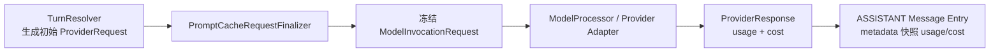

# Prompt Cache 与 Usage/Cost 冻结

本文描述当前的提示缓存控制、usage/cost 归一化与冻结边界。一次 Provider 调用使用冻结 `ModelInvocationRequest.providerRequest()` 与 `ProviderResponse` 生成 Assistant Entry；usage/cost 冻结在 Invocation result 与 Assistant Entry metadata 中，**不存在 usage ledger 表、聚合表或查询 API**。

## 1. 端到端链路



事实边界：

1. Resolver 先生成含 `ProviderCacheControl` 的 ProviderRequest；
2. `PromptCacheRequestFinalizer` 是最终 cache control 的唯一生成点；
3. `ModelInvocationRequest` 冻结 ProviderRequest、route、ToolBinding、SkillBinding 与 YOLO；
4. ModelProcessor 只使用冻结 ProviderRequest；
5. terminal `ProviderResponse` 的 `usage`/`cost` 冻结进 `resultJson`；
6. apply 时由 `HistoryPayloadMapper` 把 `stopReason`、`usage`、`cost` 快照进 ASSISTANT Message Entry 的 `AssistantMessageMetadata`（`turn_usage` 前端 meta 消息展示）。

## 2. Prompt Cache

### 能力与 policy

`PromptCacheCapability(mode, supportedRetentions, supportedBreakpoints)`：

| mode | 语义 |
| --- | --- |
| `UNKNOWN` / `UNSUPPORTED` | 只允许 `NONE`（无缓存控制） |
| `AUTOMATIC` | Provider 自行决定缓存命中；harness 不发送 cache hint，依赖 Provider 报告 cache 用量 |
| `AFFINITY` | harness 通过稳定哈希派生 affinity key，不依赖显式 breakpoint |
| `BREAKPOINTS` | harness 在 system 和/或 tools 上显式打 cache_control 标记 |

`PromptCacheRetention`：`NONE`（唯一对所有 mode 合法）/ `SHORT` / `LONG`。`PromptCacheBreakpoint`：`SYSTEM` / `TOOLS`。

`ProviderCacheControl(retention, affinityKey, breakpoints)` 是派发给 Provider Adapter 的不可变快照：

- `NONE` 时 affinityKey 与 breakpoints 必须为空；
- 非 `NONE` 时 affinityKey 必须非空白；
- `AFFINITY` 不携带 breakpoints；`BREAKPOINTS` 至少携带一个 breakpoint。

Finalizer 的规则：

| 情况 | 最终 control |
| --- | --- |
| retention 为 `NONE` | `ProviderCacheControl.none()` |
| capability 为 `UNKNOWN` / `UNSUPPORTED` / `AUTOMATIC` | `none()` |
| `AFFINITY` | 派生 affinity key |
| `BREAKPOINTS` | capability 与当前 SYSTEM/TOOLS 内容求交集；空交集为 `none()` |

### Affinity key

格式固定为：

```text
pc1-<SHA-256 Base64URL without padding>
```

digest 使用 `(type, nameLen:4B, name, valueLen:4B, value)` 长度前缀帧（字段值可含 NUL，避免跨字段拼接歧义），输入包括 key format version、session 前缀、Model 身份与请求前缀内容（leading system messages、tool definitions 等）。

### Provider 映射

| ProviderType | capability | adapter 形态 |
| --- | --- | --- |
| `OPENAI` | `AFFINITY`（仅 SHORT） | Chat Completions `prompt_cache_key` |
| `OPENAI_RESPONSES` | `AFFINITY`（仅 SHORT） | Responses `promptCacheKey` |
| `ANTHROPIC` | `BREAKPOINTS`（仅 SHORT + SYSTEM/TOOLS） | system/tools `cache_control` |
| `GOOGLE` | `AUTOMATIC` | 不发送显式 cache control；读 Provider cached count |

## 3. Usage 归一化

`ModelUsage` 包含七个非负 token 字段：

| 字段 | 语义 |
| --- | --- |
| `inputTokens` | 普通输入 token |
| `outputTokens` | 普通输出 token |
| `cacheReadTokens` | 从提示缓存读取 |
| `cacheWriteTokens` | 写入短期缓存 |
| `cacheWriteLongTokens` | 写入长期缓存 |
| `reasoningTokens` | reasoning/thoughts token |
| `providerTotalTokens` | Provider 原样报告的 total（独立观测值，不由前六项补造） |

前六项是互斥计费类别；负值在归一化边界失败。`rawUsageJson` 只保存 Provider usage metadata（缺失为 `{}`，必须是 JSON object 或 array）。

## 4. Cost

`ModelCost` 是金额快照：

```text
currency
input / output / cacheRead / cacheWrite / cacheWriteLong / reasoning
total
```

`ModelPricing` 是请求使用的不可变价格快照（单价非负、multiplier 为正），由 Catalog 冻结。成本分项按 `pricePerMillionTokens * tokens / 1_000_000 * serviceTierMultiplier` 计算，scale 12、`HALF_UP`；`total` 是已舍入分项之和。聚合按 currency 分组，不跨币种相加。

## 5. 冻结边界

- terminal `ProviderResponse` 的 `usage`/`cost`/`requestId`/`serviceTier`/`rawUsageJson` 与 `stopReason` 一起写入 `harness_model_invocation.result`；
- apply 时 `HistoryPayloadMapper` 把 `stopReason`、`usage`、`cost` 快照进 ASSISTANT Message Entry 的 `AssistantMessageMetadata`；
- `provider_name`/`model_name` 等身份是写入时冻结的历史事实，不随 Catalog 当前内容变化；
- **不存在** `harness_model_usage` 账本表、usage 聚合 API（`/usage/...`）或 settings API；前端只从 snapshot Entry 的 `turn_usage` meta 读取单次调用的 usage/cost。

## 6. Model config 与运行时解析

Model config 写入时严格校验：`limit.context`/`limit.output` 为正整数且 output 不超过 context；`abilities.tools`/`abilities.reasoning` 为 boolean；`inputModalities` 非空且只包含受支持 enum；`variants` 非空、variant id 唯一且命中 `defaultVariant`；pricing 字段完整、单价非负、multiplier 为正。Agent config 写入时校验可选择 Tool 名与 Skill 字段结构。

每次 turn 由 `DatabaseTurnResolver` 从 `BranchSettings` 重新读取最新 Agent、Provider、Model、Variant、ToolCatalog 与 Environment route，并把结果冻结进 `ModelInvocationRequest`。缺失 Agent/Provider/Model/Variant 或未知可选择 Tool → `ASSISTANT_ERROR` barrier；非 null Environment route 无论 activeTools 都必须存在且 READY，null route 只允许 platform-only 且无 skills 的 turn。违反这些 fail-closed 规则时不创建 Provider 调用。

## 7. 实现与测试入口

| 能力 | 文件 |
| --- | --- |
| Cache affinity | [`PromptCacheAffinityKeyFactory`](../../harness/runtime/src/main/java/fun/fengwk/kkstudio/harness/runtime/cache/PromptCacheAffinityKeyFactory.java) |
| Cache finalizer | [`PromptCacheRequestFinalizer`](../../harness/runtime/src/main/java/fun/fengwk/kkstudio/harness/runtime/cache/PromptCacheRequestFinalizer.java) |
| Cache 类型 | [`ProviderCacheControl`](../../harness/runtime/src/main/java/fun/fengwk/kkstudio/harness/runtime/model/cache/ProviderCacheControl.java) |
| Usage 模型 | [`ModelUsage`](../../harness/runtime/src/main/java/fun/fengwk/kkstudio/harness/runtime/model/ModelUsage.java) |
| Cost 模型 | [`ModelCost`](../../harness/runtime/src/main/java/fun/fengwk/kkstudio/harness/runtime/model/ModelCost.java) |
| Entry metadata | [`HistoryPayloadMapper`](../../harness/runtime/src/main/java/fun/fengwk/kkstudio/harness/runtime/history/HistoryPayloadMapper.java) |
