# Prompt 到 Artifact 数据流

本文描述 Harness 从消息、Chat 可见发送设置和 Thread 当前 Environment 构造 Provider request，到 Tool Result/Artifact 回到 Entry 并在浏览器呈现的事实链。

## 1. 数据流

```mermaid
flowchart LR
    Input[USER/CUSTOM Input<br/>TurnSettings]
    Entry[Session Entry]
    Planner[ModelInvocationPlanner]
    Resolver[DatabaseTurnExecutionResolver]
    Request[Frozen ModelInvocationRequest]
    Model[ModelInvocation]
    Assistant[Assistant Entry + Usage]
    Tool[ToolInvocation<br/>original binding]
    Result[Tool Result]
    Artifact[Artifact Store]
    UI[REST snapshot + SSE]

    Input --> Entry
    Entry --> Planner
    Planner --> Resolver
    Resolver --> Request
    Request --> Model
    Model --> Assistant
    Assistant --> Tool
    Tool --> Result
    Result --> Artifact
    Result --> Entry
    Assistant --> UI
    Tool --> UI
    Artifact --> UI
```



## 2. Input 与 Entry

用户消息通过：

```text
POST /api/ai/runtime/threads/{threadId}/messages
```

自定义 SYSTEM/USER 消息通过：

```text
POST /api/ai/runtime/threads/{threadId}/messages/custom
```

请求携带：

```text
content
agentName
yoloEnabled
clientMessageId
expectedExecutionEpoch
```

服务端先做幂等键短路，再把 payload 写成 `USER_MESSAGE` 或 `CUSTOM_MESSAGE` Input。Reconciler 按 TURN_INPUT_BATCH harvest，Entry 追加与 Input 标记 `APPLIED` 在同一事务完成。

Entry 只允许 `ROOT`、`MESSAGE`、`CUSTOM_MESSAGE`、`ASSISTANT_ERROR`、`ASSISTANT_ABORTED`。USER `MESSAGE` 与 `CUSTOM_MESSAGE` 保存 compact `TurnSettings`；Assistant、Tool result 与错误 Entry 保存各自的语义事实。

## 3. Per-turn Prompt 构建

1. `ModelInvocationPlanner` 从完整 root-to-head path 检测 response debt。
2. 从 debt 前缀中找到最近的 USER/CUSTOM `TurnSettings`。
3. `DatabaseTurnExecutionResolver` 读取最新 Agent、Provider、Model、Variant、ToolCatalog 和 Thread 当前 Environment。
4. Agent 配置中的 Tool 名必须命中可选择目录，未知 Tool 返回 `TOOL_NOT_FOUND`。Platform Tool 总可候选；只有 READY Environment 才贡献 Environment Tool/Skill，配置的 Environment Tool/Skill 与当前能力取交集；null、stale 或 offline Environment 只贡献零 Environment Tool/Skill，不返回 Environment/Skill 缺失错误。
5. Resolver 依据交集结果生成本次 `ToolBinding`、`SkillBinding` 和 system prompt；有 Skill binding 时隐式加入内部 Platform Tool `load_skill`。
6. Planner 投影语义消息、生成 Provider tool definitions，并通过 `PromptCacheRequestFinalizer` 生成最终 cache control。
7. Planner 冻结 `ModelInvocationRequest`：

```text
providerRequest
toolBindings(descriptor, type, environmentName)
skillBindings
yoloEnabled
```

缺失 Agent、Provider、Model、Variant 或未知可选择 Tool 返回 `PlanningFailure`。Reconciler 追加
`ASSISTANT_ERROR` barrier，不创建 ModelInvocation，也不静默使用其他资源；Environment 不可用时只让对应 Environment Tool/Skill 不进入本次 request。

## 4. Model 执行

`harness_model_invocation.request` 保存 exact request。ModelWorker 只回放其中的 `providerRequest`；retry 仍使用同一 invocation request，只改变 attempt 和调度时间。

Provider streaming delta 写入 Redis realtime。Provider terminal 先写 ModelInvocation terminal 并唤醒 Thread；Provider 返回冻结 request 中不可见或未知的 Tool 时，终结为可恢复错误，错误消息包含请求名称和本次可用 Tool 名称，Reconciler 追加 `ASSISTANT_ERROR`，不物化 ToolInvocation。正常 terminal 再由 Reconciler 在 processor fencing 下原子写入 Assistant Entry、Usage、ToolInvocation materialization 与 head。

## 5. Tool 执行与上下文回流

Provider Tool Call 根据冻结 request 的 tool name 找到对应 ToolBinding，按 ordinal 写入 ToolInvocation：

```text
ToolBinding.type == PLATFORM
  -> local Platform Tool

ToolBinding.type == ENVIRONMENT
  -> RemoteTool -> Gateway -> Daemon -> Tool
```

`ToolBinding` 的 descriptor、type 和 `environmentName` 是本次执行的冻结路由；Tool worker 在外部 I/O 前完成 permission boundary。ALLOW 持久化 `ALLOWED` 与最终 descriptor/arguments；ASK 持久化 OPEN Interaction 并等待；DENY 写 `FAILED + DENIED`。用户批准只恢复同一 ToolInvocation 的执行，不重新读取 Agent 或 Environment。

Tool partial 写 Redis realtime；terminal 写 ToolInvocation。当前 Assistant 的全部 Tool sibling terminal 后，Reconciler 按 ordinal 追加 Tool Result `MESSAGE` Entry，推进 head，下一次 planning 只读取持久 Entry。

## 6. Artifact

- 大型 Tool 输出写入不可变 `harness_artifact`，Entry 只保存 artifact ref 与可选 preview。
- Daemon wire 的 bytes 经 Gateway 校验后写入 Artifact Store。
- Artifact 保存 bytes、media type、encoding、size 与 SHA-256。
- `GET /api/ai/runtime/artifacts/{id}` 返回原始 bytes 和有效 media type，并带 `nosniff` 与 sandbox 响应头。
- ComfyUI/S3 使用独立对象存储边界，不复用 Tool Artifact 表。

## 7. 前端投影与恢复

前端先读取 Thread snapshot，再叠加：

```text
path Entries
  + QUEUED USER/CUSTOM inputs
  + Redis realtime text/thinking overlay
```

revision SSE 使用 durable cursor；Redis realtime 没有 SSE id。重连时重新读取 snapshot，从 Redis live edge 接收新 delta。

Tool Result 的 artifact ref 通过 `/api/ai/runtime/artifacts/{artifactId}` 读取。浏览器不复制 Tool Artifact 的 JSON/Base64 内容，也不把 Tool Artifact 重新上传到 S3。

恢复来源始终是 PostgreSQL 的 Entry、Input、Invocation、Interaction、Artifact 与 Usage；daemon connection、worker 和 EventSource 都可以重连或替换。
