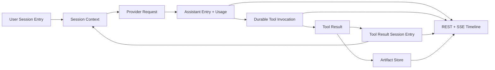

# Prompt 到 Artifact 数据流

本文描述 Harness 从已持久化的对话上下文构造 Provider 请求，到 Tool Result/Artifact 回到 Session Entry 并在浏览器呈现的完整事实链。

## 数据流

## Prompt 构建

1. 用户消息通过 `POST /api/sessions/{id}/messages` 作为 User `MessageEntryPayload` 写入，并在同一事务创建 queued Run。
2. Root Session 的首个 Entry 保存 Agent Snapshot。Session Context 从活动 leaf path 加载 Entry，依次应用 Snapshot、Model Change、Toolset Change 和有效 Compaction，得到不可变 `AgentRuntimeConfig` 与消息列表。
3. Turn Resource Resolver 按该配置解析 Model、Variant、Provider 和冻结 Tool binding；Provider Message Projector 把语义消息投影为 Provider 无关的内容块。
4. `PromptCacheRequestFinalizer` 是 Provider Cache Control 的唯一派生点。它根据冻结模型能力、cache policy、system/tools breakpoint 和 affinity key 生成最终请求。

Provider 流式响应的 delta 只写入 Run Event。Assistant 完成时，完整 Assistant Entry、Model Usage Record 和 terminal/requeue Run Event 在同一稳定事务中写入；Usage Record 冻结 token、cache、价格和成本事实。

## Tool 执行与上下文回流

Provider Tool Call 经过 Tool Binding、interceptor 和 Permission Boundary 后，写为带 tool/version/target/arguments/deadline/permission 的 `tool_invocation`。ASK、YOLO、allow/deny 与 cancel 都是持久状态变化。

Cloud、Control 和 Environment worker 从数据库 claim Invocation。partial Result 写为 `TOOL_DELTA_BATCH` Run Event；terminal Result 写入 Invocation。所有 Invocation terminal 后，协调事务按 assistant 中的 ordinal 顺序物化 Tool Result Session Entry，并将 Run 重新入队。因此下一轮 Provider 请求从持久 Tool Result 而不是 worker 内存读取上下文。

## Artifact 边界

- 大型 Cloud Tool 输出可以外置为全局 Artifact；Session Entry 只保存 `artifactId`、media type 和可选小 preview。
- Environment daemon 的 artifact wire content 包含原始 bytes 的 canonical Base64、media type 和声明大小。Gateway 在持久化前验证 invocation ownership、envelope、payload shape、Base64 canonical 形式、声明/实际长度和配置的最大字节数。
- Artifact Store 保存不可变 bytes、media type、encoding、size 和 SHA-256。ComfyUI/S3 对象走独立的固定 bucket 和预签名边界，不复用 Tool Artifact Store。

`GET /api/artifacts/{id}` 返回原始 artifact bytes 和有效的持久 media type；异常的既有 media metadata 降级为 `application/octet-stream`。响应始终带 `X-Content-Type-Options: nosniff` 与 `Content-Security-Policy: sandbox`，避免工具生成的文档内容取得可执行同源页面能力。

## 前端投影

前端先读取 `HarnessSessionEntryDTO[]` 作为时间线基线，再以 active Run 的 `RunEventDTO[]` 构建尚未物化的 streaming 覆盖层。Run SSE 以 sequence cursor 重放，Root Activity SSE 以 Snowflake eventId 字符串 cursor 重放。

Tool Result 中的 artifact 引用投影为 `/api/artifacts/{artifactId}`。image、audio、video 使用浏览器原生预览；任何其它 media type 都保留为文件占位和原始内容链接。浏览器不接收 Tool Artifact bytes 的 JSON/Base64 副本，也不将 artifact 重新上传到 S3。

## 恢复约束

- 数据库记录是 Prompt、Run、Tool、Artifact、Usage 和 Task 的唯一恢复来源。
- Session Entry 保存完整语义，Run Event 保存实时进度；SSE 断线不改变已提交的事实。
- daemon connection、worker 和 EventSource 可以替换或重连，不能创建内存唯一状态或伪造 terminal Result。
- 事务锁顺序始终为 `Run -> Session -> Root -> Invocation/Task/Control`。
