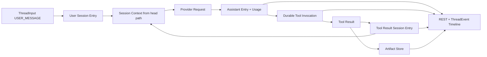

# Prompt 到 Artifact 数据流

本文描述 Harness 从已持久化的对话上下文构造 Provider 请求，到 Tool Result/Artifact 回到 Session Entry 并在浏览器呈现的完整事实链。Studio 资源与 ComfyUI/S3 对象边界保持独立。

## 数据流

## Prompt 构建

1. 用户或自定义消息通过 `POST /api/threads/{threadId}/messages` 写入 `ThreadInput`（202，`clientMessageId` 幂等）。`ThreadProcessor` 在安全边界 Harvest cutoff 内全部 queued Input，按 sequence 物化相应 Entry 并连续推进 head；同批任意数量的消息只形成一次新的 Assistant Turn。
2. Thread 保存当前 agent/model/yolo。Context 消息路径从 Thread `headEntryId` 投影 transcript 与有效 Compaction；运行时配置由 Thread 状态与当前 AgentDefinition 组合（含可选 `environmentName` 与已解析 Skill 元数据），不从 Entry path fold 完整 snapshot。`SessionContextBuilder` 仅在选中 Skill 时追加 pi-base 风格 `<available_skills>`（name/description，不含 body/path）。
3. `TurnResourceResolver` 按当前运行时配置解析 Model、Variant、Provider；Tool 短名 platform-first（已注册非 ENVIRONMENT）再回退到所选 READY Environment。所选 Environment 离线则明确失败，不静默回退。
4. `PromptCacheRequestFinalizer` 绑定 `sessionId`，是 Provider Cache Control 的唯一派生点。

Provider 流式 delta 写入 **ThreadEvent**。Assistant 完成时，完整 Assistant Entry、`model_usage_record`（`sessionId`/`threadId`/`assistantEntryId`）与 terminal ThreadEvent 在同一稳定事务中提交。

## Tool 执行与上下文回流

Provider Tool Call 经 Binding、interceptor 与 Permission Boundary 后写入 `tool_invocation`（归属 `thread_id`）。ASK、YOLO、allow/deny 均为持久状态。

非 Environment 与 Environment Tool 均从数据库 claim Invocation；partial 写为 `tool_delta_batch` ThreadEvent；terminal 写入 Invocation。所属 Thread 上当前 Tool batch 全部终态后，按 ordinal 物化 Tool Result Session Entry 并推进 head。下一轮 Provider 请求只读持久 Entry，不依赖 worker 内存。

## Artifact 边界

- 大型 Cloud Tool 输出可外置为全局 Artifact；Session Entry 只保存 `artifactId`、media type 与可选 preview。
- Environment daemon 的 artifact wire content 经 Gateway 校验 ownership、envelope、Base64 canonical 形式与大小后写入 Artifact Store。
- Artifact Store 保存不可变 bytes、media type、encoding、size、SHA-256。
- ComfyUI/S3 对象走固定 bucket 预签名，**不**复用 Tool Artifact Store。
- Studio `FunctionRun` 与画布资源是独立概念。

`GET /api/artifacts/{id}` 返回原始 bytes 与有效 media type；异常 media 降级为 `application/octet-stream`。响应始终带 `X-Content-Type-Options: nosniff` 与 `Content-Security-Policy: sandbox`。

## 前端投影

前端读取 Thread 路径 `HarnessSessionEntryDTO[]` 为基线，叠加未物化 `USER_MESSAGE` inputs 与 `ThreadEventDTO[]` 覆盖层（`thread-timeline-builder.ts`）。SSE 以全局 `eventId` 字符串 cursor 重放。

Tool Result 中的 artifact 引用投影为 `/api/artifacts/{artifactId}`。image / audio / video 原生预览；其它 media type 保留文件占位与原始链接。浏览器不接收 Tool Artifact 的 JSON/Base64 副本，也不把 artifact 重新上传到 S3。

## 恢复约束

- 数据库记录是 Prompt、Thread、Tool、Artifact、Usage 和 Task 的唯一恢复来源。
- Entry 保存完整语义，ThreadEvent 保存实时进度；SSE 断线不改变已提交事实。
- daemon connection、Processor 与 EventSource 可替换或重连，不能创建内存唯一状态或伪造 terminal Result。
- 事务锁序：非锁 peek → Thread → Invocation/Task。
