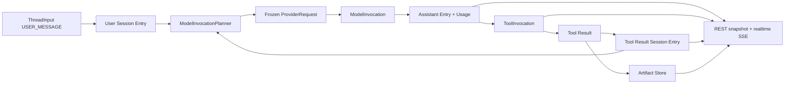

# Prompt 到 Artifact 数据流

本文描述 Harness 从已持久化的对话上下文构造 Provider 请求，到 Tool Result/Artifact 回到 Session Entry 并在浏览器呈现的完整事实链。Studio 资源与 ComfyUI/S3 对象边界保持独立。

## 数据流

## Prompt 构建

1. 用户或自定义消息通过 `POST /api/threads/{threadId}/messages` 写入 `ThreadInput`（202，幂等键）。`ThreadReconciler` 按 TURN_BOUNDARY harvest mailbox，物化 Entry 并推进 head。
2. 有效运行配置来自路径上最近完整 `RUNTIME_CONFIG` Entry，不从 live Definition 补齐历史。`ModelInvocationPlanner` 从 root-to-head path 判定 response debt，投影语义消息、组装 Skill system section 与冻结 Tool definitions，再经 `PromptCacheRequestFinalizer` 得到最终 `ProviderRequest`。
3. Tool 短名 platform-first，再回退所选 READY Environment。Environment 离线则明确失败。
4. Provider 执行只回放冻结请求中的 providerType/providerResourceId/model。

Provider 流式 delta 写入 Redis realtime projection。Assistant 完成时，`ModelWorker` 先把 terminal 写入 `harness_model_invocation` 并标记 Thread runnable；`ThreadReconciler` 再原子提交 Assistant Entry、`harness_model_usage`、可选 ToolInvocations 与 head。

## Tool 执行与上下文回流

Provider Tool Call 经 Binding、interceptor 与 Permission Boundary 后写入 `harness_tool_invocation`。Approval 走 Interaction，不写 Tool 专用 approval 列。

统一 `ToolWorker` 从数据库 claim Invocation：

- `PLATFORM` → 本地 `Tool`
- `ENVIRONMENT` → `RemoteTool` → transport → Daemon → 同一 Tool API

partial 写 Redis realtime；terminal 写 Invocation。当前 Tool batch 全部终态后，Reconciler 按 ordinal 物化 Tool Result Entry 并推进 head。下一轮 Provider 请求只读持久 Entry。

## Artifact 边界

- 大型 Tool 输出可外置为全局 Artifact；Session Entry 只保存 artifact 引用与可选 preview。
- Environment daemon 的 artifact wire content 经 Gateway 校验后写入 Artifact Store。
- Artifact Store 保存不可变 bytes、media type、encoding、size、SHA-256。
- ComfyUI/S3 对象走固定 bucket 预签名，不复用 Tool Artifact Store。
- Studio Canvas 是 Harness / AI 之外独立领域；Artifact 不进入 Canvas domain。

`GET /api/artifacts/{id}` 返回原始 bytes 与有效 media type；异常 media 降级为 `application/octet-stream`。响应带 `X-Content-Type-Options: nosniff` 与 `Content-Security-Policy: sandbox`。

## 前端投影

前端读取 Thread 路径 Entries 为基线，叠加 QUEUED inputs 与 Redis realtime 覆盖层。SSE 事件名 `realtime`，cursor 为 Redis stream-id。

Tool Result 中的 artifact 引用投影为 `/api/artifacts/{artifactId}`。浏览器不接收 Tool Artifact 的 JSON/Base64 副本，也不把 artifact 重新上传到 S3。

## 恢复约束

- 数据库记录是 Prompt、Thread、Tool、Artifact、Usage 的唯一恢复来源。
- Entry 保存完整语义；Redis realtime 保存可丢失进度覆盖层。
- daemon connection、worker 与 EventSource 可替换或重连，不能创建内存唯一状态或伪造 terminal Result。
- 事务锁序：Thread → Invocation/Interaction → Entry/Input。
