# Prompt 到 Resource 数据流

本文描述 Harness 从命令 batch、BranchSettings 到 compact ModelRequestSpec，经 MODEL claim 内 Materializer 重建内存 ProviderRequest，再经 Model/Tool 执行，最终把 Tool Result 的瞬时 `ResourceRef` 摄入全局 Blob，并以 `resource(blobId,name,preview)` 回到 Entry/浏览器的事实链。Runtime 语义见 [harness-runtime-architecture.md](harness-runtime-architecture.md)，Resource 编解码见 [harness-storage-runtime.md](harness-storage-runtime.md)。

## 1. 数据流

```mermaid
flowchart LR
    Command[Commands batch<br/>USER_MESSAGE + SET_*]
    Turn[TurnPlanBuilder<br/>TURN_START + Message]
    Resolver[TurnResolver]
    Spec[compact ModelRequestSpec]
    Mat[ModelRequestMaterializer<br/>MODEL claim 内重建内存请求]
    Request[内存 ProviderRequest]
    Model[ModelInvocation]
    Assistant[ASSISTANT Message Entry<br/>+ usage/cost metadata]
    Tool[ToolInvocation<br/>call + binding]
    Result[Tool Result]
    Effects[Plugin intents<br/>validated ToolEffectBatch]
    Ext[ToolResultExternalizer]
    Inline[Text/Json <= 8KB inline ToolContent]
    Resource[瞬时 ResourceRef<br/>超出阈值 / Binary -> file URI]
    Blob[GlobalStorageToolResultHistoryMaterializer<br/>storage_blob + session ref]
    Durable[durable resource<br/>blobId/name/preview]
    Entry[TOOL Message Entry]
    UI[REST snapshot + 应用事件 WS]

    Command --> Turn
    Turn --> Resolver
    Resolver --> Spec
    Spec --> Model
    Mat --> Request
    Model --> Mat
    Request --> Model
    Model --> Assistant
    Assistant --> Tool
    Tool --> Result
    Tool --> Effects
    Result --> Ext
    Ext --> Inline
    Ext --> Resource
    Inline --> Entry
    Resource --> Blob
    Blob --> Durable
    Durable --> Entry
    Effects --> Entry
    Entry --> UI
    Assistant --> UI
```



说明：**Text/Json 内容 UTF-8 ≤ 8KB 保持 inline ToolContent**；超过阈值或二进制内容先转为瞬时 `ResourceRef`。Tool Result Entry 写入前，资源字节统一摄入 `storage_blob`，durable message 不保存该 URI。

## 2. Command 到 Turn

用户消息与设置通过：

```text
POST /api/ai/runtime/command-batches
```

请求携带 `owner`、`target`（NEW_SESSION / ENTRY / THREAD 三态）与命令数组（每项含 `clientCommandId`）。THREAD target 携带 `expectedHeadEntryId`、`expectedNextCommandSequence`；服务端**幂等查找先于任何 head/sequence/live 检查**：全部 `clientCommandId` 已存在、raw `requestHash` 相同且 sequence 在请求顺序上连续时是 ordered command-set replay——忽略 expected cursors 与 QUEUED/APPLIED/CANCELLED lifecycle，返回原行；部分存在/hash 不同/非连续顺序分别 `PARTIAL_COMMAND_REPLAY` / `COMMAND_ID_REUSED` / `COMMAND_REPLAY_ORDER_MISMATCH`。全新 batch 才做双 cursor CAS（`STALE_COMMAND_CURSOR`）并一次性预留 sequence（200 返回权威 `session/rootEntry/thread/acceptedCommands/replayed`，不代表模型已完成）。

`ThreadProcessor` 收割 queued Commands：

```text
INPUT Turn：消费 cutoff 内完整 queued 快照
  -> 可选 history normalization（synthetic UNKNOWN/HISTORY_CUT ToolResult + CANCELLED TURN_END）
  -> TURN_START(INPUT, 完整 BranchSettings) + 按 sequence 顺序的 USER/CUSTOM Message Entries

CONTINUATION：消费普通配置命令（SET_AGENT/MODEL/ACTIVE_TOOLS）
  -> 保留 SET_ENVIRONMENT（只会在后续 INPUT Turn 完整收割时进入 BranchSettings）
  -> 不产生 Message Entry
```

`USER_MESSAGE` / `CUSTOM_MESSAGE` 之外的 settings 命令不产生 Message Entry；`SET_ENVIRONMENT` 只进入 TURN_START 的 BranchSettings 快照。

## 3. Resolver 冻结 compact spec

`TurnResolver.resolve(threadId, candidatePath, compactionPreparation)` 在事务外同步解析，只读最新 Catalog/Environment 事实（YOLO 不参与 Resolver）：

1. 从 candidate path 前缀的最近 TURN_START `BranchSettings`（**latest-snapshot-wins**：只使用最近一个 ROOT/TURN_START 的完整快照，null/缺失/不可用值绝不向更旧快照回退）读取 `environment` binding、`agentName`、`model`；历史 `activeTools` 不参与新 turn 能力计算；
2. 按 `agentName` 读取最新 Agent；按 Model ref 读取最新 Provider/Model/Variant；
3. 从最新 Agent config 派生 tool set：直接工具按 `config.tools` 顺序绑定；skills 非空时追加内部 `load_skill`；subagents 非空且当前 Session depth 小于 `maxDepth` 时追加内部 `task`。ENVIRONMENT 工具一律按最新 binding 绑定（null/缺失/未 READY 规划不拒绝；实际 start 时不可用 → 确定性 `Rejected`，durable `FAILED` ToolResult 对模型可见）；
4. Agent skills 必须由最新选中且 live 的 Environment 精确提供；subagent allowlist 每个名称必须解析到现存 Agent，名称 + 描述冻结为 `subagentBindings`；
5. 生成 compact `ModelRequestSpec`：

```text
providerType      # Provider 协议类型（随 invocation 冻结；attempt 时当前行 type 必须一致）
model / variant   # 本次调用真正使用的 ModelDescriptor / ModelVariant
preambleMessages  # Resolver 冻结的非历史投影（Agent system prompt、current_environment、skill/subagent prompt、插件 ContextProjector）
toolBindings      # (descriptor, type, environment binding, plugin provenance/access)；Provider tools 由它派生
skillBindings     # 最新 Agent skills（非空时自动派生内部 load_skill）
subagentBindings  # 最新 Agent subagents 的名称 + 描述 allowlist（未达最大深度时）
cacheControl      # Resolver 生成的 compact ProviderCacheControl
```

`ModelRequestSpec` 不携带 compaction metadata：压缩调用由 basis EntryPath 末尾 owned `TURN_START.compaction` / `CompactionStart` 识别，candidate path 冻结在该 TURN_START。

system prompt 由 `AgentPromptComposer` 作为唯一受信任边界集中组合，固定顺序为：Agent 正文（非空时）→ `<current_environment>`（至少有一个有值字段时）→ `available_skills`（skills 非空时）→ `available_subagents`（subagents 非空时，含 task 指令与默认回合预算）。Debug 视图顶部只读预览通过 `GET /api/ai/runtime/threads/{threadId}/system-prompt` 按当前 branch 最新状态现算同一组合；进入 `/debug` 拉一次，turn 开始与结束时各 refetch 一次，使同批设置变更在模型工作期间即可可见。current_environment 只输出有值字段：

```text
<current_environment>
- name: ${name}
- workspace: ${workspace}
- system: ${system}
- date: ${date}
- note: ${note}
</current_environment>
```

所有动态值在进入模板前做 XML escape，日期严格为 `yyyy-MM-dd`；`null` / 空白 / `none` 字段整行省略。`DatabaseTurnResolver` 每次普通解析只读取一次 `clock.instant()`，构造只携带 `EnvironmentBinding`、`DaemonOperatingSystem`、`LocalDate` 与 note 的 `CurrentEnvironmentContext`：

- 未选择 Environment：只输出 date（服务端 Clock zone）；
- 已选择且 registry 条目存在 READY metadata（capabilities 非 null，无论当前 status/heartbeat 是否 ready）：name/workspace 来自 binding，system/note 来自 metadata，日期按 metadata timeZone；
- 已选择但无 metadata：只输出 name/workspace/date，日期回退服务端 Clock zone。

运行状态、workdir、时间与 timeZone 都不进入 Prompt；Tool/Skill 的实时 ready 校验保持独立，因此相同 name/system/date/note 下心跳过期不会改变系统提示词。

Compaction summarizer 走独立最小请求路径，不调用 `AgentPromptComposer`，因此不注入 `<current_environment>`。

缺失 Agent/Provider/Model/Variant/未知 Tool、Environment 不可用、task 无 allowlist/超深度等确定性拒绝共用稳定 `AssistantError` code `PLANNING_FAILED`（message 携带原因）→ `Rejected(AssistantError)`；Processor 写入 `ASSISTANT_ERROR` + `FAILED TURN_END` barrier，不产生 ModelInvocation。临时基础设施失败以异常表达，由 Processor reschedule。

## 4. Model 执行与 usage/cost 冻结

`harness_model_invocation.request` 保存 compact `ModelRequestSpec`（不持久化完整 ProviderRequest）。每次 MODEL attempt 由 `ModelRequestMaterializer` 在有效 claim 内从 `basisHeadEntryId + spec` 重建内存 ProviderRequest（preamble + compaction-aware Entry 历史投影），随后 `ModelProcessor` 两阶段激活（每次 attempt 由 `DatabaseProviderResolutionService` 按 `providerName` 读取当前 `agent_provider` 行构造 attempt-local Provider，见 [harness-capability-wiring.md](harness-capability-wiring.md)）：

- `MODEL_DELTA` 节流持久化 `stream_checkpoint`（attempt-local），**commit 后**才 best-effort 发布 Redis realtime delta；
- retryable `TRANSIENT` 失败把当前 accumulator 的 text/thinking、最后已提交 sequence、error 与 `failedAt/retryAt` 追加到 Invocation `failedAttempts`，清除 checkpoint 并按 retryAt reschedule；每次 retry 从相同 `basisHeadEntryId + spec` 重新 materialize logical request（credential/baseURL/timeout/Resource URL 保持 attempt-time live）；
- terminal `resultJson` 是 canonical `ProviderResponse`：

```text
{ text, thinking, toolCalls, stopReason, usage, cost, requestId, serviceTier, rawUsageJson }
```

- `usage`（`ModelUsage` 七项 token 分类）与 `cost`（`ModelCost` 七项金额）在 terminal 冻结进 `resultJson`，apply 时由 `HistoryPayloadMapper` 快照进 ASSISTANT Message Entry 的 `AssistantMessageMetadata`（stopReason + usage + cost）；
- 最终 apply/Stop 先按 attempt 顺序把 `failedAttempts` 物化为 `MODEL_ATTEMPT_FAILURE`，再写 Assistant/AssistantError/AssistantAborted 与 TURN_END；terminal `ASSISTANT_ERROR` 把 error 与当前 attempt partial 分离。两类失败审计都不投影给 Provider；
- 无 ToolCall 时追加 COMPLETED TURN_END；Provider 返回冻结 spec 中不可见的 Tool 时（unknown，binding 查找失败）由 `ModelResponsePlanner` 物化为带 null binding 的 FAILED ToolInvocation 槽位并反馈模型，不执行该调用。

**无 usage ledger**：usage/cost 只冻结在 Invocation result 与 Assistant Entry metadata 中，不存在 usage 表、聚合表或查询 API。

## 5. Tool 执行与结果外部化

Provider Tool Call 按名称找到冻结 binding，按 ordinal 写入 ToolInvocation：

```text
ToolBinding.type == PLATFORM
  + ToolBinding.plugin == null
    -> CoreToolGateway -> local Platform Tool
  + ToolBinding.plugin != null
    -> CoreToolGateway -> frozen PluginContribution -> PluginTool(BranchView)

ToolBinding.type == ENVIRONMENT
  -> CoreToolGateway -> RemoteToolTransport -> EnvironmentDaemonGateway -> Daemon v3 -> Tool
```

- 外部 I/O 前 `ToolGateway.preflight`：权限判定（Allow/Ask/Deny）与机械校验（未取消/未过期、`name@version` 命中固定目录、arguments 是 JSON object）；plugin Tool 还按 frozen `(pluginId, contributionLocalName)` 恢复贡献并校验 descriptor/state accesses 未漂移；发送结果不确定收敛 `UNKNOWN`，不重放副作用。
- Tool partial 写 Redis realtime（`TOOL_PARTIAL` 永不携带 Resource）。
- plugin Tool 是同步纯函数，只读取 Assistant Entry 对应的冻结 `BranchView` 并返回声明式 intents。Core 只接受 owner 匹配、customType 已注册且 binding 声明 WRITE 的 `AppendCustomEntry`，映射为有序 `ToolEffectBatch`；intent 校验失败在任何 Resource 写入与 durable `SUCCEEDED` 之前终结为 `PLUGIN_CONTRACT_VIOLATION`。
- **瞬时外部化发生在 CoreToolGateway 回调桥**（`ToolResultExternalizer`）：effects 校验通过后的 terminal success 回调 all-or-nothing 处理：

```text
Text/Json 内容 UTF-8 <= 8KB（INLINE_RESULT_UTF8_BYTES） -> 保持 inline ToolContent 编码进 ToolResult JSON
超过阈值或二进制内容 ->
  1) ResourceStore.reference 无副作用计划精确 ResourceRef
  2) 逐项 put 写入
  3) 每次 put 返回的 ref 必须与计划 ref 精确相等（不等即存储契约违反）
```

- `ResourceRef` 是 canonical 严格校验的引用：

```text
uri         # data / file / s3 / https / http 五种 scheme
mediaType   # canonical lowercase type/subtype
name        # 可选，非空非控制字符
size        # 可选，非负
sha256      # 可选，64 位小写 hex
```

- `LocalFileResourceStore` 生成 canonical `file:///` URI（空 authority、无 dot/空 segment、非空 size/sha256）。daemon coding tool 自身可因输出超过 preview 限制（默认 2000 行 / 50KB）或二进制内容先产生 Resource，core 对 Text/Json >8KB 及 Binary 统一再次外部化/透传。
- Tool outcome Entry 写入前，`ToolOutcomeAppender` 在同一 Store 事务调用 `GlobalStorageToolResultHistoryMaterializer`：有界读取 data/file/http/https/s3，摄入 `storage_blob`，通过 `session_blob_ref` retain，并把 durable 内容转换为 `resource(blobId,name,preview)`。任何一步失败时事务整体回滚；没有 materializer 时含 Resource 的成功结果 fail closed。
- ToolProcessor 接收 `ToolSuccess(已外部化 ToolResult, effects)` 并在短事务内做严格 terminal CAS（fire-once、claim ownership 校验），以一次 Store update 原子持久化 `SUCCEEDED + result + effects`，不做存储外部化。
- Model terminal materialize siblings 时按 ordinal 静态检查 plugin state accesses；同一 `(pluginId, customType)` 的 WRITE 后再 READ/WRITE 直接写成 `FAILED(kind=SIBLING_STATE_CONFLICT)`，不 dispatch。
- 全部 Tool siblings terminal 后，`ThreadProcessor` 通过唯一 `ToolOutcomeAppender` 按 ordinal apply：每个成功调用先按 effects 顺序追加 `CUSTOM`，再追加 TOOL `MESSAGE` Entry（inline 内容 + durable `resource(blobId,name,preview)` + ToolResultMetadata），推进 head，并**固定追加 `TURN_END(COMPLETED, continueModel=true)`**、请求 THREAD Work，随后删除全部 Tool siblings 再删除父 ModelInvocation（closed turn 不保留 Invocation 行）；Stop 的 terminal winner 使用同一 appender。

## 6. 前端呈现与恢复

前端先读取 Thread snapshot（entries + queuedCommands + 活跃 Invocation + 尚未物化的 modelAttemptFailures），再叠加：

```text
path Entries
  + snapshot modelAttemptFailures（durable active retry audit）
  + Redis realtime text/thinking/tool partial overlay（非 durable）
  + durable terminal projection（resultJson/errorJson 无条件压过 overlay）
```

Tool Result 的 Resource 呈现：

- durable `resource(blobId,name,preview)` 通过 `/api/storage/blobs/{blobId}/presigned-original|presigned-preview` 在渲染期解析；原件响应携带权威 `mediaType/sizeBytes`，前端不按扩展名猜测；
- preview 保持纯文本视口；预签名 URL 不进入 durable message；
- 瞬时/Invocation URI 引用的兼容 renderer 中，仅 `data:` 自动媒体预览，http/https 只显式直连，file/s3 仅在内容身份完整时走 `GET /api/ai/runtime/resources/{sha256}`，绝不把宿主 URI 直接交给浏览器。

task 委派工具（`rendererKey=task`）的呈现契约：call 阶段叠加 `TOOL_PARTIAL` 心跳（`details.kind=task.status` 完整快照，含扁平 `descendants` 活动子树 relay，前端按规范化快照整帧替换/语义去重），终态展示 `<task id state>` envelope 的 `<task_result>`/`<task_error>`；任意深度子工具的待决审批都按实际子 ThreadId 复用同一 approval 端点。

恢复来源始终是 PostgreSQL 的 Entry/Command/Invocation/Work；daemon connection、processor 进程与事件通道连接都可以重连或替换。
