# Prompt 到 Resource 数据流

本文描述 Harness 从命令 batch、BranchSettings 到冻结 ProviderRequest，经 Model/Tool 执行，最终把 Tool Result 外部化为 durable ResourceRef 并回到 Entry/浏览器的事实链。Runtime 语义见 [harness-runtime-architecture.md](harness-runtime-architecture.md)，Resource 编解码见 [harness-storage-runtime.md](harness-storage-runtime.md)。

## 1. 数据流

```mermaid
flowchart LR
    Command[Commands batch<br/>USER_MESSAGE + SET_*]
    Turn[TurnPlanBuilder<br/>TURN_START + Message]
    Resolver[TurnResolver]
    Request[Frozen ModelInvocationRequest]
    Model[ModelInvocation]
    Assistant[ASSISTANT Message Entry<br/>+ usage/cost metadata]
    Tool[ToolInvocation<br/>frozen binding]
    Result[Tool Result]
    Ext[ToolResultExternalizer]
    Inline[Text/Json <= 8KB inline ToolContent]
    Resource[ResourceRef<br/>超出阈值 / Binary -> file URI]
    Entry[TOOL Message Entry]
    UI[REST snapshot + SSE]

    Command --> Turn
    Turn --> Resolver
    Resolver --> Request
    Request --> Model
    Model --> Assistant
    Assistant --> Tool
    Tool --> Result
    Result --> Ext
    Ext --> Inline
    Ext --> Resource
    Inline --> Entry
    Resource --> Entry
    Entry --> UI
    Assistant --> UI
```



说明：**Text/Json 内容 UTF-8 ≤ 8KB 保持 inline ToolContent**（不是 ResourceRef）；只有超过阈值或二进制内容才转为 `ResourceRef`（外部 `file:` URI）。

## 2. Command 到 Turn

用户消息与设置通过：

```text
POST /api/ai/runtime/threads/{threadId}/commands
```

请求携带 `expectedHeadEntryId`、`expectedNextCommandSequence` 与命令数组（每项含 `clientCommandId`）。服务端**幂等查找先于任何 head/sequence/live 检查**：全部 `clientCommandId` 已存在且 payload 相同、sequence 在请求顺序上连续时是 ordered command-set replay——忽略 expected cursors 与 QUEUED/APPLIED/CANCELLED lifecycle，返回原行；部分存在/不同 payload/非连续顺序分别 `PARTIAL_COMMAND_REPLAY` / `COMMAND_ID_REUSED` / `COMMAND_REPLAY_ORDER_MISMATCH`。全新 batch 才做双 cursor CAS（`STALE_COMMAND_CURSOR`）并一次性预留 sequence（202 表示已接受，不代表模型已完成）。

`ThreadProcessor` 收割 queued Commands：

```text
INPUT Turn：消费 cutoff 内完整 queued 快照
  -> 可选 history normalization（synthetic UNKNOWN/HISTORY_CUT ToolResult + CANCELLED TURN_END）
  -> TURN_START(INPUT, 完整 BranchSettings) + 按 sequence 顺序的 USER/CUSTOM Message Entries

CONTINUATION：消费普通配置命令（SET_AGENT/MODEL/THINKING/ACTIVE_TOOLS/YOLO）
  -> 保留 SET_ENVIRONMENT（只会在后续 INPUT Turn 完整收割时进入 BranchSettings）
  -> 不产生 Message Entry
```

`USER_MESSAGE` / `CUSTOM_MESSAGE` 之外的 settings 命令不产生 Message Entry；`SET_ENVIRONMENT` 只进入 TURN_START 的 BranchSettings 快照。

## 3. Resolver 冻结请求

`TurnResolver.resolve(threadId, candidatePath, yoloEnabled)` 在事务外同步解析，只读最新 Catalog/Environment 事实：

1. 从 candidate path 前缀的最近 TURN_START `BranchSettings` 读取 `environmentId`、`agentName`、`model`、`thinkingLevel`、`activeTools`；
2. 按 `agentName` 读取最新 Agent；按 Model ref 读取最新 Provider/Model/Variant；
3. 按 `activeTools` 与 `environmentId` 构造 tool set（fail closed）：**非 null `environmentId` 无论 activeTools 内容都必须 registry 命中且 READY**（`environment not found` / `environment is not ready` 拒绝）；**null `environmentId` 只允许 platform-only 且无 skills 的 turn**——任何 ENVIRONMENT tool（`environment tool requires a selected environment: <name>`）或 Agent skill（`agent skills require a selected environment`）确定性拒绝，绝不静默省略；Agent skills 只从 Agent config 读取、由选中 READY Environment 精确提供、且 `activeTools` 必须显式包含内部 `load_skill`；
4. 生成 `ModelInvocationRequest`：

```text
environmentId      # 本请求的单一 Environment route（可 null）
providerRequest    # exact Provider transport payload（model/variant/messages/tools/cacheControl）
toolBindings       # (descriptor, type, environmentId) 与 providerRequest.tools 一一对应
skillBindings      # 选中 skill（必须显式选中 load_skill，非隐式追加）
yoloEnabled        # 冻结运行时策略
```

缺失 Agent/Provider/Model/Variant/未知 Tool、Environment 不可用等确定性拒绝共用稳定 `AssistantError` code `PLANNING_FAILED`（message 携带原因）→ `Rejected(AssistantError)`；Processor 写入 `ASSISTANT_ERROR` + `FAILED TURN_END` barrier，不产生 ModelInvocation。临时基础设施失败以异常表达，由 Processor reschedule。

## 4. Model 执行与 usage/cost 冻结

`harness_model_invocation.request` 保存 exact 冻结请求。`ModelProcessor` 两阶段激活后（每次 attempt 由 `DatabaseProviderResolutionService` 按 `providerName` 读取当前 `agent_provider` 行构造 attempt-local Provider，见 [harness-capability-wiring.md](harness-capability-wiring.md)）：

- `MODEL_DELTA` 节流持久化 `stream_checkpoint`（attempt-local），**commit 后**才 best-effort 发布 Redis realtime delta；
- terminal `resultJson` 是 canonical `ProviderResponse`：

```text
{ text, thinking, toolCalls, stopReason, usage, cost, requestId, serviceTier, rawUsageJson }
```

- `usage`（`ModelUsage` 七项 token 分类）与 `cost`（`ModelCost` 七项金额）在 terminal 冻结进 `resultJson`，apply 时由 `HistoryPayloadMapper` 快照进 ASSISTANT Message Entry 的 `AssistantMessageMetadata`（stopReason + usage + cost）；
- 无 ToolCall 时追加 COMPLETED TURN_END；Provider 返回冻结 request 中不可见的 Tool 时终结为可恢复错误（`ASSISTANT_ERROR` 含请求名称与可用 Tool 名称），不物化 ToolInvocation。

**无 usage ledger**：usage/cost 只冻结在 Invocation result 与 Assistant Entry metadata 中，不存在 usage 表、聚合表或查询 API。

## 5. Tool 执行与结果外部化

Provider Tool Call 按名称找到冻结 binding，按 ordinal 写入 ToolInvocation：

```text
ToolBinding.type == PLATFORM
  -> CoreToolGateway -> local Platform Tool

ToolBinding.type == ENVIRONMENT
  -> CoreToolGateway -> RemoteToolTransport -> EnvironmentDaemonGateway -> Daemon v2 -> Tool
```

- 外部 I/O 前 `ToolGateway.preflight`：权限判定（Allow/Ask/Deny）与机械校验（未取消/未过期、`name@version` 命中固定目录、arguments 是 JSON object）；发送结果不确定收敛 `UNKNOWN`，不重放副作用。
- Tool partial 写 Redis realtime（`TOOL_PARTIAL` 永不携带 Resource）。
- **durable 外部化发生在 CoreToolGateway 回调桥**（`ToolResultExternalizer`）：terminal success 回调 all-or-nothing 处理：

```text
Text/Json 内容 UTF-8 <= 8KB（INLINE_RESULT_UTF8_BYTES） -> 保持 inline ToolContent 编码进 ToolResult JSON
超过阈值或二进制内容 ->
  1) ResourceStore.reference 无副作用计划精确 ResourceRef
  2) 逐项 put 写入
  3) 每次 put 返回的 ref 必须与计划 ref 精确相等（不等即存储契约违反）
```

- `ResourceRef` 是 canonical 严格校验的引用：

```text
uri         # data / file / s3 / https / http 五种 scheme
mediaType   # canonical lowercase type/subtype
name        # 可选，非空非控制字符
size        # 可选，非负
sha256      # 可选，64 位小写 hex
```

- `LocalFileResourceStore` 生成 canonical `file:///` URI（空 authority、无 dot/空 segment、非空 size/sha256）；**PostgreSQL 不存 BLOB**——durable 表只保存 ResourceRef JSON 与可选文本 preview。daemon coding tool 自身可因输出超过 preview 限制（默认 2000 行 / 50KB）或二进制内容先产生 Resource（daemon 侧 store），core 对 Text/Json >8KB 及 Binary 统一再次外部化/透传。
- ToolProcessor 接收已外部化的 terminal ToolResult 并在短事务内做严格 terminal CAS（fire-once、claim ownership 校验），不做存储外部化。
- 全部 Tool siblings terminal 后，`ThreadProcessor` 按 ordinal 追加 TOOL `MESSAGE` Entry（Tool Result 内容 + ResourceRef 列表 + ToolResultMetadata），推进 head，并**固定追加 `TURN_END(COMPLETED, continueModel=true)`**，随后 classifier 进入 CONTINUATION_DUE 启动下一轮 Model continuation（不是普通结束）。

## 6. 前端呈现与恢复

前端先读取 Thread snapshot（entries + queuedCommands + 活跃 Invocation），再叠加：

```text
path Entries
  + Redis realtime text/thinking/tool partial overlay（非 durable）
  + durable terminal projection（resultJson/errorJson 无条件压过 overlay）
```

Tool Result 的 Resource 呈现：

- **仅 `data:` URI** 自动媒体预览；http/https/file/s3 只展示稳定 URI 文本 + 显式 `rel="noopener noreferrer"` 链接；
- preview 保持 `<pre>` 文本块；
- 允许的 scheme 集合固定为 data/file/s3/http/https，未知 scheme 不渲染链接。

恢复来源始终是 PostgreSQL 的 Entry/Command/Invocation/Work；daemon connection、processor 进程与 EventSource 都可以重连或替换。
