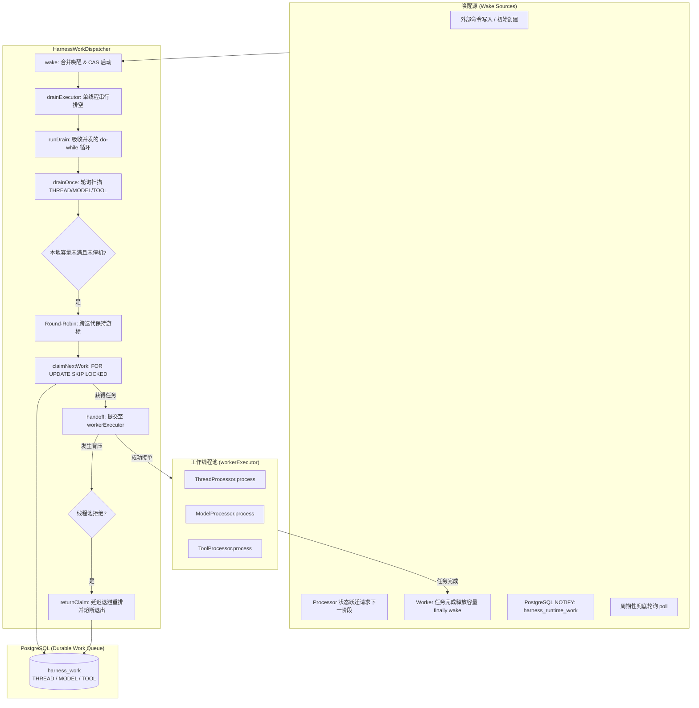

# Harness Infra 调度器架构设计 (HarnessWorkDispatcher)

`HarnessWorkDispatcher` 位于 `harness-infra` 模块（包路径 `fun.fengwk.kkstudio.harness.infra.dispatch`），是驱动 Durable Agent 运行时的后台并发调度引擎与物理马达。

---

## 1. 定位与设计原则

- **物理马达，业务无感知（Zero Business Knowledge）**：
  调度器本身完全不理解 Agent、Session、Entry、Prompt 或模型调用的业务含义。它仅负责从 PostgreSQL 的 `harness_work` 任务表中领取（Claim）到期任务，并以有界并发安全交接（Handoff）给对应的 Processor（`ThreadProcessor`、`ModelProcessor`、`ToolProcessor`）。
- **状态机、调度协议与进程装配分层**：
  - `harness-runtime` 定义领域状态机、Processor 与 Store/外部能力端口；
  - `harness-infra` 实现 PostgreSQL claim/lease 协议与 `HarnessWorkDispatcher`；
  - `web` 组合根创建并持有实际的 drain/worker/poll executor，再注入 Dispatcher。
- **无本地任务囤积（No Local Task Hoarding）**：
  绝不一次性拉取大量任务到本地内存排队，严格按本地可用并发预算按需 Claim，避免因本地排队过长导致数据库租约超时引发其他节点错误抢占。

---

## 2. 总体分发流转图

---

## 3. 核心机制详解

### 3.1 排空循环机制（Drain Loop）

Dispatcher 不采用“收到一次唤醒就仅拉取一个任务”的低效模式，而是采用**事件合并排空（Coalesced Drain）**：

1. **唤醒合并与防抖（`wake()`）**：
   - 无论短时间内涌入多少次唤醒调用，通过 `wakeRequested.set(true)` 汇聚为一个请求标记；
   - 通过 `drainRunning.compareAndSet(false, true)` 保证同一时刻全局仅有一个 Drain 任务在单线程池 `drainExecutor` 中运行。
2. **并发吸收循环（`runDrain()`）**：
   - 使用 `do { wakeRequested.set(false); drainOnce(); } while (wakeRequested.get());` 结构；
   - 排空期间若有新任务到达再次触发 `wake()`，当前 Drain 线程在退出前会自动重新执行下一轮 `drainOnce()`，无需创建额外线程。
3. **尾随防丢防护**：
   - 在 `finally` 块中复核 `wakeRequested`，若在重置状态的竞态窗口内有新唤醒到达，重新发起提交，杜绝通知丢失。

### 3.2 批量扫描与背压控制（`drainOnce()`）

- **双重准入检查**：
  循环条件严格要求 `!stopped && dispatchCapacity.get() < maxDispatchTasks`。
  - 本地承载达到上限时立即停手，不抢占任何多余任务；
  - 每个任务被工作线程池接受时原子递增 `dispatchCapacity`，工作结束在 `finally` 中原子递减并再次反向触发 `wake()`。
- **全队列判空收敛（`consecutiveEmpty`）**：
  - 调度器目标包含 `THREAD`、`MODEL`、`TOOL` 三类；
  - 只有当三类任务在单次扫描中**连续全部返回空**时（`consecutiveEmpty == 3`），才判定当前节点没有可领取的到期任务，退出本次扫描。

### 3.3 公平轮询调度（Fair Round-Robin）

- 维护实例级游标 `roundRobinCursor`：
  $$\text{THREAD} \longrightarrow \text{MODEL} \longrightarrow \text{TOOL} \longrightarrow \text{THREAD}$$
- **跨扫描周期持久保持**：即使在极端受限的 `maxDispatchTasks = 1` 场景下，每次 Drain 只取一个任务就退出，下一次 Drain 启动时依然会从下一个目标类型开始，彻底防止高频提交的命令把调度权完全霸占而导致模型或工具任务饥饿。

### 3.4 分布式租约与环境亲和抢占协议

- **短事务抢占**：
  `claimNextWork` 在单个短事务内通过 `FOR UPDATE SKIP LOCKED` 选择并更新一条 `harness_work`，写入当前 `lease_token`（UUID）与到期时间戳 `lease_until`；该路径不持有 Thread 或 Invocation 锁。
- **环境路由绑定（Environment Affinity）**：
  对于标记了 `required_environment_id` 的 `TOOL` 任务，SQL 内部通过关联 `environment_connection` 校验：
  - `status = 'READY'`；
  - `owner_node_id = 当前节点 UUID`；
  - `lease_until > statement_timestamp()`。
  只有持有该环境有效租约的 App 节点才允许领取该工具任务。

### 3.5 线程池拒绝与防热循环熔断（Anti-Hot-Loop Mitigation）

当 `workerExecutor` 队列满或处于不可用状态抛出 `RejectedExecutionException` 时：
1. **安全归还（`returnClaim`）**：
   通过原子短事务检查任务所有权，将数据库记录的 `available_at` 推迟一个退避时间（`rejectionDelay`，默认 1 秒），清除租约标记，给其他节点或本地恢复争取缓冲；
2. **立即熔断退出（`break`）**：
   **强制退出当前 Drain 循环**。否则调度器会继续重复 claim 与 reject 短事务，形成热循环并持续向数据库施压。

---

## 4. 部署配置与环境变量

调度器配置现已完全迁入 Spring Boot 配置与环境变量中，支持容器化独立配置：

| YAML 配置路径 | 环境变量映射 | 默认值 | 约束与用途 |
|---|---|---|---|
| `kk-studio.harness.dispatcher.max-dispatch-tasks` | `KK_STUDIO_HARNESS_DISPATCHER_MAX_DISPATCH_TASKS` | `64` | 本地 queued/running Processor handoff 总量上限（$\ge 1$） |
| `kk-studio.harness.dispatcher.lease-duration` | `KK_STUDIO_HARNESS_DISPATCHER_LEASE_DURATION` | `30s` | 任务初始 Claim 获得的分布式租约时长（正整毫秒 Duration） |
| `kk-studio.harness.dispatcher.poll-interval` | `KK_STUDIO_HARNESS_DISPATCHER_POLL_INTERVAL` | `1s` | 丢失通知时的保底定期轮询间隔（正整毫秒 Duration） |
| `kk-studio.harness.dispatcher.rejection-delay` | `KK_STUDIO_HARNESS_DISPATCHER_REJECTION_DELAY` | `1s` | 线程池背压拒绝后的延迟退避时长（正整毫秒 Duration） |
| `kk-studio.harness.dispatcher.worker.concurrency` | `KK_STUDIO_HARNESS_DISPATCHER_WORKER_CONCURRENCY` | `16` | Processor handoff 平台线程池并发数（$\ge 1$） |
| `kk-studio.harness.dispatcher.worker.queue-capacity` | `KK_STUDIO_HARNESS_DISPATCHER_WORKER_QUEUE_CAPACITY` | `64` | 后台工作线程池阻塞队列容量（$\ge 1$） |
