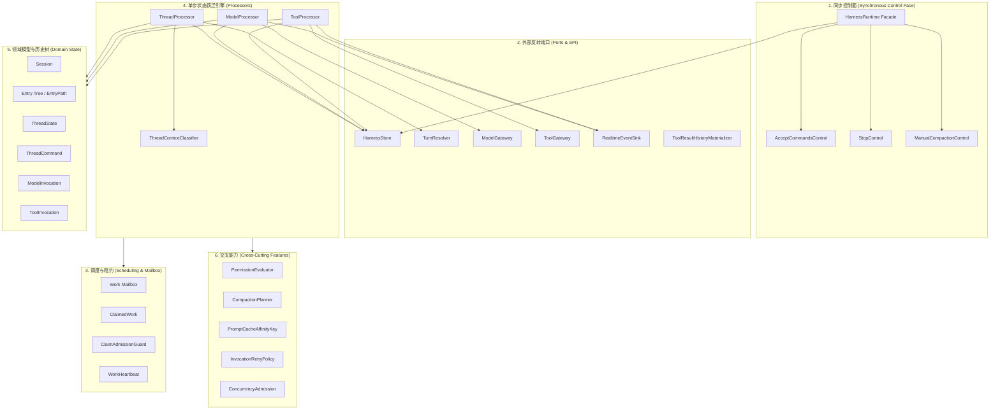
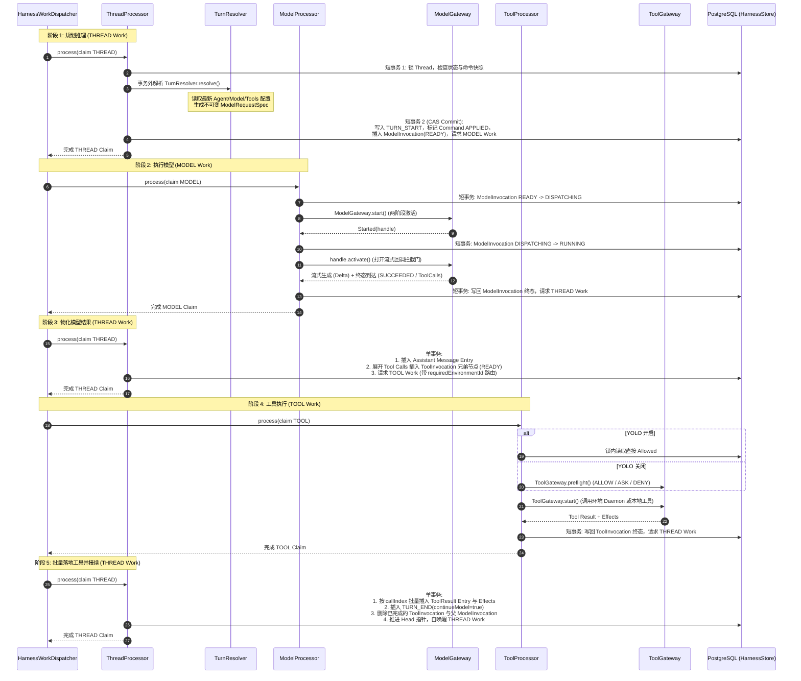
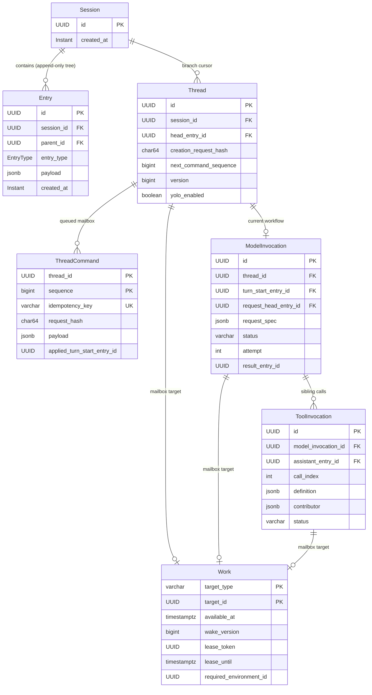

# Harness Runtime 架构设计与包索引

`harness-runtime` 是一个纯 Java 实现的持久化 Agent 执行运行时（Durable Agent Runtime）。它不依赖任何具体的数据库实现、Spring 框架、第三方大模型 SDK 或 HTTP/WebSocket 传输层，仅依赖 `harness-common`、`harness-tool`、`harness-environment`、Jackson、SLF4J 与 JGit（仅用于路径匹配）。

---

## 1. 核心定位与职责边界

Harness Runtime 负责承载以下核心状态机与协议：

1. **会话与历史（Session Entry Tree）**：组织单根、追加型（Append-Only）的历史 Entry 树，以确定的语法树保证历史不可变。
2. **分支游标（Thread）**：通过轻量级的 Thread 指针追踪当前历史分叉点（Head）、版本号（Version）和命令游标。
3. **命令信箱（Thread Command Mailbox）**：支持外部命令批量写入、幂等重放校验（Idempotency Key & Hash）与有序状态标记（QUEUED / APPLIED / CANCELLED）。
4. **长执行状态机（Model & Tool Invocation）**：将模型请求与工具调用固化为可被抢占、续租、取消和恢复的持久化调用对象。
5. **调度信箱（Work Mailbox）**：提供 `THREAD`、`MODEL`、`TOOL` 三种调度目标，通过分布式排他租约（Lease）驱动单步状态跃迁。
6. **单一持久化事务端口（HarnessStore）**：所有状态变更均在单一 Store 事务内按严格顺序加锁并原子提交。
7. **外部能力反转（Ports）**：通过清晰定义的窄端口对接外部模型执行、工具执行、规划解析和实时流事件推送。

---

## 2. 总体分层架构



---

## 3. 核心执行闭环（Agent Loop）

运行时采用“单次 Claim 恰好执行一次持久化动作（Single-Action Durable Action）”机制，通过数据库表 `harness_work` 串联起完整的推理与工具执行循环。



---

## 4. 绝对加锁顺序与数据模型

为避免跨表与跨事务发生死锁，所有多实体数据库操作必须严格遵循全局定义的加锁顺序：

```text
Session ──► Thread ──► Commands ──► ModelInvocation ──► ToolInvocation ──► Work
```



---

## 5. 包结构索引与职责映射

| 包名 (`fun.fengwk.kkstudio.harness.runtime.*`) | 核心类与接口 | 职责描述 |
|---|---|---|
| **`root`** | `HarnessRuntime`, `AcceptCommandsControl`, `StopControl`, `ChangeGate` | 外部同步门面与控制入口；原子控制批处理命令提交、停止与变更观察。 |
| **`store`** | `HarnessStore`, `HarnessStore.Transaction`, `LockKey` | 持久化抽象接口，声明强类型事务与全局锁序。 |
| **`session`** | `Session`, `AgentMessage`, `AgentMessageRole` | 会话聚合根与基础消息角色契约。 |
| **`entry`** | `BranchSettings`, `ModelSelection` | 分支运行时上下文设置（环境路径、Agent 标识、模型配置）。 |
| **`history`** | `Entry`, `EntryPath`, `EntryPayload`, `TurnPathValidator` | 追加型历史语法树、不可变路径校验、Turn Grammar 守卫。 |
| **`thread`** | `ThreadState`, `ThreadCommand`, `ThreadContext` | 线程状态投影、命令信箱定义、6 种运行时上下文状态机。 |
| **`work`** | `Work`, `ClaimedWork`, `WorkTargetType` | 分布式可调度任务信箱、排他租约与抢占结果。 |
| **`invocation.model`** | `ModelInvocation`, `ModelRequestSpec`, `ModelRequestMaterializer` | 模型调用实体、不可变请求规格、历史到请求纯投影转换器。 |
| **`invocation.tool`** | `ToolInvocation`, `ToolBinding`, `ContributorBinding`, `ToolEffectBatch` | 工具调用实体、绑定规格、插件溯源与自定义状态副作用批处理。 |
| **`invocation.codec`** | Codec 系列 | 调用实体与绑定的 JSON 编解码器。 |
| **`model`** | `ModelDescriptor`, `ModelVariant`, `ModelCost`, `ModelUsage` | 语言模型元数据描述、成本用量核算与采样变体。 |
| **`model.provider`** | `ProviderRequest`, `ProviderResponse`, `ProviderType` | 语言模型服务商中立的请求/响应实体与流式事件。 |
| **`processor`** | `ThreadProcessor`, `ModelProcessor`, `ToolProcessor`, `TurnPlan` | 状态机引擎；消费 Work 租约并驱动离散持久化跃迁。 |
| **`port`** | `TurnResolver`, `ModelGateway`, `ToolGateway`, `RealtimeEventSink` | 外部能力接入端口（SPI）。 |
| **`compaction`** | `CompactionPlanner`, `CompactionConfig`, `CompactionTurns` | 历史上下文自动与手动修剪规划器、软硬阈值判定。 |
| **`permission`** | `PermissionEvaluator`, `ToolSettings`, `BashSurfaceAnalyzer` | 工具执行权限求值器、通配符规则匹配与命令表面分析。 |
| **`cache`** | `PromptCacheAffinityKeyFactory`, `PromptCachePolicy` | 上下文缓存亲和键生成与服务商缓存策略适配。 |
| **`retry`** | `InvocationRetryPolicy`, `BackoffPolicy` | 可重试异常指数退避与重试次数约束。 |
| **`admission`** | `ConcurrencyAdmission` | 进程内基于信号量的并发容量准入控制器。 |
| **`resource`** | `ResourceStore`, `ResourceSink`, `ResourceSource` | 外部化二进制与文件资源存储抽象。 |
| **`realtime`** | `RealtimeEvent`, `RealtimeEventSink` | 瞬态流式增量与事件下发管道。 |
